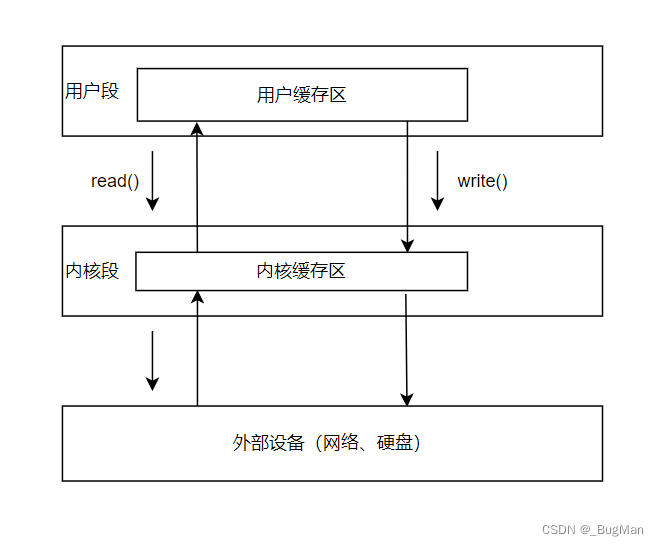

# 一些关键字
## this: 
**记住就是当前对象的引用即可**，例如
```java
public class Person {
    private String name;
    public void setName(String name) {
        this.name = name;
    }
}
```
这里就是当前对象的name，即当前对象的`private String name`，这里是处理同名，this()同理，而且this()必须放在第一行。另外，单独的this()表示调用当前类的无参构造函数，有参的话就是调用当前类的有参构造函数。

## super: 
**记住就是父类对象的引用即可**，例如
```java
public class Student extends Person {
    private String name;
    public void setName(String name) {
        super.setName(name);
    }
}
```
那么这里就是父类的name，即父类的`private String name`，这里是处理同名，super()同理。
其他的和this()一样，**但是super由于继承机制，必须放在重写的父类方法的内第一行，而不能放在重写父类方法的外部。而构造方法则是直接用super()不用接具体方法名**

## static:
- 被static修饰的变量或者方法，是属于类的，而不是属于对象的，*即静态变量或者静态方法，可以直接通过类名来访问，而不需要实例化对象。*
- **静态方法中不能使用this和super关键字**，因为静态方法是属于类的，而不是属于对象的，可看做类的示例变量，所以this和super关键字是不能使用的。而静态变量和方法又叫作类变量和类方法。
- **静态类只能访问静态变量或者静态方法，反之非静态类可以随意访问静态变量或者静态方法**。
- **static不是全局变量。一个属性被写在类最外部，那么这个属性就是全局变量。而static是将属性变成静态属性，可通过类名来直接访问**。
- 一个类实例化，该类中带static是属于类的而不是对象，故无论实例化多少个对象都共享该属性，而不带static的属性则每实例化一个都是不同的属性，例如
```java
public class Person {
    private static String name;
    private String age;
}
```
**age实例化的age1，age2，age3都是不同的，而name实例化的name1，name2，name3都是相同的**。
- ***static{}:静态代码块，在类加载时执行，且只执行一次。用于初始化静态资源。***
```java
class MyBatisUtil{
    private static SqlSessionFactory ssf;
    static {
        try {
            String resource = "mybatis-config.xml";
            InputStream is = Resources.getResourceAsStream(resource);
            ssf = new SqlSessionFactoryBuilder().build(is);
        } catch (IOException e) {
            throw new RuntimeException(e);
        }
    }

    public SqlSession getSession(){
        return ssf.openSession();
    }
}
```
这里要初始化SqlSessionFactory这个静态资源，故用到了静态代码块。**另外，静态代码块只初始化在对应属性的类加载时执行，且只执行一次，往后的继承重写并不会改变。静态代码块的执行顺序是先执行父类的静态代码块，再执行子类的静态代码块，但不可以被重写。**一个类中可以有多个静态代码块，执行顺序是从上到下，但为了代码的可读性，一般只写一个静态代码块。
## intanceof:
用于判断一个对象是否是一个类的实例，格式为`目标对象 instanceof 类名`，即类名是否是目标对象的实例，返回值为boolean类型。
## public\private\protected\final:
- public: 公共的，任何地方都可以访问,包括不同包下的类（但一定要在项目文件夹）
- protected: 受保护的，相同包下都可以访问，不同包下的类只能是protected的子类才能访问
- private: 私有的，只有本类可以访问，故继承只继承了但不能访问或重写（这里访问会报错，但重写不会，因为它无法访问父类的私有方法所以实际上不是重写了方法而是定义了一个新方法）
- final: 最终的，不可变的，不能被继承，不能被重写，不能被修改，否则编译报错
# 一些方法及一些必要的基本概念
## newString():
new String(byte[] bytes, int offset, int length, String charsetName)
- bytes：这是一个 byte 类型的数组，它包含了需要转换为字符串的字节数据。在文件读取的场景中，这个数组通常是从文件中读取到的字节内容。
- offset：这是一个整数，表示从 bytes 数组的哪个位置开始进行转换。索引从 0 开始计数。例如，若 - - offset 为 0，则从数组的第一个字节开始转换。
- length：同样是一个整数，指定了要转换的字节数量。它决定了从 offset 位置开始，取多少个字节进行字符串转换。
- charsetName：***这是一个字符串，代表了字符编码的名称,所以对于非utf-8编码的字节数组可用词方法转换***

## try-catch:
- try-catch: 用于捕获异常，当try中的代码出现异常时，会跳转到catch中，catch中的代码会被执行, 这里注意，***如果catch捕获的异常和try中的异常不匹配，那么catch中的代码不会被执行，且会继续向上抛出异常，直到被捕获，如果没有被捕获，那么程序会直接终止。同理在catch块出现异常时也会继续向上抛出异常，直到被捕获，如果没有被捕获，那么程序会直接终止。如果异常被捕获，那么catch中的代码会被执行，且后续的代码会继续执行。***
```java
try {
    // 可能会抛出异常的代码 
}
catch (Exception e) {
    // 异常处理代码 
}
```
- try-resource-catch: 除了捕获异常，还可以用于资源的释放，格式为
```java
try (Resource resource = new Resource()) {
    // 使用资源的代码
}
catch (Exception e) {
    // 异常处理代码 
}
```
**注意，这里的资源是所有相关的资源都会关闭,`BufferedReader br = new BufferedReader(new InputStreamReader(socket.getInputStream()))`不仅关闭了BufferedReader还会关闭右边包括socket在内的所有资源。**

- try-finally-catch: 除了捕获异常，还可以用于资源的释放，格式为
```java
try {
    // 可能会抛出异常的代码
}
finally {
    // 无论是否抛出异常，都会执行的代码，注意这里会在try之后执行，所以即使try没有错误，也会执行finally中的代码，此时可能会有覆盖。
}
```

- **一些必须要抛出异常的方法：如IO、Socket、线程、数据库等**。
## switch-case:
- switch-case: 用于多分支选择，略。***但这里注意，case后面如果不加break，等到选到符合条件的case运行相应语句后不会结束，会继续执行后面的case，直到遇到break或者switch结束。所以如果不是特殊的需求，一般所有的case后面都要加break。***
## 重载和重写：
- 重载的方法必须有相同的方法名，但是参数列表必须不同。
- 重载的方法可以有不同的返回类型，**但如果只有不同的返回类型没有第一项的两个必要条件则不能重载。**
- ***重载和重写不同，重写是子类对父类的方法的重写，重载是同一个类中方法的重载。***
## 继承：
- 父类可以有多个子类，子类可以有多个子类，但是子类只能有一个父类。
- 子类继承父类的所有属性和方法，**但是父类的私有属性和方法也继承了但不能直接访问，自然也不存在重写**，需要在父类建立公共的方法来访问，如getter和setter方法。
- **子类无法继承父类的构造方法，但是可以通过super()来调用父类的构造方法，因为构造方法是每个类的专属的。**
- **子类直接使用父类的属性，*重写*父类的方法**，也可以添加新的属性和方法。
- **子类可以向上实例化为父类，但是父类不能向下实例化为子类。**
## 参数传递：
- 基本类型的参数传递是值传递，即传递的是值的副本，对副本的修改不会影响原变量，如
```java
public static void main(String[] args) {
		String a = new String("hello");
		test t =new test();
		t.chage(a);
		System.out.println(a);
	}
	
	public void chage(String str) {
		str="he";
	}
```
这里的输出结果为hello，因为str是a的副本，对副本的修改不会影响原变量。想要修改原变量的值，可以返回并被原变量接收重新赋值。   
- 引用类型的参数传递是引用传递，即传递的是引用的副本，即对象在内存中的地址，对副本的修改会影响原变量。如数组、collection、map等。值类型变量分配在栈上，而引用型变量分配在堆上。
## 变量初始化：
- **实例变量及静态变量的初始化不初始化会有默认值，直接用不会报错。**
- **局部变量的不初始化无默认值，不用编译不报错，但直接用会报错。**
- final变量必须初始化，不初始化用不用都报错。且final方法不能重写、继承、重载等，都会报错
## java垃圾税收机制：
- java垃圾回收机制是JVM自动完成且时间不确定的，程序员不能控制。
- java垃圾回收机制是由JVM自动完成的，程序员不能完全控制，只能通过System.gc()方法来建议JVM进行垃圾回收，但不是立即回收。
- java垃圾回收机制是由垃圾回收器（GC）来完成的，垃圾回收器是一个独立的线程，它会自动地检测和回收不再使用的对象。
## 接口：
- 接口可以被多个类实现，一个类可以实现多个接口。
- **接口全部是抽象方法。而抽象类可以有抽象方法也可以有非抽象方法。**
- 接口不能被实例化，但是可以被实现。
- 接口可以继承接口，但是不能继承类。
- ***接口的变量默认是abstract、public的，即使没有显式声明也是，而实现接口的方法访问权限必须大于等于，所以该方法至少要有public***
## 实例化初始化顺序
父类静态资源->子类静态资源->父类成员变量->父类构造方法->子类成员变量->子类构造方法
## 内部类：
***先说一下外部类，外部类只能用public或不加修饰符，而内部类则可以用public、protected、private、static、final、abstract等修饰符。***
1. **成员内部类**，格式为：
```java
class Outer {
    class Inner {
        // 内部类的代码
    }
}
```
- 成员内部类可以访问外部类的所有属性和方法，包括私有属性和方法。***（除了静态内部类另外的都和成员内部类相同）***
- 成员内部类可以被实例化，但是必须先实例化外部类，然后再实例化内部类,格式为：
```java
Outer outer = new Outer();
Outer.Inner inner = outer.new Inner();
或
Outer.Inner inner = new Outer().new Inner();
```
2. 静态内部类
- 静态内部类可以访问外部类的所有**静态**属性和方法，包括私有静态属性和方法。
- 静态内部类可以被实例化，但是不需要实例化外部类,格式为：`Outer.Inner inner = new Outer.Inner();`
3. 局部内部类
局部内部类权限和成员内部类一样，但是局部内部类只能在方法中定义和使用，不能在类中定义和使用。
4. **匿名内部类**
匿名内部类用于只是用一次的类，可以继承一个父类或者实现一个接口(都是重写方法)，继承和接口的格式都类似为：
```java
MyClass class = new MyClass(可选参数) {
    // 重写MyClass中的方法
}
```

## lambda表达式：
lambda表达式的语法为：
```java
(参数列表) -> {
    // 方法体
}
如
Thread t = new Thread(new Runnable() {
    @Override
    public void run() {
        // 方法体
    }
});
用lambda表达式表示为（由于run方法没有参数故参数列表也没有）：
Thread t = new Thread(() -> {
                    // 方法体
                }).start();

```
## 三元运算符：
- 格式为：`条件 ? 表达式1 : 表达式2`
- 条件为true时，返回表达式1，否则返回表达式2。
## 正则表达式：
- 正则表达式是一种用于匹配字符串的模式，它由一些特殊字符和普通字符组成。
- 使用方法
  1. 定义正则表达式，及要匹配的字串，定义规则除了基本的字母数字下划线外，还有一些特殊字符,具体见定义正则表达式.md
  2. 编译正则表达式，使用`Pattern.compile(正则表达式)`方法
  3. 创建匹配器，使用`Pattern.matcher(字符串)`方法，即要匹配的字串
  4. 匹配
   - 匹配第一个符合规则的字符串，使用`Matcher.find()`方法
   - 匹配整个字符串，使用`Matcher.matches()`方法
  6. 获取匹配结果
   - 获取匹配的字符串，使用`Matcher.group()`方法
   - 获取匹配的字符串的起始位置，使用`Matcher.start()`方法
   - 获取匹配的字符串的结束位置，使用`Matcher.end()`方法 
- continue: 用于循环中，跳过当前循环，继续下一次循环。
- break: 用于循环中，跳出当前循环。
## 数值转化：
- 强制类型转换：`(类型)变量名`，高精度向低精度转换时会丢失精度，低精度向高精度转换时会自动转换，*精度排行：byte(8) < short(16) < int(32) < long(64) < float(32) < double(64)。*
如`short a= 8;int b = (int)a` 
- 类型提升：低精度向高精度转换时自动转换
- **数值运算时：byte之间计算会自动转换为int，short之间计算会自动转换为int，char之间计算需要将其会自动转换为int，int之间计算不需要转换，long之间计算会自动转换long，float和double之间计算会自动转换为double。**所以在运算时注意最终结果的类型，如`byte a=1;byte = 2;a = a+b;`会报错，因为a+b的结果为int，而a为byte，故需要强制类型转换,也可以用`a+=b`，`+=`会自动类型转换。
- **将父类强制转换为子类，这个应用很广**
- 数值的表示范围：
  - byte：-128~127
  - short：-32768~32767
  - int：-2147483648~2147483647
- 数值的进制转换：
  - 十进制转二进制：`Integer.toBinaryString(十进制数)`
  - 二进制转十进制：`Integer.parseInt(二进制数, 2)`
- 字符串和数值的转换（以int为例）：字符转整型有`Integer.parseInt(String s)`和`Integer.valueOf(String s)`，整型转字符有`String.valueOf(int i)`和`Integer.toString(int i)`。
- 日期和字符串的转换：时间和字符串:format parse 格式:××formatter，例如：
```java
    // 获取当前日期时间
    LocalDateTime now = LocalDateTime.now();
    // 定义日期格式
    DateTimeFormatter formatter = DateTimeFormatter.ofPattern("yyyy-MM-dd HH:mm:ss");
    // 将日期转换为字符串
    String dateString = now.format(formatter);
  
    // 定义日期字符串
    String dateString = "2024-10-01 12:30:00";
    // 定义日期格式
    DateTimeFormatter formatter = DateTimeFormatter.ofPattern("yyyy-MM-dd HH:mm:ss");
    // 将字符串转换为日期
    LocalDateTime date = LocalDateTime.parse(dateString, formatter);
```

## 计时：
- System.currentTimeMillis()-start(start为在开始计时的System.currentTimeMillis())
- 用schedule
    - schedule(TimerTask task, long delay)：在指定延迟delay（以毫秒为单位）后执行task任务。
    - schedule(TimerTask task, Date time)：在指定的Date时间执行task任务。
    - schedule(TimerTask task, long delay, long period)：在延迟delay毫秒后开始执行task任务，之后每隔period毫秒重复执行。
    - schedule(TimerTask task, Date firstTime, long period)：在firstTime指定的时间开始执行task任务，之后每隔period毫秒重复执行。
    - 使用固定格式：
    ```java
    Timer timer = new Timer();
    TimerTask timerTask = new TimerTask() {
	public void run(){
        // 任务代码
			};
    timer.schedule(参数);}
    ```
---
# IO流：
参考博客：[IO流](https://blog.csdn.net/a1405/article/details/116766237)
***IO流，读的时候通过输入流读取数据，写的时候写入输出流，然后通过转到相应对象***
## 字节流
字节流以字节为单位进行数据的读写操作，可处理任意类型的数据，如图片、音频、视频等，在文件上传、下载、传输等场景中广泛应用。使用时需注意关闭输入输出流，否则可能导致数据写入失败。
- 节点流
FileInputStream 和 FileOutputStream：用于文件的读取和写入操作，可实现文件复制等功能。在开发中，文件的上传、下载等操作常使用这两个节点流，通常会与装饰后的处理流配合使用。（**这个读写的对象都是文件**）
- 处理流:ByteArrayInputStream 和 ByteArrayOutputStream：这个内部维护了一个字节数组，即**读写的对象是字节数组**。
那么除了以上还能想到可以将字节数组转化为字节流，就是直接创造一个输入流对象，参数是你要转的字节数组即可。
以及反过来，那么前提是输入流里有数据可以转换，读取后（**注意读取返回的是int**），这里有的话就用输出处理流write写入输出流，**输出流可用toString方法转成字符**。
- 缓冲流：BufferedInputStream 和 BufferedOutputStream 是字节流的缓冲流，是一个装饰装饰字节流（即获取字节流对象），通过设置缓冲区，减少与数据源的交互次数，提高数据传输效率。(**节点流每次只能读一个字节，而缓冲流可以一次读多个字节即字节数组**)
## 字符流
字符流以字符为单位进行数据的读写操作，主要用于处理纯文本文件。在进行纯文本文件的 I/O 操作时，通常会配合处理流一起使用。
- 节点流
FileReader 和 FileWriter：用于纯文本文件的读取和写入操作，针对文本数据的处理更加方便。
- 处理流:
StringReader 和 StringWriter：这个内部维护了一个字符串或字符数组等等，即**读写的对象是字符串或字符数组等**。
那么除了以上还能想到可以将字符串等转化为字节流，就是直接创造一个输入处理流对象，参数是你要转的字符串等即可。
以及反过来，那么前提是流里面字符串等有数据可以转换，读取后（**注意读取返回的是int**），这是有的话就用输出处理流write方法一下输出流，同理**输出流可用toString方法转成字符**。
- 缓冲流：BufferedReader 和 BufferedWriter 是字符流的缓冲流，同样通过设置缓冲区，提高文本数据的读写效率，并且 BufferedReader 提供了按行读取的便捷方法。(**节点流每次只能读一个字符，而缓冲流可以自动识别换行符读一行**)
- 转换流：InputStreamReader 和 OutputStreamWriter 用于在字节流和字符流之间进行转换，可指定字符编码，默认编码为 UTF - 8。在处理不同编码的文本文件时非常有用。

# Socket网络编程：
## Socket:
参考博客：[Scoket](https://blog.csdn.net/weixin_49561506/article/details/131554978)
1. Socket（TCP，面向连接，客户端连接了服务端才能通信）:
```java
服务端:
ServerSocket serverSocket = new ServerSocket(监听的端口号);
Socket clientSocket = serverSocket.accept();
类似clientScoket.getInputStream获取对应输入输出字节流
- 客户端:
Socket socket = new Socket(服务端地址和监听的端口);
类似socket.getInputStream获取对应输入输出字节流
这里客户端的socket被正确创建（连接的端口无误，连接的地址有效）服务端才会accept
```

2. UDP（通信时再通过对方的端口地址进行通信）:
```java
服务端:
DatagramSocket socket = new DatagramSocket(监听的端口);
while(true){
    byte[] buffer = new byte[1024];
    DatagramPacket recivePacket = new DatagramPacket(buffer, buffer.length);
    socket.receive(recivePacket);
    这里接收后可以用`recivePacket.getAddress()`和`recivePacket.getAddress()`获取客户端地址以及端口，发送后也可以只是只用于提示用户发送的地址和端口信息

    DatagramPacket sendPacket = new DatagramPacket(发送的信息message，还是要转为字节数组, message.length, 客户端地址及监控的端口);
    socket.send(sendPacket);
    用getData()获取数据(获取的字节数组,且编码需要变成utf-8)
}
客户端:
DatagramSocket socket = new DatagramSocket();
while(true){
    byte[] buffer = new byte[1024];
    DatagramPacket recivePacket = new DatagramPacket(buffer, buffer.length);
    socket.receive(recivePacket);
    这里接收后可以用`recivePacket.getAddress()`和`recivePacket.getAddress()`获取服务端地址以及端口

    DatagramPacket sendPacket = new DatagramPacket(发送的信息message，还是要转为字节数组, message.length, 服务端地址及连接的端口);
    socket.send(sendPacket);	
    用getData()获取数据（获取的字节数组，且编码需要变成utf-8）
}
```

# java并发编程
## 多线程一些总结：
多线程就是让程序同时多件事，例如服务器实时监控客户端状态，而控制多线程即让线程安全有如同步互斥锁（synchronized()）、(后面都是线程调度)睡眠、让步（yeild）、线程加入（join（先要开启一个线程才能加入，加入后只等该线程完成才进行被加入线程并独占完成））、wait()
参考博客：[Thread](https://blog.csdn.net/Justw320/article/details/131848634)  
这里说一下提到的方法：
1. sleep: 让当前线程休眠，参数为休眠时间，单位为毫秒。休眠会让*线程阻塞*，暂时让出CPU资源，但*不会释放锁*。当休眠结束后，他会进入就绪态，等待CPU调度，此时他比同优先级和比它低优先级的线程更有机会获得CPU资源。
2. yeild: 让当前线程让步，让出CPU资源，但它*不会进入阻塞*也不会释放锁，只是让其他具有相同优先级的线程有机会获得CPU资源。
3. wait: 是*object类的方法而不是thread类*的方法，即所有对象都可调用该方法。但通常还是用于多线程，让当前线程进入**等待**（不是阻塞）状态，直到*其他线程调用该对象的notify()或notifyAll()方法唤醒它*，如果设置了时间超时也会唤醒，此时它会进入*就绪*态，等待CPU调度，此时他比同优先级和比它低优先级的线程更有机会获得CPU资源。另外，wait()方法会释放锁，即不影响其他线程的执行。最后，wait方法依赖于锁（监视器），所以**必须在synchronized修饰的代码块中使用**。
4. join: 当想让某一个线程必须等另一个线程完成后才能执行时，可以使用join方法，此时被join的线程阻塞，这是最常用的情况。另外也可以设置最大等待时间，如果超时就进入就绪态，等待CPU调度。
在来说一下怎么中断线程：
5. notify: 随机唤醒一个在该对象上调用wait方法进入等待的线程，即如果有多个线程就无法雀鲷会唤醒哪一个，这可以看出它设用于唤醒一个线程的情况
6. notifyAll: 唤醒所有在该对象上调用wait方法进入等待的线程
## while（true）
while（true）为除非被停止的死循环，可以用作需要一直运行的方法。**另外死循环会导致程序一直停在这出不来，所以对于所有死循环，如果该程序还有其他需要运行的，需要给死循环开启一个线程**，***另外在while（true）中可以用`Thread.sleep(100)`每运行一次休眠0.1即每0.1秒运行一次，在运行该程序的情况下定时休息而防止CPU占用过高，适用于一些不需频繁运行的功能，如记录输入字的字数、单个游戏角色的实时状态等等***
## 并发编程

# 字符串：
## 常用类：
- StringBuffer：可变的字符序列，线程安全，效率低。需建立对象来使用
- StringBuilder：可变的字符序列，线程不安全，效率高。需建立对象来使用
- String：不可变的字符序列，线程安全，效率低。可直接赋值也可以创建对象
## 常用方法：
- StringBuffer：append()、delete()、insert()、replace()（替换特殊字符用replaceAll）、reverse()、substring()、length()、charAt()、indexOf()、clone()(浅拷贝)
- StringBuilder：append()、delete()、insert()、replace()（替换特殊字符用replaceAll）、reverse()、substring()、length()、charAt()、indexOf()
- String：length()、charAt()、indexOf()、substring()、equals()、concat()、toLowerCase()（小写变大写）、toUpperCase()（小变大）、trim()（去两端空格）、startsWith()（是否以某某开头）、endsWith()（是否以某某结尾）、contains()（是否包含某个字符串）、replace()（替换特殊字符用replaceAll）、split()、getBytes()、toCharArray()、valueOf()。

# 数据存储以及数据结构：
## 各种数值类型的存储：
***一个重要知识点***：**当一个对象未被初始化时，如果是基本类型，那么除了字符是空字符、字符串是null、布尔是false外其他都是是0，如果是引用类型（包括类、接口、数组等），那么它的值是null。** ***初始化后，但没有任何数据时不一定等同于null，这取决该对象的具体情况，如果该对象对空有额外的定义（一般是没有的，但像以下各种数据结构及自定义对象等有）如ArraryList，这时是空数组列表，即[]而不是null，也就是以下数据的各种判空方法如isEmpty()不等同于判断是否为null，一般是两种结合一起使用***  
前情提要，一个英文字符占1个字节，***一个中文字符在主流的GBK编码占2个字节，而在UTF-8编码占一般认为3个字节（生僻字或特殊字符可能占4个）***
- 整数：int[$2^{31}$-1，$-2^{31}$]、short[$2^{15}$-1，$-2^{15}$]、long[$2^{63}$-1，$-2^{63}$]、byte[$2^7$-1，$-2^7$]
- 浮点数：float[3.4*$10^{38}$，$-3.4*10^{38}$]、double[1.7*$10^{308}$，1.7*$10^{308}$]
- 字符：char[0，$2^{16}$]
- 对应的引用型变量：**Integer**[$2^7$-1，$-2^7$]缓存机制使最大长度变小、Short[-32768,32768]、Long[也有缓存机制但不常用]、Byte范围不变、Double范围不变、Float范围不变、Character、Boolean，不易看出大部分都只是变大写
## 数值比较：
基本的大小比较略，我们主要说判断是否相等：
1. == ("="是赋值)  ：对于基本数值类型，就是比较值，故double和int也不可比较。而对于引用变量，比较的是地址，故不同的对象不可比较，如Double和Integer，不同的Integer对象也不能比较。比如同一个Integer对象的实例，这时是同一对象可以比较。但除了String，String是特殊的，不是同一对象也能比较，但则针对已经声明的String的对象，如`String s=h;s=="h"`，这时不可比较，这种一般用**equals比较。**
2. equals ：equals调用的类型和参数必须是同一类型，调用类型必须是引用变量，而参数只要是对应的类型即可，如Integer.equals(int)是可以的，equals会自动将int封装成Integer
## 数组和集合存储，需要结合数据结构理解：
### ***使用场景***:
- 数组和列表适合固定大小、要频繁高性能访问的场景；
- 集合适合动态大小、多样化、多对象操作的场景
  - 集合中list接口和Queue接口的适用数据不唯一有序
  - hashSet唯一无序，TreeSet唯一有序
  - Map接口的适用数据键值对，hashMap唯一无序，TreeMap唯一有序
- 字符串适合处理文本信息。
### 详细介绍及常用方法
- 数组：存储固定长度的相同类型的数据，**最大的长度为int的最大值**。aslist变列表
- 列表：存储固定长度的相同类型的数据，列表的长度在创建时就确定，无法改变。toArray转对象数组
- 集合：存储可变长度的不同类型的数据，集合的长度可以动态改变。
  - 集合的分类（一层层都是继承关系，子类继承父类所用方法）：
    - Collection：
      - **List**：存储一组不唯一、有序（插入顺序）的对象。（**这里子类特殊是可以直接用=转成list的**，而同级转换到其他如ArrayList转到LinkedList直接在建立LinkedList加上ArrayList参数即可）
        - ArrayList：基于数组实现故插入和删除效率低，动态数组，支持随机访问，线程不安全。
          *常用方法*：add(),get(),remove(),set(),size(),contains(),isEmpty(),indexOf()(返回数据索引),clear(),equals()，addAll(加另一个集合)、clone()(浅拷贝)等等
        - LinkedList：基于双向链表实现故插入和删除效率高，不支持随机访问，线程不安全。  
          *常用方法*：方法和ArrayList类似，就是多了addFirst()(在开头添加),addLast()(在结尾添加)等等关于首尾的方法。另外，**还可以作为栈、队列使用，即链栈和链队列**,相应方法如下：
          链栈：出栈push()或addFirst()(后面包括队就不写或了，自行找对应方法)，入栈pop()，查看栈顶元素peek()，判断栈是否为空empty()
          链队列: 出队poll()，入队offer()，查看队首元素peek()，判断队是否为空isEmpty()
        - Vector：基于数组实现，线程安全。类似于ArrayList，常用方法也类似。
          - Stack：基于Vector实现，线程安全，后进先出（LIFO）的栈结构,**即顺序栈**，方法就多了pop()(出栈),push()(入栈),peek()(查看栈顶元素)，empty()(判断栈是否为空)，search()(查找元素在栈中的位置)等等
      - Queue：存储一组不唯一、有序（先进先出）的对象。
        - Deque：双端队列，支持在队列的两端进行插入和删除操作。线程不安全。
          - ArrayDeque：基于数组实现的双端队列。**即顺序队列**。
          - LinkedList：基于链表实现的双端队列。*但其实用linkedList即可*
        - ArrayBlockingQueue：基于数组实现的有界阻塞队，用于多线程环境，
          当队列已满时，如果有线程尝试向队列中添加元素，该线程会被阻塞，直到队列中有空间可用；当队列为空时，如果有线程尝试从队列中移除元素，该线程也会被阻塞，直到队列中有元素可用。
        - LinkedBlockingQueue：基于链表实现的无界阻塞队列。线程安全。
        - PriorityQueue：基于堆实现的优先队列，元素按照优先级排序，至于如何自定义优先级即排序规则，我们在TreeSet说明。
        - PriorityBlockingQueue：基于优先级堆实现的无界阻塞队列。
      - **Set**：
        - HashSet：基于哈希表实现，不保证元素的顺序。**基于哈希码（hashCode()）和equals方法判断表中元素是否相等，即每个元素只能出现一次**且无索引无序。  
          *常用方法*：也和List类似，就是有了哈希码来判断是否相等
        - LinkedHashSet：基于哈希表和链表实现，保证元素的插入顺序。其他和HashSet类似。
        - TreeSet：基于红黑树实现，元素按照自然顺序排序，也可以自定义排序规则。
          常用方法：和list类似。  
          #### ***自定义排序规则***：
          1. 实现Comparable接口，重写compareTo方法。
          ```java
          public class Person implements Comparable<Person> {
              private String name;
              private int age;
              @Override
              public int compareTo(Person other) {
                  // 按照年龄升序排序
                  return Integer.compare(this.age, other.age);;
              }
          }主类中实例化该类自动按照自定义的年龄升序排序
          ```
          2. 实现Comparator接口，重写compare方法。
          ```java
          public class Person {
              private String name;
              private int age;
              //略其他方法
          }
          主类中实例化该类，使用匿名内部类实现Comparator接口，重写compare方法。
          TreeSet<Person> set = new TreeSet<>(new Comparator<Person>() {
              @Override
              public int compare(Person o1, Person o2) {
                  // 按照年龄升序排序
                  return Integer.compare(o1.getAge(), o2.getAge());
              }
          });也可以不用匿名内部类，直接实例化一个重写了compare方法Comparator对象，然后作为参数传入TreeSet中，这里是为了简化代码。
          ```
          ***这里补充一个重要知识点，对象的toString方法，返回的是对象名和哈希码，要想得到相应的数值，因该重写toString方法。*** 如以上两个例子都应该重写toString方法。
      - **Map**：存储一组**键值对**，每个键对应一个值。
        - HashMap：基于哈希表实现，不保证键的顺序。允许键或值为null。
          *常用方法*：put(key,value),get(key),remove(key),containsKey(key),containsValue(value),size(),isEmpty(),clear(),keySet()（得到Set类型的键值集合）,values()（得到Collection的值集合）,entrySet()(获取Set类型的Map.Entry集合，有getkey和getvalue方法)、clone()(浅拷贝)等等
        - LinkedHashMap：基于哈希表和链表实现，保证键的插入顺序。    
          *常用方法*：和HashMap类似，就是多了putFirst(key,value),putLast(key,value),removeFirst(),removeLast(),getFirst(),getLast()等等关于首尾的方法。 
        - TreeMap：基于红黑树实现，键按照自然顺序排序。常用方法和LinkedHashMap类似。不允许键为null。
        - Hashtable：基于哈希表实现，线程安全，不允许键或值为null。常用方法和HashMap类似。
- 一些线程安全的集合或包装类：如synchronizedList，synchronizedSet，synchronizedMap，Collections.synchronizedList，Collections.synchronizedSet，Collections.synchronizedMap，CopyOnWriteArrayList，CopyOnWriteArraySet，ConcurrentHashMap等等,**这些集合或包装类的效率较低，所以一般情况下不使用，但如果程序对线程安全的要求较高时也必须可以使用这些线程安全的集合或包装类**。具体使用自行搜索。
- 集合遍历方法：
  - 迭代器（常用，但不能在迭代时修改数据）：Iterator
    - 常用方法：hasNext(),next(),remove() （即删除用迭代器的remove方法）
  - 增强for循环（更简单，但不能在迭代时修改和删除数据，但可以用Iterator.remove()删除当前数据）：for(E e : 要遍历的对象)  (E为集合中元素的类型)
  - 普通for循环（通用,对于要修改或删除数据时使用）：for 
  - 对于Map集合的遍历：
    - 通过keySet()遍历：
    ```java
    Map<String, Integer> map = new HashMap<>();
    map.put("A", 1);
    //略多次put
    for (String key : map.keySet()) {
        int value = map.get(key);
        System.out.println(key + ": " + value);
    }
    ```
    - 通过entrySet()遍历：
    ```java
    Map<String, Integer> map = new HashMap<>();
    map.put("A", 1);
    //略多次put
    for (Map.Entry<String, Integer> entry : map.entrySet()) {
        String key = entry.getKey();
        int value = entry.getValue();
        System.out.println(key + ": " + value);
    }
    ```
    - 通过values()遍历：类似于keySet()，略
- 参考博客：[集合](https://blog.csdn.net/2301_79842503/article/details/140886252)

# 泛型：
- 泛型的本质是参数化类型，即把类型作为参数传递给类或方法。
- 泛型的优点是可以提高代码的复用性和安全性，避免了类型转换的错误。
- 泛型在以上优点下同时没有改变原来的性能，因为泛型在编译时会进行类型擦除，即把泛型类型擦除为Object类型，所以泛型在运行时的性能和非泛型是一样的。
- 泛型的使用方法：
  - 定义泛型类时，需要在类名后面加上尖括号，并在尖括号中指定泛型类型参数。 
    比如ArrayList<E>，其中E就是泛型类型参数。
  - 泛型类可以有多个泛型类型参数，每个参数之间用逗号分隔。
    比如HashMap<K,V>，其中K和V就是泛型类型参数。 
  - 泛型类可以在类的成员变量、方法参数和方法返回值中使用泛型类型参数。  
  - 泛型类的实例化时需要指定泛型类型参数的具体类型。 
  - 那对于加了泛型的类，该类的对象可以调用泛型类的方法，但是不能调用泛型类的属性，**该类的泛型方法的参数和返回值也需要指定泛型类型参数的具体类型**。就比如上面集合几乎都是泛型类，都有泛型方法，如：
  ```java 
  class Person implements Comparable<Person> {
      private String name;
      private int age;
  
      public Person(String name, int age) {
          this.name = name;
          this.age = age;
      }
      public int gatAge() {
          return age;
  }
      @Override //重写compareTo方法,这里用不到就随便写了
      public int compareTo(Person o) {
          return 0;
      }
      public String toString() {
          return "Person{name='" + name + "', age=" + age + '}';
      }
  }

  public class test {
      public static void main(String[] args)  {
          HashSet<Person> h = new HashSet<Person>();
          h.add(new Person("a",1));
          h.add(new Person("b",2));
          h.add(new Person("c",3));
          for(Person e : h) {
              System.out.println(e);
          }
      }
  }
  ```
  hashSet的泛型方法add()和遍历都得用Person对象。那么可以得出使用泛型类**可以灵活的指定泛型类型参数的具体类型，而不用像普通类那样指定具体类型**，当我们需要灵活的指定泛型类型参数的具体类型时，可以使用泛型类定义泛型类方法，**参数类型和返回值类型都用泛型参数指定**。
  - ***泛型参数***：所有大写字母都可以作为泛型参数，但为了代码的可读性，一般约定使用以下字母作为泛型参数：
    - K - Key（键）
    - V - Value（值）
    - N - Number（数值类型）
    - E - Element (在集合中使用，因为集合中存放的是元素)
    - T - Type（java类型，最常用最广泛的约定参数）
    - K - Key（键）V - Value（值） N - Number（数值类型）等等
    - K,V - 键值对
    - 两个或两个以上的泛型参数用逗号分隔 按A，B，C顺序命名
# 枚举类：
- 定义：
  ```java
  enum 枚举类名 {
      枚举值1,
      枚举值2,
      ...
  }
  ```
- 特性：
  - 枚举类中的每个常量都是该枚举类的一个实例，并且是单例的，如：
    ```java
    enum Day {
    MONDAY, TUESDAY, WEDNESDAY, THURSDAY, FRIDAY, SATURDAY, SUNDAY;
    }

    public class EnumSingleton {
        public static void main(String[] args) {
            Day day1 = Day.MONDAY;//因为每个常量都是该枚举类的一个实例，故这里可以用枚举类名.枚举值来创建实例
            Day day2 = Day.MONDAY;
            System.out.println(day1 == day2); // 输出: true
        }
    }
    ```
    这里的day1和day2是同一个实例。
  - 枚举类可以使用 Enum 类提供的一些方法，如：name()、ordinal()(枚举常量在枚举类中声明的顺序，从 0 开始计数)、values()（得到所以枚举值）等等。
  - 枚举类可以用自己的属性和方法，如：
    ```java
    enum Season {
        //因为每个常量都是该枚举类的一个实例，故枚举值也可看做一个实例对象，故这里可以用构造函数来初始化属性
        SPRING("温暖"), SUMMER("炎热"), AUTUMN("凉爽"), WINTER("寒冷");

        private final String description;

        // 构造函数
        Season(String description) {
            this.description = description;
        }

        // 获取描述信息的方法
        public String getDescription() {
            return description;
        }
    }

    public class EnumWithAttributes {
        public static void main(String[] args) {
            for (Season season : Season.values()) {
                System.out.println(season + ": " + season.getDescription());
            }
        }
    }
    ```
    这里的枚举类Season有自己的属性description，且有自己的方法getDescription()。
  - 枚举类可以实现接口，如：
    ```java
    interface SeasonAction {
        void action();
    }

    enum Season implements SeasonAction {
        SPRING {
            @Override
            public void action() {
                System.out.println("外出踏青");
            }
        },
        SUMMER {
            @Override
            public void action() {
                System.out.println("游泳解暑");
            }
        //略重复实现的代码
        };
    }

    public class EnumImplementingInterface {
        public static void main(String[] args) {
            //用Season.values()来遍历枚举类
            for (Season season : Season.values()) {
                System.out.print(season + " 适合: ");
                season.action();
            }
        }
    }
 - 枚举类在switch语句中的使用：
  ```java
  enum Day {
        MONDAY, TUESDAY, WEDNESDAY, THURSDAY, FRIDAY, SATURDAY, SUNDAY;
    }

    public class EnumSwitchExample {
        public static void main(String[] args) {
            Day today = Day.MONDAY;
            switch (today) {
                case MONDAY:
                    System.out.println("开始新的一周，加油工作！");
                    break;
                //略重复的代码
                case SUNDAY:
                    System.out.println("周日，准备迎接新一周！");
                    break;
            }
        }
    }
- 枚举类的使用场景：
  - **当需要定义一组固定的常量时，可以使用枚举类，如颜色选择、星期选择、策略选择等。**
  - 当需要在 switch 语句中使用枚举类型时，可以使用枚举类。
# 反射   
[参考](https://blog.csdn.net/weixin_44207403/article/details/106736102)
## 概述
Java反射是Java语言的一种特性，它允许程序在运行时自我检查并对内部成员进行操作。这种动态获取信息以及动态调用对象方法的功能称为Java语言的反射机制。具体来说，***反射机制允许在运行状态中对于任意一个类，都能够知道这个类的所有属性和方法；对于任意一个对象，都能够调用它的任意方法和属性，并且能改变它的属性。***Java反射机制的核心是在程序运行时*动态加载类*并获取类的详细信息，从而操作类或对象的属性和方法。其本质是JVM得到Class对象之后，再通过Class对象进行反编译，从而获取对象的各种信息。
使用主要场景：
- 在运行时判断任意一个对象所属的类；
- 在运行时实例化任意一个类的对象；
- 在运行时获取任意类的名称、package信息、所有属性、方法、注解、类型、类加载器等；
- 在运行时获取任意对象的属性，并且能改变对象的属性；
- 在运行时调用任意对象的方法。
## Class类(这个也注意抛出异常)：
1. 反射机制的核心是Class类，它是Java反射机制的入口点。(里面基本静态方法)
2. 获取Class对象的常用方法：
    - forname("类的全路径")
    - Class c = Student.class 通过类名.class获取
    - getClass() 通过对象.getClass()获取，对应还有getSuperClass()获取父类、getInterfaces()获取接口。
    - Integer.TYPE 获取基本的包装类类型的Class对象
3. Class一般会返回的三个对象
    1. Field对象：存放获取对象的成员变量属性
    2. Method对象：存放获取对象的方法
    3. Constructor对象：存放获取对象的构造方法
4. Class类的常用方法：
    - getField(String name)：获取指定名称的public修饰的成员变量，包括继承父类的变量
    - getFields()：获取所有public修饰的成员变量，包括继承父类的变量，用下标访问，返回Field数组，下面同理
    - getDeclaredFields()：获取所有的成员变量，包括private修饰的，但不包括继承父类的变量,去掉s同理，都是获取单个，下面不再赘述  

    - getMethods()：获取所有public修饰的方法，包括继承父类的方法
    - getDeclaredMethods()：获取所有的方法，包括private修饰的，但不包括继承父类的方法

    - getConstructors()：获取所有public修饰的构造方法，包括继承父类的构造方法，这个获取单个的参数是构造函数参数列表
    - getDeclaredConstructors()：获取所有的构造方法，包括private修饰的，但不包括继承父类的构造方法
5. 其他常用方法：
    - newInstance()：创建一个新的实例对象
    - getName()：获取类的名称
    - getSimpleName()：获取类的简单名称(即不包含完整类路径，只有类名)
    - getInterfaces()：获取类实现的接口
    - getClassLoader()：获取类的类加载器
    - getResource(String name)：获取类路径下的资源
    - getResourceAsStream(String name)：获取类路径下的资源流
# NIO： 
## Path:
1. Paths：
作用就是获取Path对象，常用的方法有，通过get方法获取Path对象，这里参数可以时一个路径，也可以是多个字符串拼接成一个路径，而拼接路径就是引入Path的意义
2. 常用方法：
    - 各种get方法：如getFileName、getParent、getRoot、getFileSystem等
    - resolve、resolveSibling：将当前path和另一个path或字符串拼接，如果参数时绝对路径则返回绝对路径，是相对路径则拼接在当前path后面，而resolveSibling则拼接在当前path的父路径后面。
    - 各种to方法：如toAbsolutePath、toRealPath、toUri、toFile等
    - 各种normalize方法：如normalize、relativize、subpath等，即标准化路径、相对化路径、子路径等
## Files:
Files 类包含了一组静态方法，这些方法用来操作文件和目录。它可以用于文件的创建、删除、复制、移动以及检查文件的属性等。和path配合使用，对于IO流的操作更加方便，还有各种好用的方法。
以下是常用方法：  
- 各种create方法：如createDirectory、createDirectories、createFile、createTempFile、createTempDirectory等
- exist: 检查文件或目录是否存在
- 各种is方法：如isRegularFile、isDirectory、isSymbolicLink（路径是否符号链接）、isOther（是否是其他类型文件，即不是目录、普通文件，也不是符号链接）。
- 各种read方法：如readAllBytes、readAllLines、readAttributes、readString，分别是读取所有字节、读取所有行、读取属性、读取字符串，其他好说，这里说一下readAttributes（继承files）。
  - readAttributes有三个参数，第一个path;第二个是读取的属性类型，windows一般用BasicFileAttributes.clasS即可;第三个是链接方式，用于指定在读取属性时如何处理符号链接。还有一个可选的编码。常用的选项有 LinkOption.NOFOLLOW_LINKS，若指定该选项，在读取属性时将不会跟随符号链接。最终返回的是Map集合，我们一般用你选定的属性类型接受即BasicFileAttributes。
  - BasicFileAttributes有如下常用方法：
    - size：文件大小
    - lastModifiedTime：最后修改时间
    - lastAccessTime：最后访问时间
    - creationTime：创建时间
  - 如果想获取 Windows 文件系统下的文件属性，像只读、隐藏等属性，用DosFileAttributes（也继承BasicFileAttributes）
    - isReadOnly()：判断文件是否为只读文件。
    - isHidden()：判断文件是否为隐藏文件。
    - isSystem()：判断文件是否为系统文件。
    - isArchive()：判断文件是否为存档文件。
- 各种write方法：如write、writeString：这里write可以写入字节数组、字符串列表，writeString写入字符串，参数都一样，第一个是path，第二个是内容，第三个选项，另外还有编码，常用选项如下：
  - StandardOpenOption.CREATE：若指定文件不存在，就创建该文件
  - StandardOpenOption.CREATE_NEW：若指定文件不存在，就创建该文件，但这个不存在会抛出异常
  - StandardOpenOption.APPEND：若指定文件存在，就在文件末尾追加数据
  - StandardOpenOption.TRUNCATE_EXISTING：若指定文件存在，就在文件开头截断数据，一般和create组合清空文件
  - StandardOpenOption.DELETE_ON_CLOSE：在文件关闭时自动删除，即用于临时文件
  - StandardOpenOption.WRITE：这个是在read里用的
  - StandardOpenOption.READ：只读打开
- copy（这个IO流没有）：参数第一个是源，第二个是目标，第三个是复制选项，这里可以一个是流一个是path也可以两个都是path，常用选项如下：
  - StandardCopyOption.REPLACE_EXISTING：若指定文件存在，替换他
  - StandardCopyOption.COPY_ATTRIBUTES：复制文件属性，包括文件属性
  - StandardCopyOption.ATOMIC_MOVE：以原子方式执行复制操作，确保操作的原子性。
- delete：删除文件或目录
- move：移动文件或目录，参数第一个是源，第二个是目标，第三个是复制选项
## NIO
[参考博客](https://blog.csdn.net/Joker_ZJN/article/details/131852342)  
介绍了NIO包引入的好用的工具，我们正式介绍NIO。 
NIO有三大核心，即**Buffer、Channel、Selector**。
### Buffer：
Buffer：缓冲区，有各种**基本**数值类型的缓冲区，如`ByteBuffer`等。缓存区有这些基本属性：
- 容量（capacity）：**缓存区创建后大小不可变**
- 限制（limit）：**缓存区可以限制（limit）可用大小**
- 位置（position）：**表示接下来要读写的数据的所在位置，可以理解为设置的新的起始点**
- 标记（mark） **标记一个位置的索引，调用reset()方法可以回到该位置上**  
然后是如何初始化一个Buffer，这里以ByteBuffer为例，`ByteBuffer buffer = ByteBuffer.allocate(容量);`，除了allocate还有：
- allocateDirect（容量）：直接分配内存，即分配在堆外，速度快，但是需要手动释放内存，否则会导致内存泄漏
- wrap(字节数组)：将字节数组包装成ByteBuffer，这里需要注意的是，包装后的ByteBuffer和原字节数组共享数据，即修改ByteBuffer会修改原字节数组，修改原字节数组会修改ByteBuffer。
Buffer的常用方法：
- capacity() limit() mark() position()：获取容量、限制、设置标记、位置
- clear()：清空缓冲区，将位置设置为0，限制设置为容量，标记设置为-1
- filp: 反转缓冲区，将位置设置为0，限制设置为位置，标记设置为-1
- hasRemaining() remaining() :判断是否还有剩余元素 返回剩余元素的数量(即limit-position)
- limit(界限值)：设置限制
- position(位置值)：设置位置
- reset rewind：重置位置为标记位置 将位置设置为0并取消标记
- get put：获取和设置元素，按照索引，获取只能单个获取，设置可以单个设置也可以批量设置，想全部读取可以用array()方法将其转为数组。
### Channel：
#### 读写
显然get、put读写太麻烦了，而Channel用来向buffer中读写数据，可以理解为内核段和用户段之间进行数据传输的一条逻辑通道，***与IO不同，Channel面向缓冲区，另外Channel可以实现了异步读写，且可以读写同时进行***。  
根据不同数据，有以下类型通道：
- FileChannel：文件通道，*通过FileInputStream得到（都是getChannel）读通道、FileOutputStream得到写通道、RandomAccessFile得到读写通道（这个还有一个参数指定是只读只写还是读写，即"r"）*
- DatagramChannel：UDP数据报通道，*通过open方法得到通道*
- SocketChannel：TCP套接字通道，*通过open方法得到通道*
- ServerSocketChannel：TCP服务器套接字通道，*通过open方法得到通道*
得到通道后，***我们还要用缓冲区的flip方法开启读否则读不到任何数据（写就不用了不然写不了）***，之后就可以用read和write从缓冲区读写数据了。**注意这里写是从缓冲区写出数据到对应流，读是从对应流读入缓冲区，即看做读写的对象是对应流但最终面向缓冲流。**同样，这个用完也记得关闭通道。 
#### 零拷贝 
[参考](https://blog.csdn.net/Joker_ZJN/article/details/131841573?spm=1001.2014.3001.5502)  
另外，使用通道还能实现零拷贝，这里先介绍一下普通拷贝：普通拷贝流程是先把磁盘从用户缓存区读取数据复制到内核缓冲区，再从内核缓冲区读取复制到外部设备，然后外部设备写入要复制内容到内核缓冲区，再从内核缓冲区复制到用户缓存区，一共四次复制。  
  
而零拷贝有两种，MMP方式在这从内核缓冲区复制到外部设备之一部，复制的不是数据而是数据的映射，这样就减少了一次复制。  
而sendFile方式是直接从内核缓冲区复制到外部设备，但其由于不经过用户缓冲区故只能文件传输而不能进行数据处理，所以只用于数据传输，且其还限制文件大小。  
上面只是概念了解就好，java中通过通道实现零拷贝，它提供了两个底层使用零拷贝的API，一个是transferTo、一个是transferFrom。可以通过transferTo方法将数据从一个Channel传输到另一个Channel，也可以使用transferFrom方法将数据从一个Channel传输到另一个Channel。即通道之间的数据传输。    
这可以想象一下怎么实现的，我们不通过通道间传输显然还是四次通道传输，我们在用户缓冲区读数据和内核缓冲区间的通道直接传输到内核缓冲区和外部设备间的通道，这样就减少了一次拷贝，传回过程如果还这样又能减少一次，然后更具系统是使用数据映射还是直接传输来实现MMP和sendFile。具体实现比较简单，我们这里只介绍方法参数：
- transferTo(long position, long count, WritableByteChannel target)：将当前通道中的数据传输到目标通道中，position表示起始位置，count表示传输的字节数，target表示目标通道,并返回传输的字节数。***这里可以通过通道的positio方法来决定传输的起始位置以及size方法获取通道大小来确定是追加还是覆盖，下同。***
- transferFrom(ReadableByteChannel src, long position, long count)：将目标通道中的数据传输到当前通道中，src表示目标通道，position表示起始位置，count表示传输的字节数，并返回传输的字节数。
#### 阻塞与非阻塞
即没读取到就阻塞，读取到了就继续执行。  
用在SocketChannel和ServerSocketChannel上，这两个和Socket和ServerSocket是对应的基本方法没区别只是用通到实现了异步读写，**但注意这里获取服务通道或客户端通道需要open方法来获得，绑定监听端口需要类似serverSocketChannel.bind(new InetSocketAddress(8080))来绑定**，这里要设置是否阻塞用`configureBlocking(false or true)`即可
### Selector：
即通道的监听器，用于监听多个通道的事件，如连接、读写、关闭等，常用于实现多路复用、辅助并发编程等。  
有以下常用监听事件：
- 读：SelectionKey.OP_READ 1
- 写：SelectionKey.OP_WRITE 4
- 连接：SelectionKey.OP_CONNECT 8
- 接收：SelectionKey.OP_ACCEPT 16
- 复合：若不止一个事件时，使用或操作符连接
要使用Selector，先要open方法获取，然后将其注册到服务端或客户端通道，如`serverSocketChannel.register(selector, SelectionKey.OP_ACCEPT);`，然后：
```java
while(selector.select()>0){
    Iterator<SelectionKey> iterator=selector.selectedKeys().iterator();
    while (iterator.hasNext()){
        SelectionKey selectionKey=iterator.next();
        //判当前socket的事件
        //1.接收事件（表示socket接收到了数据）
        if(selectionKey.isAcceptable()){
            SocketChannel socketChannel=serverSocketChannel.accept();
            //切换为非阻塞模式
            socketChannel.configureBlocking(false);
            //将通道以读就绪的事件重新注册到选择器
            socketChannel.register(selector,SelectionKey.OP_READ);
        }
        //2.读就绪事件
        if(selectionKey.isReadable()){
            SocketChannel socketChannel=(SocketChannel)selectionKey.channel();
            //读取数据
            ByteBuffer byteBuffer=ByteBuffer.allocate(1024);
            int length=0;
            while((length=socketChannel.read(byteBuffer))>0){
                byteBuffer.flip();
                System.out.println(new String(byteBuffer.array(),0,length));
                byteBuffer.clear();
            }
        }
        //事件处理完成，移除事件
        iterator.remove();
    }}
```