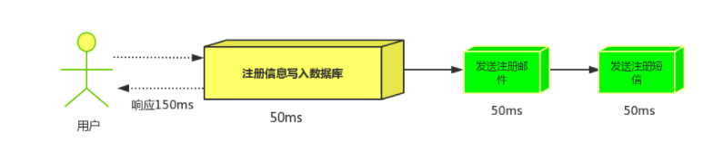
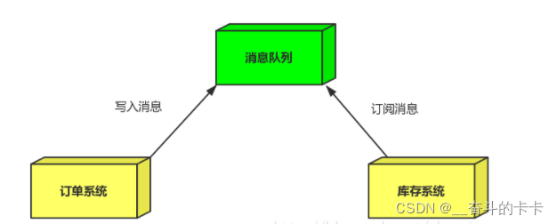

重要概念看和各种MQ选择可以看这篇博客，[点击前往](https://blog.csdn.net/weixin_42039228/article/details/123493937?ops_request_misc=%257B%2522request%255Fid%2522%253A%2522d59f97895167622e70604d09af7bbc74%2522%252C%2522scm%2522%253A%252220140713.130102334..%2522%257D&request_id=d59f97895167622e70604d09af7bbc74&biz_id=0&utm_medium=distribute.pc_search_result.none-task-blog-2~all~top_positive~default-1-123493937-null-null.142^v102^pc_search_result_base8&utm_term=rabbitmq&spm=1018.2226.3001.4187)

# 概念、原理、优缺点等
MQ是一种消息队列，用于实现分布式系统中的异步通信。主要特别就是异步通信，解耦，削峰填谷。
## 异步处理
用户注册后，需要发注册邮件和注册短信，传统的做法有两种，串行和并行。
1. 串行方式：将注册信息写入数据库后，发送注册邮件，再发送注册短信，以上三个任务全部完成后才返回给客户端。这有一个问题是，邮件，短信并不是必须的，它只是一个通知，而这种做法让客户端等待没有必要等待的东西。  
  
2. 并行方式：将注册信息写入数据库后，发送邮件的同时，发送短信，以上三个任务完成后，返回给客户端，并行的方式能提高处理的时间。  
  
3. 消息队列 引入消息队列后，把发送邮件，短信不是必须的业务逻辑异步处理。
  
## 应用解耦
如双11是购物狂节，用户下单后，订单系统需要通知库存系统，传统的做法就是订单系统调用库存系统的接口。
这种做法有一个缺点:
- 当库存系统出现故障时，订单就会失败。
- 订单系统和库存系统高耦合。  
  
引入消息队列  
  
订单系统：用户下单后，订单系统完成持久化处理，将消息写入消息队列，返回用户订单下单成功。
库存系统：订阅下单的消息，获取下单消息，进行库操作。
就算库存系统出现故障,消息队列也能保证消息的可靠投递,不会导致消息丢失。
## 流量削锋
如秒杀活动，一般会因为流量过大，导致应用挂掉，为了解决这个问题，一般在应用前端加入消息队列，这样可以：
1. 可以控制活动人数，超过此一定阀值的订单直接丢弃(我为什么秒杀一次都没有成功过呢^^)
2. 可以缓解短时间的高流量压垮应用(应用程序按自己的最大处理能力获取订单)
  
1. 用户的请求，服务器收到之后，首先写入消息队列，加入消息队列长度超过最大值，则直接抛弃用户请求或跳转到错误页面。
2. 秒杀业务根据消息队列中的请求信息，再做后续处理。
## 缺点
缺点如下：  
- 系统可用性降低：系统引入的外部依赖越多，越容易挂掉。本来你就是 A 系统调用 BCD 三个系统的接口就好了，人 ABCD 四个系统好好的，没啥问题，你偏加个 MQ 进来，万一 MQ 挂了咋整，MQ 一挂，整套系统崩溃的，你不就完了？如何保证消息队列的高可用，可以点击这里查看。
- 系统复杂度提高：硬生生加个 MQ 进来，你怎么[保证消息没有重复消费]？怎么[处理消息丢失的情况]？怎么保证消息传递的顺序性？头大头大，问题一大堆，痛苦不已。
- 一致性问题：A 系统处理完了直接返回成功了，人都以为你这个请求就成功了；但是问题是，要是 BCD 三个系统那里，BD 两个系统写库成功了，结果 C 系统写库失败了，咋整？你这数据就不一致了。
# 常用中间件介绍
1. AMQP，即Advanced Message Queuing Protocol，一个提供统一消息服务的应用层标准高级消息队列协议，是应用层协议的一个开放标准，为面向消息的中间件设计。基于此协议的客户端与消息中间件可传递消息，并不受客户端/中间件不同产品，不同的开发语言等条件的限制。Erlang中的实现有RabbitMQ等。
2. JMS即Java消息服务（Java Message Service）应用程序接口，是一个Java平台中关于面向消息中间件（MOM）的API，用于在两个应用程序之间，或分布式系统中发送消息，进行异步通信。Java消息服务是一个与具体平台无关的API，绝大多数MOM提供商都对JMS提供支持。
## AMQP和JMS
MQ是消息通信的模型，并发具体实现。现在实现MQ的有两种主流方式：AMQP、JMS。
两者间的区别和联系：
- JMS是定义了统一的接口，来对消息操作进行统一；AMQP是通过规定协议来统一数据交互的格式
- JMS限定了必须使用Java语言；AMQP只是协议，不规定实现方式，因此是跨语言的。
- JMS规定了两种消息模型；而AMQP的消息模型更加丰富
## 常见MQ产品
ActiveMQ：基于JMS
RabbitMQ：基于AMQP协议，erlang语言开发，稳定性好
RocketMQ``：基于JMS，阿里巴巴产品，目前交由Apache基金会
Kafka：分布式消息系统，高吞吐量
其实现在主流的消息中间件就4种：kafka、ActiveMQ、RocketMQ、RabbitMQ
## ActiveMQ
我们先看ActiveMQ。其实一般早些的项目需要引入消息中间件，都是使用的这个MQ，但是现在用的确实不多了，说白了就是有些过时了。我们去它的官网看一看，你会发现官网已经不活跃了，好久才会更新一次。
它的单机吞吐量是万级，一些小的项目已经够用了，但对于高并发的互联网项目完全不够看。
在高可用上，使用的主从架构的实现。
在消息可靠性上，有较低的概率会丢失数据。
综合以上，其实这个产品基本可以弃用掉了，我们完全可以使用RabbitMQ来代替它。
## RabbitMQ
RabbitMQ出现后，国内大部分公司都从ActiveMQ切换到了RabbitMQ，基本代替了activeMQ的位置。它的社区还是很活跃的。
它的单机吞吐量也是万级，对于需要支持特别高的并发的情况，它是无法担当重任的。
在高可用上，它使用的是镜像集群模式，可以保证高可用。
在消息可靠性上，它是可以保证数据不丢失的，这也是它的一大优点。
同时它也支持一些消息中间件的高级功能，如：消息重试、死信队列等。
但是，它的开发语言是erlang，国内很少有人精通erlang，所以导致无法阅读源码。
对于大多数中小型公司，不需要面对技术上挑战的情况，使用它还是比较合适的。而对于一些BAT大型互联网公司，显然它就不合适了。
## RocketMQ
接下来我们来讨论一下我比较喜欢的MQ-RocketMQ，它是阿里开源的消息中间件，久经沙场，非常靠谱。
它支持高吞吐量，能达到10万级，能承受互联网项目高并发的挑战。
在高可用上，它使用的是分布式架构，可以搭建大规模集群，性能很高。
在消息可靠性上，通过配置，可以保证数据的绝对不丢失。
同时它支持大量的高级功能，如：延迟消息、事务消息、消息回溯、死信队列等等。
它非常适合应用于java系统架构中，因为它使用java语言开发的，我们可以去阅读源码了解更深的底层原理。
目前来看，它没有什么特别的缺点，可以支持高并发下的技术挑战，可以基于它实现分布式事务，大型互联网公司和中小型公司都可以选择使用它来作为消息中间件使用，如果我来做技术选型，我首选的中间件就是它。
## Kafka
kafka的吞吐量被公认为中间件中的翘楚，单机可以支持十几万的并发，相当强悍。
在高可用上同样支持分布式集群部署。
在消息可靠性上，如果保证异步的性能，可能会出现消息丢失的情况，因为它保存消息时是先存到磁盘缓冲区的，如果机器出现故障，缓冲区的数据是可能丢失的。
它的功能非常的单一，就是消息的接收与发送，因此不适合应用于许多场景。
它在行业内主要应用于大数据领域，使用它进行用户行为日志的采集和计算，来实现比如“猜你喜欢”的功能。
所以，如果没有大数据的需求，一般不会选择它。
## 总结
1. ActiveMQ，性能不是很好，因此在高并发的场景下，直接被pass掉了。它的Api很完善，在中小型互联网公司可以去使用。
2. kafka，主要强调高性能，如果对业务需要可靠性消息的投递的时候。那么就不能够选择kafka了。但是如果做一些日志收集呢，kafka还是很好的。因为kafka的性能是十分好的。
3. RocketMQ，它的特点非常好。它高性能、满足可靠性、分布式事物、支持水平扩展、上亿级别的消息堆积、主从之间的切换等等。MQ的所有优点它基本都满足。但是它最大的缺点：商业版收费。因此它有许多功能是不对外提供的。
4. RabbitMQ，它的功能非常的完善，它的社区也非常活跃，但是它的开发语言是erlang，国内很少有人精通erlang，所以导致无法阅读源码。  
  
# RabbitMQ使用
## 下载
看博客  
控制台网址为(http://localhost:15672/),账密默认为guest
## 工作原理
  
黄色的圈圈就是我们的消息推送服务，将消息推送到 中间方框里面也就是 rabbitMq的服务器，然后经过服务器里面的交换机、队列等各种关系将数据处理入列后，最终右边的蓝色圈圈消费者获取对应监听的消息。  
  
组成部分说明：
- Broker：消息队列服务进程，此进程包括两个部分：Exchange和Queue
- Exchange：消息队列交换机，按一定的规则将消息路由转发到某个队列，对消息进行过虑。
- Queue：消息队列，存储消息的队列，消息到达队列并转发给指定的消费者
- Producer：消息生产者，即生产方客户端，生产方客户端将消息发送
- Consumer：消息消费者，即消费方客户端，接收MQ转发的消息。
### 生产者发送消息流程：
1. 生产者和Broker建立TCP连接。
2. 生产者和Broker建立通道。
3. 生产者通过通道消息发送给Broker，由Exchange将消息进行转发。
4. Exchange将消息转发到指定的Queue（队列）
### 消费者接收消息流程：
1. 消费者和Broker建立TCP连接
2. 消费者和Broker建立通道
3. 消费者监听指定的Queue（队列）
4. 当有消息到达Queue时Broker默认将消息推送给消费者。
5. 消费者接收到消息。
6. ack回复
### 主题交换机的规则 
- '*' (星号) 用来表示一个单词 (必须出现的),如`*.T.*`表示必须要有路由键值必须要有`.T.`的路由键。  
- '#' (井号) 用来表示任意数量（零个或多个）单词，如`#.T.#`表示可以是`A.T.B`、`A.T`、`A.T.B.C.D`等。  
那么易得，当一个队列的绑定键为 # 的时候，这个队列将会无视消息的路由键，接收所有的消息，即扇形交换机的功能。  
当* (星号) 和#(井号) 这两个特殊字符都未在绑定键中出现的时候，此时主题交换机就拥有的直连交换机的行为。  
这样主题交换机实际上能实现三种交换机的功能。
## 交换机
### 交换机的类型
1. Direct exchange（直连交换机），是根据消息携带的路由键（routing key）将消息投递给对应队列的交换机。过程为将一个队列绑定到某个交换机上，同时赋予该绑定一个路由键（routing key）、当一个携带着路由值为R的消息被发送给直连交换机时，交换机会把它路由给绑定值同样为R的队列。
2. Fanout exchange（扇型交换机），将消息路由给绑定到它身上的所有队列。不同于直连交换机，路由键在此类型上不启任务作用。如果N个队列绑定到某个扇型交换机上，当有消息发送给此扇型交换机时，交换机会将消息的发送给这所有的N个队列。
3. Topic exchange（主题交换机），主题交换机（topic exchanges）中，队列通过路由键绑定到交换机上，然后，交换机根据消息里的路由值，将消息路由给一个或多个绑定队列。和主题的异同：
- 对于扇型交换机路由键是没有意义的，只要有消息，它都发送到它绑定的所有队列上
- 对于主题交换机，路由规则由路由键决定，只有满足路由键的规则，消息才可以路由到对应的队列上
## 使用
导入依赖，`org.springframework.boot.spring-boot-starter-amqp`
配置
```yml
spring:
  rabbitmq:
    host: 127.0.0.1
    port: 5672
    username: guest （默认guest)
    password: guest （默认guest)
```
分别可以选择配置直连交换机、主题交换机、扇型交换机：  
### 直连交换机：
```java
@Configuration
public class DirectRabbitConfig {
    @Bean
    public Queue TestDirectQueue() {  //队列
        //第一个是交换机名字
        // durable:是否持久化,默认是false,持久化队列：会被存储在磁盘上，当消息代理重启时仍然存在，暂存队列：当前连接有效
        // exclusive:默认也是false，只能被当前创建的连接使用，而且当连接关闭后队列即被删除。此参考优先级高于durable
        // autoDelete:是否自动删除，当没有生产者或者消费者使用此队列，该队列会自动删除。
        // return new Queue("TestDirectQueue",true,true,false);
        //一般设置一下队列的持久化就好,其余两个就是默认false
        return new Queue("TestDirectQueue",true);
    }
    @Bean
    DirectExchange TestDirectExchange() {  //交换机
        return new DirectExchange("TestDirectExchange",true,false);
    }
    @Bean
    Binding bindingDirect() {  //交换机绑定队列
        return BindingBuilder.bind(TestDirectQueue()).to(TestDirectExchange()).with("TestDirectRouting");
    }
    @Bean  
    DirectExchange lonelyDirectExchange() {
        return new DirectExchange("lonelyDirectExchange");
    }
}
// 简单控制器示例 这是一个生产者
@Autowired
RabbitTemplate rabbitTemplate;

@GetMapping("/sendDirectMessage")
public String sendDirectMessage() {
    String messageId = String.valueOf(UUID.randomUUID());
    String messageData = "test message, hello!";
    String createTime = LocalDateTime.now().format(DateTimeFormatter.ofPattern("yyyy-MM-dd HH:mm:ss"));
    Map<String,Object> map=new HashMap<>();
    map.put("messageId",messageId);
    map.put("messageData",messageData);
    map.put("createTime",createTime);
    //将消息携带绑定键值：TestDirectRouting 发送到交换机TestDirectExchange
    rabbitTemplate.convertAndSend("TestDirectExchange", "TestDirectRouting", map);
    return "ok";
}

// 然后处理消息的简单实例 这是一个消费者
//注意交换机和队列都可以在第一个配置类里定义多个，所以根据交换机类型和队列数量也可能写多个receiver，下面也一样
@Component
@RabbitListener(queues = "TestDirectQueue") //监听的队列名称 TestDirectQueue
public class DirectReceiver {

    @RabbitHandler  //对监听的队列进行处理
    public void process(Map<String, Object> testMessage) {
        System.out.println("DirectReceiver消费者收到消息  : " + testMessage.toString());
    }
}

// 最新的rabbitMQ引入了白名单，对于Map类型反序列化不允许，只允许基本数值类型的包装类和大部分Collection类型，故对于Map类型需要额外一个配置反序列化，这里用json
@Configuration
public class RabbitConfig {
    @Bean
    public MessageConverter messageConverter() {
        return new Jackson2JsonMessageConverter();  //使用json序列化机制，进行消息转换
    }
    @Bean
    public RabbitTemplate rabbitTemplate(ConnectionFactory connectionFactory) {  //注入ConnectionFactory使其生效
        RabbitTemplate rabbitTemplate = new RabbitTemplate(connectionFactory);
        rabbitTemplate.setMessageConverter(messageConverter());  
        return rabbitTemplate;
    }
}
```
### 主题交换机：
```java
@Configuration
public class TopicRabbitConfig {
    public final static String man = "topic.man";  //绑定键
    public final static String woman = "topic.woman";
    @Bean
    public Queue firstQueue() {
        return new Queue(TopicRabbitConfig.man);
    }
    @Bean
    public Queue secondQueue() {
        return new Queue(TopicRabbitConfig.woman);
    }
    @Bean
    TopicExchange exchange() {
        return new TopicExchange("topicExchange");
    }
    @Bean
    Binding bindingExchangeMessage() {
        return BindingBuilder.bind(firstQueue()).to(exchange()).with(man);
    }
    @Bean
    Binding bindingExchangeMessage2() {
        return BindingBuilder.bind(secondQueue()).to(exchange()).with("topic.#"); //可以用主题规则
    }
// 其他的基本一致，这里就不写了
```
### 扇型交换机：
```java
@Configuration
public class FanoutRabbitConfig {
    //这里示例创建三个队列 ：fanout.A   fanout.B  fanout.C，将三个队列都绑定在交换机 fanoutExchange 上
    // 将三个队列都绑定在交换机 fanoutExchange 上， 因为是扇型交换机, 路由键无需配置,配置也不起作用
    @Bean
    public Queue queueA() {
        return new Queue("fanout.A");
    }
    @Bean
    public Queue queueB() {
        return new Queue("fanout.B");
    }
    @Bean
    public Queue queueC() {
        return new Queue("fanout.C");
    }
    @Bean
    FanoutExchange fanoutExchange() {
        return new FanoutExchange("fanoutExchange");
    }
    @Bean
    Binding bindingExchangeA() {
        return BindingBuilder.bind(queueA()).to(fanoutExchange());
    }
    @Bean
    Binding bindingExchangeB() {
        return BindingBuilder.bind(queueB()).to(fanoutExchange());
    }
    @Bean
    Binding bindingExchangeC() {
        return BindingBuilder.bind(queueC()).to(fanoutExchange());
    }
}
// 其他同理
```
### 消息回调（相当与日志）
开启需要在配置文件里配置：
```yml
publisher-returns: true  # 确认消息已发送到队列(Queue)
template:
    mandatory: true  # 需要配合publisher-returns使用，确保返回消息
publisher-confirm-type: correlated  # 确认消息已发送到交换机(simple（同步)，correlated（异步），none（禁止发布，默认值）)
```
然后自定义配置类
```java
@Bean
public RabbitTemplate createRabbitTemplate(ConnectionFactory connectionFactory){
    RabbitTemplate rabbitTemplate = new RabbitTemplate();
    rabbitTemplate.setMessageConverter(messageConverter()); //注意合并前面写的json序列化，因为只能有一个RabbitTemplate的Bean多了会注入错误
    rabbitTemplate.setConnectionFactory(connectionFactory);   
    //设置开启Mandatory,才能触发回调函数,无论消息推送结果怎么样都强制调用回调函数,不如可能出错导致不回调
    rabbitTemplate.setMandatory(true);
    //当你找到或没找到交换机都会触发，这里手动写了没找到才触发
    rabbitTemplate.setConfirmCallback(new RabbitTemplate.ConfirmCallback() {
        @Override
        public void confirm(CorrelationData correlationData, boolean ack, String cause) {
            if(!ack){
                System.out.println("ConfirmCallback:     "+"相关数据："+correlationData);
                System.out.println("ConfirmCallback:     "+"确认情况："+ack);
                System.out.println("ConfirmCallback:     "+"原因："+cause);
            }
        }
    });
    //当你没找到路由键时触发
    rabbitTemplate.setReturnsCallback(new RabbitTemplate.ReturnsCallback() {
        @Override
        public void returnedMessage(ReturnedMessage returnedMessage) {
            System.out.println("ReturnCallback:     "+"消息："+returnedMessage.getMessage());
            System.out.println("ReturnCallback:     "+"回应码："+returnedMessage.getReplyCode());
            System.out.println("ReturnCallback:     "+"回应信息："+returnedMessage.getReplyText());
            System.out.println("ReturnCallback:     "+"交换机："+returnedMessage.getExchange());
            System.out.println("ReturnCallback:     "+"路由键："+returnedMessage.getRoutingKey());
        }
    });
    return rabbitTemplate;
}
```
通过回调就可以很清楚的知道消息是否成功发送到队列里了
### 消息确认（ACK）
默认是自动确认的，即消息一旦被消费者接收，队列会删除该消息。（注意只有接受了才有确认机制，否则一直是错误了，确认机制是保证消息接收后能被正确处理）。
但自动确认不够安全，如果消息没被正确处理，就会丢失消息。  
而手动确认有三种方式：
1. Channel.basicAck用于肯定确认,参数1:消息的ID:参数2:是否批量确认
2. Channel.basicNack用于否定确认,参数多了一个是否重新入队
3. Channel.basicReject用于否定确认，但与basic.nack相比有一个限制：一次只能拒绝单条消息，故少了是否批量确认的参数。  
这里对于是否重新入队是当消息处理错误时，是否将其重新入队（尾部），而不是直接丢弃。设定时要慎重，不然会造成无限入队，形成队积压。  
首先要开启手动确认，可以在yml全局开启，也可以在用注解局部开启，如`@RabbitListener(queues = "TestDirectQueue", ackMode = "MANUAL")`，yml如下
```yml
listener:
    direct:
    acknowledge-mode: manual # 设置交换机ack策略，manual是手动，auto自动为默认值，none是不确定
```
手动确认有两种写法，第一种是直接在消费者里写，如下例：
```java
@Component
@RabbitListener(queues = "TestDirectQueue", ackMode = "MANUAL")
public class AckReceiver {
    @RabbitHandler   //注意消息ID是值得MQ的消息ID，而不是我们发送的消息ID，故这里引入Message来获取
    public void process(Map<String, Object> data, Channel channel, Message message) throws IOException {
        System.out.println("收到反序列化的Map消息: " + data);
        long deliveryTag = message.getMessageProperties().getDeliveryTag();
        try {
            if (data.get("messageData").toString().contains("reject")) {
                throw new RuntimeException("拒绝该消息");
            }
            channel.basicAck(deliveryTag, false);
        } catch (Exception e) {
            System.out.println("消息被拒绝");
            channel.basicReject(deliveryTag, false);
        }
    }
}
```
这种方法较简单，但功能有限，而且队列过多重复代码也多，所以第二种方法在中、大型企业中使用较多，如下例：
```java
@Configuration
public class MessageListenerConfig {
    @Autowired
    private CachingConnectionFactory connectionFactory;
    @Autowired
    private MyAckReceiver myAckReceiver; //消息接收处理类
    @Bean
    public SimpleMessageListenerContainer simpleMessageListenerContainer() {
        SimpleMessageListenerContainer container = new SimpleMessageListenerContainer(connectionFactory);
        container.setConcurrentConsumers(1);
        container.setMaxConcurrentConsumers(1);
        // RabbitMQ默认是自动确认，这里改为手动确认消息
        container.setAcknowledgeMode(AcknowledgeMode.MANUAL);
        //设置一个队列
        container.setQueueNames("TestDirectQueue");
        //如果同时设置多个如下： 前提是队列都是必须已经创建存在的
        //  container.setQueueNames("TestDirectQueue","TestDirectQueue2","TestDirectQueue3");

        //另一种设置队列的方法,如果使用这种情况,那么要设置多个,就使用addQueues
        //container.setQueues(new Queue("TestDirectQueue",true));
        //container.addQueues(new Queue("TestDirectQueue2",true));
        //container.addQueues(new Queue("TestDirectQueue3",true));
        container.setMessageListener(myAckReceiver);
        return container;
    }
}
// 然后写一个消息接收处理类
@Component
@Component
public class MyAckReceiver implements ChannelAwareMessageListener {
    @Override
    public void onMessage(Message message, Channel channel) throws Exception {
        long deliveryTag = message.getMessageProperties().getDeliveryTag();
        try {
            byte[] body = message.getBody();
            ObjectMapper objectMapper = new ObjectMapper();
            Map<String, Object> msgMap = objectMapper.readValue(body, new TypeReference<Map<String, Object>>() {});

            String messageId = (String) msgMap.get("messageId");
            String messageData = (String) msgMap.get("messageData");
            String createTime = (String) msgMap.get("createTime");

            System.out.println("  MyAckReceiver  messageId:" + messageId + "  messageData:" + messageData + "  createTime:" + createTime);
            System.out.println("消费的主题消息来自：" + message.getMessageProperties().getConsumerQueue());

            channel.basicAck(deliveryTag, false);
        } catch (Exception e) {
            channel.basicReject(deliveryTag, false);
            e.printStackTrace();
        }
    }
}
```
这个优点是更底层，可以自定义更多的功能，如消息重试、死信队列等。同时能绑定多个队列一个类就能处理多个队列，同时显然代码结构更复杂，为避免代码过耦合，可以**创建多个SimpleMessageListenerContainer实例，每个实例设置一个监听器。**
# RocketMQ
## 下载配置
看这篇博客，[点我前往](https://blog.csdn.net/weixin_48133130/article/details/134126430?ops_request_misc=%257B%2522request%255Fid%2522%253A%2522a63350f197315595c728d54d8be36de4%2522%252C%2522scm%2522%253A%252220140713.130102334..%2522%257D&request_id=a63350f197315595c728d54d8be36de4&biz_id=0&utm_medium=distribute.pc_search_result.none-task-blog-2~all~top_positive~default-1-134126430-null-null.142^v102^pc_search_result_base8&utm_term=rocketmq&spm=1018.2226.3001.4187)
## 工作原理
### RocketMQ架构上主要分为四部分
1. Producer:消息发布的角色，支持分布式集群方式部署。Producer通过nameserver的负载均衡模块选择相应的Broker集群队列进行消息投递，投递的过程支持快速失败并且低延迟。
2. Consumer:消息消费的角色，支持分布式集群方式部署。支持以push推，pull拉两种模式对消息进行消费。同时 也支持集群方式和广播方式的消费，它提供实时消息订阅机制，可以满足大多数用户的需求。
3. Broker:Broker主要负责消息的存储、投递和查询以及服务高可用保证。
4. NameServer:NameServer是一个Broker与Topic路由的注册中心支持Broker的动态注册与发现主要包括两个功能
- Broker管理:  
NameServer接受Broker集群的注册信息并且保存下来作为路由信息的基本数据。然后提供心跳检测机制，检查Broker是否还存活。
- 路由信息管理:  
每个NameServer将保存关于Broker集群的整个路由信息和用于客户端查询的队列信息。然后Producer和Conumser通过NameServer就可以知道整个Broker集群的路由信息，从而进行消息的投递和消费
### rokectMQ的网络集群部署特点
为了增强Broker性能与吞吐量，Broker一般都是以集群形式出现的。各集群节点中可能存放着相同Topic的不同Queue。
不过，这里有个问题，如果某Broker节点宕机，如何保证数据不丢失呢？其解决方案是，将每个Broker集群节点进行横向扩展，即将Broker节点再建为一个HA集群，解决单点问题。
Broker节点集群是一个主从集群，即集群中具有Master与Slave两种角色。Master负责处理读写操作请求，Slave负责对Master中的数据进行备份。当Master挂掉了，Slave则会自动切换为Master去工作。所以这个Broker集群是主备集群。Consumer既可以从Master订阅消息，也可以从Slave订阅消息
一个Master可以包含多个Slave，但一个Slave只能隶属于一个Master。 Maste与Slave 的对应关系是通过指定相同的BrokerName、不同的BrokerId 来确定的。BrokerId为0表示Master非0表示Slave。每个Broker与NameServer集群中的所有节点建立长连接，定时注册Topic信息到所有NameServer。
原文链接：https://blog.csdn.net/weixin_48133130/article/details/134126430
### 具体流程如下

1. 启动NameServer，NameServer起来后监听端口，等待Broker、Producer、Consumer连上来，相当于一个路由控制中心。
2. Broker启动，跟所有的NameServer保持长连接，定时发送心跳包。心跳包中包含当前Broker信息(IP+端口等)以及存储所有Topic信息。注册成功后，NameServer集群中就有Topic跟Broker的映射关系。
3. 收发消息前，先创建Topic，创建Topic时需要指定该Topic要存储在哪些Broker上，也可以在发送消息时自动创建Topic。
4. Producer发送消息，启动时先跟NameServer集群中的其中一台建立长连接，并从NameServer中获取当前发送的Topic存在哪些Broker上，轮询从队列列表中选择一个队列，然后与队列所在的Broker建立长连接从而向Broker发消息。
5. Consumer跟Producer类似，跟其中一台NameServer建立长连接，获取当前订阅Topic存在哪些Broker上，然后直接跟Broker建立连接通道，开始消费消息
### 其他重要部分
1. Producer 生产者：RocketMQ提供多种发送方式，同步发送、异步发送、顺序发送、单向发送。同步和异步方式均需要Broker返回确认信息，单向发送不需要。  
RocketMQ中的消息生产者都是以生产者组（Producer Group）的形式出现的。生产者组是同一类生产者的集合，这类Producer发送相同Topic类型的消息。一个生产者组可以同时发送多个主题的消息。
2. Consumer 支持两种消费形式：拉取式消费、推动式消费。（主动，被动），RocketMQ中的消息消费者都是以消费者组（Consumer Group）的形式出现的。消费者组是同一类消费者的集合，这类Consumer消费的是同一个Topic类型的消息，*不同的 Consumer Group可以消费同一个Topic。一个Consumer Group内的Consumer可以消费多个Topic的消息。*
3. Topic 消息主题：Topic表示一类消息的集合，每个topic主题包含若干条message消息，每条message消息只能属于一个topic主题，Topic是RocketMQ进行消息订阅的基本单位。
4. Message：消息是指消息系统所传输信息的物理载体，生产和消费数据的最小单位，每条消息必须属于一个主 题。
5. Tag 标签：为消息设置的标志，用于同一主题下区分不同类型的消息。来自同一业务单元的消息，可以根据不同业务目的在同一主题下设置不同标签。标签能够有效地保持代码的清晰度和连贯性，并优化RocketMQ提供的查询系统。消费者可以根据Tag实现对不同子主题的不同消费逻辑，实现更好的扩展性。Topic是消息的一级分类标签，Tag是消息的二级分类标签
6. MessageQueue：一个Topic中可以包含多个Queue，一 个Topic的Queue也被称为一个Topic中消息的分区（Partition）。
在集群模式下, 在一个Consumer Group内，一个Queue最多只能分配给一个Consumer，一个Cosumer可以分配得到多个Queue。这样的分配规则，每个Queue只有一个消费者，可以避免消费过程中的多线程处理和资源锁定，有效提高各Consumer消费的并行度和处理效率。
消费者组中Consumer的数量应该小于等于订阅Topic的Queue数量。如果超出Queue数量，则多出的 Consumer将不能消费消息。如果一个Consmer挂了，该Consumer Group中的其它Consumer可以接着消费原Consumer消费的Queue。  
  
7. MessageId/Key:RocketMQ中每个消息拥有唯一的MessageId，且可以携带具有业务标识的Key，以方便对消息的查询。 不过需要注意的是，MessageId有两个：在生产者send()消息时会自动生成一个MessageId（msgId)，当消息到达Broker后，Broker也会自动生成一个MessageId(offsetMsgId)。msgId、offsetMsgId与key都称为消息标识。
8. Rebalance重新负载:当消费者数量或者Queue的数量修改，Rebalance是把⼀个Topic下的多个Queue重新分配给Consumer Group下的Consumer。目的是增加消费能力。
9. 消息拉取模式:消息的消费分为：拉取式 pull ,和推送是 push
- Pull:拉取式，需要消费者间隔一定时间就去遍历关联的Queue,实时性差但是便于应用控制消息的拉取
- Push:推送式，封装了Queue的遍历，实时性强，但是对系统资源占用比较多。
10. 消息消费模式
- 广播模式(一对多):同一个Consumer Group 下的所有Consumer都会受到同一个Topic的所有消息。同一个消息可能会被消费多次。
- 集群模式(一对一):同一个Gonsumer Group 下的Consumer平分同一个Topic下的消息。同一个消息只是被消费一次
11. .Queue的分配算法
- Queue是如何分配给Consumer的，这对应了四种算法：平均分配策略，环形平均策略，一致性Hash策略，同机房策略。
- 平均分配【默认】：根据 qeueuCount (4)/ consumerCount (3)作为每个消费者平均分配数量，如果多出来的queue就再依次逐个分配给Consumer。 
- 环形平均策略：根据消费者的顺序，一个一个的分配Queue即可类似于发扑克牌。
- 一致性Hash策略 ： 该算法将Consumer的Hash值作为节点放到Hash环上，然后将Queue的hash值也放入Hash环上，通过顺时针进行就近分配。
- 同机房策略：该算法会根据queue的部署机房位置和consumer的位置，过滤出当前consumer相同机房的queue。然后按照平均分配策略或环形平均策略对同机房queue进行分配。如果没有同机房queue，则按照平均分配策略或环形平均策略对所有queue进行分配。  
平均分配性能比较高，一致性Hash性能不高，但是能减少Rebalance，如果Consumer数量变动频繁可以使用一致性Hash。
## 使用
先yml配置一下
```yml
rocketmq:
  name-server: 127.0.0.1:9876
  producer:
    # 是否开启自动配置
    enable-msg-trace: true
    # 发送同一类消息设置为同一个group，保证唯一默认不需要设置，rocketmq会使用ip@pid（pid代表jvm名字）作为唯一标识
    group: "service-pay-producer"
    # 消息最大长度 默认 1024 * 4 (4M)
    max-message-size: 4096
    # 发送消息超时时间，默认 3000
    send-message-timeout: 3000
    # 发送消息失败重试次数，默认2
    retry-times-when-send-failed: 2
    retry-times-when-send-async-failed: 2
```
### 普通消息
```java
@Service
public class normalMessageProducer {
    @Autowired
    private RocketMQTemplate rocketMQTemplate;
    @Value("${rocketmq.producer.send-message-timeout}")
    private Integer messageTimeOut;
    // 发送普通消息
    public SendResult sendMsg(String msgBody){
        SendResult result = rocketMQTemplate.syncSend("queue_test_topic", MessageBuilder.withPayload(msgBody).build());
        return result;
    }

    //发送异步消息 在SendCallback中可处理相关成功失败时的逻辑
    public void sendAsyncMsg(String msgBody) {
        rocketMQTemplate.asyncSend("queue_test_topic", MessageBuilder.withPayload(msgBody).build(), new SendCallback() {
            @Override
            public void onSuccess(SendResult sendResult) {
                System.out.println("发送成功:" + Arrays.toString(sendResult.getRawRespBody()));// 处理消息发送成功逻辑
            }

            @Override
            public void onException(Throwable e) {
                System.out.println("发送失败！");// 处理消息发送异常逻辑
            }
        });
    }
    //发送延时消息,延时消息一共分为18个等级分别为：1s 5s 10s 30s 1m 2m 3m 4m 5m 6m 7m 8m 9m 10m 20m 30m 1h 2h
    public void sendDelayMsg(String msgBody, Integer delayLevel){
        rocketMQTemplate.syncSend("queue_test_topic",MessageBuilder.withPayload(msgBody).build(),messageTimeOut,delayLevel);
    }
    // 发送带tag的消息,直接在topic后面加上":tag"
    public void sendTagMsg(String msgBody){
        rocketMQTemplate.syncSend("queue_test_topic:tag1",MessageBuilder.withPayload(msgBody).build());
    }
}
// 消费者
@Component  // rocketmq 消息监听，@RocketMQMessageListener中的selectorExpression为tag，默认为*
@RocketMQMessageListener(topic = "queue_test_topic",selectorExpression="*",consumerGroup = "queue_group_test")
public class NormalRocketMQListener implements RocketMQListener<MessageExt> {
    @Override
    public void onMessage(MessageExt message) {
        byte[] body = message.getBody();
        String msg = new String(body, CharsetUtil.UTF_8);
        System.out.println("接收到消息："+msg);
    }
}
```
### 事务消息
```java
@Service
public SendResult sendTransMsg(String msgBody){
    //封装消息
    Message<String> message = MessageBuilder.withPayload(msgBody).build();
    //发送事务消息
    return rocketMQTemplate.sendMessageInTransaction(
            //这里和事务监听器里面的事务组保持一致
            "tx-producer-group",
            //topic:tag
            "queue_test_topic:trans-tags",message ,null);
}
// 事务监听器
@Component
@RocketMQTransactionListener(txProducerGroup = "tx-producer-group")
public class MyTransactionCheckListener implements RocketMQLocalTransactionListener {
    public static final Logger LOGGER = LoggerFactory.getLogger(MyTransactionCheckListener.class);
    Random random = new Random();
    @Override
    public RocketMQLocalTransactionState executeLocalTransaction(org.springframework.messaging.Message msg, Object arg) {
        //执行业务，保存本地事务
        //保存成功
        if(random.nextInt() % 2 == 0){
            LOGGER.info("本地事务提交成功...");
            return RocketMQLocalTransactionState.COMMIT;
        }
        LOGGER.info("本地事务提交未知...");
        return RocketMQLocalTransactionState.UNKNOWN;
    }
    @Override
    public RocketMQLocalTransactionState checkLocalTransaction(org.springframework.messaging.Message msg) {
        //这里查询本地事务状态
        if(random.nextInt() % 2 == 0){
            LOGGER.info("本地事务回查...COMMIT");
            return RocketMQLocalTransactionState.COMMIT;
        }
        LOGGER.info("本地事务回查...ROLLBACK");
        return RocketMQLocalTransactionState.ROLLBACK;
    }
}
```
# kafka