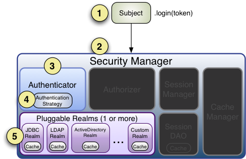
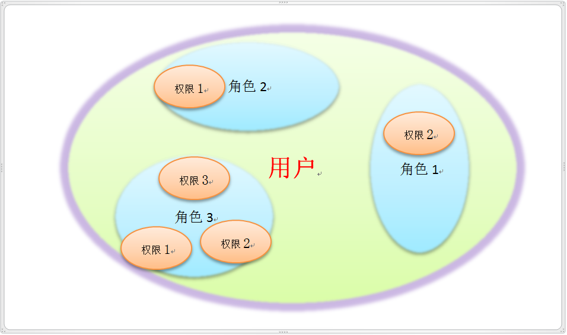

# Spring Boot
[参考](https://blog.csdn.net/cuiqwei/article/details/118188540?ops_request_misc=%257B%2522request%255Fid%2522%253A%25228981b59ad7bb535f1826580f08582080%2522%252C%2522scm%2522%253A%252220140713.130102334..%2522%257D&request_id=8981b59ad7bb535f1826580f08582080&biz_id=0&utm_medium=distribute.pc_search_result.none-task-blog-2~all~top_positive~default-1-118188540-null-null.142^v102^pc_search_result_base8&utm_term=springBoot&spm=1018.2226.3001.4187)
## 项目结构
1. java: 存放后端java代码，满足mvc的结构并进行扩展，略
2. resources: 存放配置文件以及静态资源和模板文件，重点说明这两个:
   - 静态资源：如js、html、css等等，静态资源可被直接通过名字访问，不需要经过controller，如果controller返回需要加后缀。而要在后端获取静态资源要用到Resource接口，下面说。
   - 模板文件：当你集成了类似thymeleaf这样的模板引擎时，模板文件会被放置在这个目录下。模板文件通常用于生成动态的HTML页面，当然也可以放其他类型模板。模板视图可以被控制器返回，无需后缀名且为类路径，然后由模板引擎进行渲染。
   - Resource接口：  
     - 常用实现类：
       - ClassPathResource：用于加载类路径下的资源。
       - FileSystemResource：用于加载文件系统中的资源。
       - UrlResource：用于加载通过 URL 访问的资源，例如 HTTP、FTP 等。
       - ServletContextResource：用于加载 Servlet 上下文相关的资源。
     - 常用方法：
       - exists()：检查资源是否存在。
       - isReadable()：检查资源是否可读。
       - 各种get方法：获取资源的各种信息，如文件名、URL、输入输出流、文件内容、文本长度等。
       - ResourceLoader，spring常用的资源加载，用getResource()获取资源，其他用法类似上面。
   - 另外这里说明一下RestController和Controller的注解，RestController实际上是Controller和ResponseBody的组合，即返回的数据包括视图名都会自动转为json格式，对于返回json的数据可以直接写这个而不用一个个写ResponeBody。但对于需要返回试图名的控制器需要要Controller。
   - 返回视图加`/`是在当前目录找，不加是在更目录找
## 一些配置可能的配置：
这里可以用properties文件，也可以用yml文件，内容一样只是格式不一样，prop就不说了，下面用yml演示
1. logback配置：
```yml
logging:
  config: logback.xml  # 指定logback配置文件路径
  level:
    com.CloudWhite.SpringMvcTest.Dao: trace # 指定包路径下的日志级别
```
1. 配置微服务：
```yml
server: port=8080 # 端口号
address: localhost # 地址
url: http://localhost:8002 # 这里可以在分个层写别名
# 微服务的地址,微服务如用户名，密码等等略
```
这里配置了的话，就可以在其他类里用`@Value("${url}")`来获取配置的url
## 集成mybatis：**这里注意版本兼容，非常重要**
1. 依赖：`org.mybatis.mybatis`和`org.mybatis.mybatis-spring `
2. 配置(可以对照着xml理解)：
```yml
# 服务端口号
server:
  port: 8080 
spring:
  datasource: # 数据库配置
    driver-class-name: com.mysql.jdbc.Driver
    url: jdbc:mysql://localhost:3306/usermanagesystem?useUnicode=true&characterEncoding=utf-8&useSSL=false&serverTimezone=Asia/Shanghai
    username: root
    password: 123456
    hikari: #连接池，可不用
      maximum-pool-size: 10 # 最大连接池数
      max-lifetime: 1770000
 
mybatis:
  # 指定别名设置的包为所有entity
  type-aliases-package: com.itcodai.course10.entity
  configuration:
    map-underscore-to-camel-case: true # 驼峰命名规范
  mapper-locations: # mapper映射文件位置
    - classpath:mapper/*.xml
  config-location: classpath:mybatis-config.xml #可以导入mybits主配置文件来配置其他内容 
```
这里没有配置MapperScannerConfigurer，因为springBoot可以在启动类加@MapperScan("mapper所在的包")来扫描mapper，也可以在mapper层加@Mapper注解来扫描mapper，但这样要每个mapper写一遍
此时整合了mybatis的springboot的控制器就可以直接调用service层的方法了，但注意此时不用getBean()了，所以只能用依赖注入了获取service层的方法，当然这样更简单。
## 一些常用注解（上面或下面提到的略）
- @Scheduled：定时任务，需要在启动类加@EnableScheduling注解启用
  - fixedRate：指定任务执行的固定时间间隔，单位是毫秒
  - fixedDelay：指定任务执行完成后到下一次任务开始的固定时间间隔，单位为毫秒，和上面区别是fixedRate忽略了任务执行时间。
  - initialDelay：用来设置任务首次执行的延迟时间，单位是毫秒
  - cron：借助 Cron 表达式来指定任务的执行时间。Cron 表达式是一个字符串，由 6 或 7 个字段构成，分别表示秒、分、时、日、月、周、年（年为可选字段）。如`0 0 12 * * ?`每天中午 12 点触发
## 启动时执任务
1. 实现ApplicationRunner接口：
```java
@Component
public class exmaple implements ApplicationRunner {
    @Override
    public void run(ApplicationArguments args) {
       // 这里写要执行的任务代码
    }
}
```
2. 使用 @PostConstruct 初始化(推荐)
```java
@Component
public class BloomFilterInitializer {
    @PostConstruct
    public void initBloomFilter() {
        // 这里写要执行的任务代码
    }
}

```
3. 使用@EventListener(ApplicationReadyEvent.class)注解，同PostConstruct用法，这个可以启动后运行，这一解决一些Hiberate的问题
## 集成swagger：
swagger主要是为了接口文档，便于代码理解和测试
1. 依赖：
2. 常用注解：
   - 实体类的
     - @ApiModel 注解用于实体类，表示对类进行说明，用于参数用实体类接收。
     - @ApiModelProperty 注解用于类中属性，表示对 model 属性的说明或者数据操作更改。
   - controller的:
     - @Api 注解用于类上，表示标识这个类是 swagger 的资源。
     - @ApiOperation 注解用于方法，表示一个 http 请求的操作。
     - @ApiParam 注解用于参数上，用来标明参数信息。
- 配置类：
```java
@Configuration
@EnableSwagger2
public class SwaggerConfig {
 
    @Bean
    public Docket createRestApi() {
        return new Docket(DocumentationType.SWAGGER_2)
                // 指定构建api文档的详细信息的方法：apiInfo()
                .apiInfo(apiInfo())
                .select()
                // 指定要生成api接口的包路径，这里把controller作为包路径，生成controller中的所有接口
                .apis(RequestHandlerSelectors.basePackage("com.itcodai.course06.controller"))
                .paths(PathSelectors.any())
                .build();
    }
 
    /**
     * 构建api文档的详细信息
     * @return
     */
    private ApiInfo apiInfo() {
        return new ApiInfoBuilder()
                // 设置页面标题
                .title("Spring Boot集成Swagger2接口总览")
                // 设置接口描述
                .description("跟一起学Spring Boot第06课")
                // 设置联系方式
                .contact("测试，" + "www.baidu.com")
                // 设置版本
                .version("1.0")
                // 构建
                .build();
    }
}
```
但目前swagger2和springboot3.x版本不兼容，所以要把springboot版本降到2.x，不然会报错
如果用springboot3.x,可以用Springdoc - OpenAPI，如上五个注解如api对应Tag、apimodel和apimodelproperties对应Schema，这些参数变成了name和description，ApiOperation对应Operation，参数变成了summary和description，ApiParam对应Parameter，参数变成了description和是否必填，yml可以加一些配置：
```yml
springdoc:
  api-docs:
    path: /api-docs
  swagger-ui:
    path: /swagger-ui.html
```
## 集成thymeleaf
1. 依赖：
另外，在html页面上如果要使用thymeleaf模板，需要在页面标签中引入：`<html xmlns:th="http://www.thymeleaf.org">`
1. 配置：springboot已经默认级别配置好了，可能就一个受否开启页面缓存需要注意，默认是开启的，如要关闭：`spring.thymeleaf.cache=false #关闭缓存`
2. 使用：
访问静态界面，这里上面有说，一般由于写错误页面，如500、404等等，thymeleaf会自动识别并返回错误页面，当然也可以自己写。  
然后就是一些thymeleaf操作了，我们用一个例子说明：
```html
<form action="" th:each="blogger : ${list}" >
    用户编号：<input name="id" th:value="${blogger.id}"/><br>
    用户姓名：<input type="text" name="password" th:value="${blogger.name}"/><br>
    登录密码：<input type="text" name="username" th:value="${blogger.getPass()}"/>
</form>
```
可以看出thymeleaf可以用th:操作类型来进行操作，${}替换参数
以下是一些常见操作类型：
- th:object: 获取传递的对象
- th:属性名：设置属性 如value、style、src、on事件名、href、action等等
- th:if	th:case th:default ：相当于java中的switch case default	
- th:unless	条件判断和th:if相反	Login
此外，thymeleaf还允许内嵌一些java代码，如三元表达式、字符串连接等等  
除了`${}`可以替换参数，@{}可以替换url  
现在前端框架很成熟的进行动态渲染页面，**所以thymeleaf主要是用于静态页面的渲染**。
## 全局异常处理
1. 配置：
写一个配置类，只需在该类加上@ControllerAdvice注解即可检测全局异常，然后就可以写各种异常的处理方法，以下是一个请求缺失参数异常的例子：
```java
@ControllerAdvice
@RestController
public class GlobalException {
    // 打印log
    private static final Logger logger = LoggerFactory.getLogger(GlobalException.class);
    @ExceptionHandler(MissingServletRequestParameterException.class)//这里是异常类型
    @ResponseStatus(value = HttpStatus.BAD_REQUEST)//这里是返回状态码
    public JsonResult handleHttpMessageNotReadableException(
            MissingServletRequestParameterException ex) {
        logger.error("缺少请求参数，{}", ex.getMessage());
        return new JsonResult("400", "缺少必要的请求参数");
    }
}
```
然后当有控制器有异常就可以有logger打印出来你所配置的异常信息了。  
***然后就是自定义异常，只需要把我们自定义的异常写进全局异常类即可。对于自定义异常，需要继承Throwable类，这样当你定义的异常被抛出时，就会被全局异常类捕获。  ***
关于异常，以下是一些常见异常（指springboot的）：
- 启动类：
  - SpringApplicationRunException：启动异常
  - IllegalStateException：非法状态异常，启动时可能因为配置冲突或者上下文状态异常导致
- bean异常： 
  - BeanCreationException：Bean创建异常，可能是因为Bean的配置错误或者依赖关系问题导致
  - NoSuchBeanDefinitionException：找不到Bean定义异常，可能是因为Bean的名称或者类型错误导致
- 数据库异常： 
  - DataAccessException及其子类：数据访问异常，可能是因为数据库连接问题或者SQL语句错误导致
  - TransactionSystemException：事务系统异常，可能是因为事务配置错误或者事务状态异常导致
- 请求异常
  - HttpRequestMethodNotSupportedException：HTTP请求方法不支持异常，可能是因为请求的HTTP方法不被支持导致
  - HttpMediaTypeNotSupportedException：HTTP媒体类型不支持异常，可能是因为请求的媒体类型不被支持导致
  - MethodArgumentNotValidException：方法参数无效异常，可能是因为请求参数无效导致
  - MissingServletRequestParameterException：缺少请求参数异常，可能是因为请求缺少必要的参数导致
## 集成AOP
集成AOP方法在SpringAOP讲过，这里有一些新的注解
- Pointcut(切入点表达式)：写切入点表达式，以后就不用再每个都写了，只需要写该注解标注的函数名带扩号即可
- AfterReturning(切入点表达式，returning=返回的值)：在After之前，是After的增强注解，就是还能够获取返回值
- AfterThrowing(切入点表达式，throwing=异常名)：在After之前,是After的增强注解，就是还能够获取异常
## 事务：
SpringBoot的事务管理非常简单，只需要在方法上加上@Transactional(rollbackFor=异常类型)注解即可，但由于是自动的不是手动通过sqlseeion更灵活来来提交回滚，所以这里有一些注意的问题：
1. SpringBoot默认只有遇到RuntimeException和error才会回滚，比如遇到SQL异常就不会回滚了，所以一定要指定异常
2. 当我们使用try-catch捕获异常但没有抛出时，会检测不到异常，所以要抛出异常
3. 事务的有范围的，比如我们改一个方法锁，那此时事务的范围比锁大，此时方法被锁了事务检测不到异常自然也无法回滚，此时我们应该把锁定义到更大的范围如类上。故我们应该注意事务范围
## 监听器及各种上下文
### 我们先了解一下各种上下文：
1. ApplicationContext接口：
   1. 作用：
      - Bean 管理：ApplicationContext负责创建、配置和管理应用中的所有 Bean 对象。
      - 资源加载：可以加载各种资源，如文件、URL、类路径下的资源等。通过资源加载功能，应用可以方便地获取外部资源，如配置文件、图片等。
      - 事件发布与监听：支持事件机制，允许应用程序发布和监听事件。当某个事件发生时ApplicationContext 会将事件通知给所有注册的监听器，从而实现组件之间的解耦。
      - 国际化支持：提供国际化支持，允许应用根据不同的语言环境显示不同的文本信息。
   2. 常用实现类：
      - AnnotationConfigApplicationContext：用于加载基于注解的配置类，通常用于 Spring Boot 应用程序。
      - ClassPathXmlApplicationContext：用于加载类路径下的 XML 配置文件。
      - FileSystemXmlApplicationContext：用于加载文件系统中的 XML 配置文件。 
   3. 常用方法：
      - getBean()：通过bean名称、类名.class获取bean实例
      - getResource(指定路径)：获取资源
      - 以及各种get方法
      - containsBean():判断是否包含bean 各种is方法
      - publishEvent(事件)：发布事件 
2. ServletContext类： 
   1. 作用
   - 共享数据：ServletContext 提供了一个在整个 Web 应用程序中共享数据的机制。多个 Servlet、Filter 或其他 Web 组件可以通过 ServletContext 来存储和获取共享数据，实现不同组件之间的信息传递和交互。
   - 访问资源：它允许Servlet访问Web应用程序的资源，如配置文件、静态资源等。通ServletContext，可以获取资源的输入流，从而读取资源的内容。
   - 获取服务器信息：ServletContext 提供了获取服务器相关信息的方法。
   1. 常用方法：
      - get/setAttribute()：获取/设置属性
      - removeAttribute()：移除属性
      - getRealPath()：获取资源的真实路径
      - getResourceAsStream()：获取资源的输入流
      - getInitParameter()：获取初始化参数
      - getRequestDispatcher：获取请求调度器
      - 等等  
### 监听器    
1. 监听servlet上下文，我们要实现ApplicationListener接口，然后重写onApplicationEvent方法，然后在方法里写我们要监听的事件。我们来举个例子，比如我们对于一些需要实时更新但不频繁的信息，我们在每次刷新时把当前页面信息存入ServletContext，即Aplication存储，这种机制叫缓存，之后我们直接从缓存中获取即可，这样大大减少了数据库到的开销。对应监听器如下：
```java
@Component
public class ContextRefreshedEventListener implements ApplicationListener<ContextRefreshedEvent> {
    @Override
    public void onApplicationEvent(ContextRefreshedEvent event) {
        ApplicationContext applicationContext = event.getApplicationContext();
        userService userService = applicationContext.getBean(userService.class);
        List<userInfo> userInfos = userService.showAllUserInfo();
        ServletContext application = applicationContext.getBean(ServletContext.class);
        application.setAttribute("userInfos",userInfos);
    }
}
```
**这里可以看到ApplicationListener是一个泛型，我们可以监听很多不同事件，还可以用来自定义监听器。**
1. 自定义监听器：  
显然我们只要自定义监听事件然后实现ApplicationListener接口即可。这里自定义事件只要继承ApplicationEvent类即可，这里构造函数有一个参数即数据源，即监听的对象。
1. 监听sesion：
当我们要监听session时，如需要session存储登录人数，我们需要实现HttpSessionListener接口，然后重写sessionCreated和sessionDestroyed方法，然后在方法里写我们要监听的事件。以下是一个例子：
```java
@Component
public class SessionListener implements HttpSessionListener {
    private static int OnlineCount;
    @Override
    public void sessionCreated(HttpSessionEvent event){
        HttpSession session = event.getSession();
        OnlineCount++;
        session.getServletContext().setAttribute("我登陆了",OnlineCount);
        //session.setAttribute("我登陆了",OnlineCount);
    }

    @Override
    public void sessionDestroyed(HttpSessionEvent event){
        HttpSession session = event.getSession();
        OnlineCount--;
        session.getServletContext().setAttribute("我下线了",OnlineCount);
        //session.setAttribute("我登陆了",OnlineCount);
    }
}
```
1. 监听ServletRequest：
都是一个道理，直接贴代码：
```java
@Component
public class servletRequestListener implements ServletRequestListener {
    @Override
    public void requestInitialized(ServletRequestEvent event){
        HttpServletRequest request = (HttpServletRequest) event.getServletRequest();
        System.out.println("请求sessionId："+request.getRequestedSessionId());
        System.out.println("请求url："+request.getRequestURL());
        request.setAttribute("url",request.getRequestURL());
    }

    public void requestDestroyed(ServletRequestEvent event){
        HttpServletRequest request = (HttpServletRequest) event.getServletRequest();
        System.out.println("来自："+request.getAttribute("uel")+"请求已销毁");
    }
}
```
***最后对于监听事件，有以下常见事件（可以额外了解一下生命周期）：***
- ApplicationStartingEvent：应用程序启动事件，用于系统级别初始化
- ApplicationEnvironmentPreparedEvent：应用程序的Environment（环境配置）准备好但上下文还未创建，用于在此时修改配置环境
- ApplicationContextInitializedEvent：应用程序上下文初始化完成，但还未加载任何bean，用于在此时修改应用程序上下文
- ApplicationPreparedEvent：应用程序准备好，此时可以访问bean，但还未刷新上下文，对上下文进行最后一次更改
- ApplicationStartedEvent：应用程序启动完成，用于初始化
- ApplicationReadyEvent：当 CommandLineRunner 和 ApplicationRunner 已经调用，应用程序已经准备好接收外部请求时触发。可以在这个阶段进行一些健康检查、发送通知等操作。
- ContextRefreshedEvent：应用程序上下文刷新完成，所有bean都已加载并初始化
- ContextClosedEvent：应用程序上下文关闭事件，在应用程序关闭时触发
- ApplicationClosedEvent：应用程序关闭事件，在应用程序关闭时触发,比ContextClosedEvent先触发
- RequestHandledEvent：在请求处理完成后触发，用于记录请求处理的详细信息
- SessionCreatedEvent 和 SessionDestroyedEvent：用于处理会话创建和销毁事件
## 拦截器及定义注解
1. 定义拦截器，实现HandlerInterceptor接口，重写preHandle、postHandle、afterCompletion方法。  
这里三个方法的区别：
   - preHandle：该方法的执行时机是，当某个 url 已经匹配到对应的 Controller 中的某个方法，且在这个方法执行之前。此时可以做一些判断然后决定是否拦截。
   - postHandle：在请求处理之后，视图渲染之前调用。
   - afterCompletion：在整个请求处理完成之后调用，即在视图渲染完成之后。  
那现在我们来举个例子： 
```java
public class MyInterceptor implements HandlerInterceptor{
    @Override
    public boolean preHandle(HttpServletRequest request, HttpServletResponse response, Object handler){
        HandlerMethod handlerMethod = (HandlerMethod) handler;
        Method method = handlerMethod.getMethod();
        System.out.println("方法执行前，确认是否拦截————");
        //这里返回false则拦截，true就不拦截
        return false;
    }
    @Override
    public void postHandle(HttpServletRequest request, HttpServletResponse response, Object handler, ModelAndView modelAndView){
        System.out.println("方法已经执行，准备渲染视图————");
    }
    @Override
    public void afterCompletion(HttpServletRequest request, HttpServletResponse response, Object handler, Exception ex){
        System.out.println("方法完成，抛出异常");
    }
}
```
这里时拦截的是请求故有request和response，而handler是拦截的对象，即拦截的方法。而postHandle在视图渲染之前，故有一个ModelAndView参数，即视图渲染之前的模型和视图。而afterCompletion在整个请求处理完成之后，故要抛出异常。  
这里有个HandlerMethod类，里面封装了请求的各种方法信息。  
***这里重点说一下HandlerMethod：HandlerMethod类是在springmvc中用于表示处理程序方法的类。它封装了一个方法对象和一个控制器对象，提供了对方法的各种操作和信息的访问。也叫是说只要是springmvc请求，基本都会有一个HandlerMethod对象。*** 而如果只是普通方法，除非自定义否则是不会自动把方法信息封装成一对象的。
1. 配置拦截器：
```java
@Configuration
public class interceptionConfig extends WebMvcConfigurationSupport {
    @Override
    protected void addInterceptors(InterceptorRegistry registry) {
        registry.addInterceptor(new MyInterceptor()).addPathPatterns("/**");
        super.addInterceptors(registry);
    }}
```
**这里的addPathPatterns是拦截的路径，`/**`是拦截所有路径**，一般就是拦截所有请求，具体视情况而定。  
但是这里有个问题，就是拦截器是全局的，即所有请求都会被拦截，静态资源也会被拦截，即视图都无法显示，所以即使我们拦截所有请求也要防止拦截静态资源。这里有两个方法：

```java
//方法一为重写addResourceHandlers方法，指定不拦截某些资源更灵活
@Override
    protected void addResourceHandlers(ResourceHandlerRegistry registry) {
        registry.addResourceHandler("/**").addResourceLocations("classpath:/static/");
        super.addResourceHandlers(registry);
    }
//方法二，直接改成实现WebMvcConfigurer接口，一劳永逸，对于没有额外要求的拦截器可以用这个
@Configuration
public class MyInterceptorConfig implements WebMvcConfigurer {
    @Override
    public void addInterceptors(InterceptorRegistry registry) {
        // 实现WebMvcConfigurer不会导致静态资源被拦截
        registry.addInterceptor(new MyInterceptor()).addPathPatterns("/**");
    }
}
```
1. 让特定方法不被拦截
```java
//定义这个注解，在不席位被拦截的方法上加上这个注解即可，这样更方便、更灵活，可与上面合使用
@Target(ElementType.METHOD)
@Retention(RetentionPolicy.RUNTIME)
public @interface UnInterception {
}
```
但注意这里还要在拦截器里加上判断：
```java
if (handler instanceof HandlerMethod) {
            HandlerMethod handlerMethod = (HandlerMethod) handler;
            Method method = handlerMethod.getMethod();
            // 检查方法是否有 @UnInterception 注解
            if (method.isAnnotationPresent(UnInterception.class)) {
                System.out.println("方法标记了 @UnInterception 注解，不进行拦截");
                return true; // 有 @UnInterception 注解，不拦截
            }
        }
```
这里有个isAnnotationPresent 方法，用于判断方法是否有指定注解。  
那么现在就可以来看如何定义注解：

      1. @interface关键字修饰方法
            2.2. 定义元注解，以下是常用元注解：

- @Target：指定注解的作用目标，如方法（ElementType.METHOD）、类接口或枚举类(.TYPE)、成员变量(.FIELD)、方法参数（.PARAMETER）、构造方法(.CONSTRUCTOR)、局部变量(.LOCAL_VARIABLE)上。 
- @Retention：指定注解的保留策略，如运行时（RetentionPolicy.RUNTIME，最常用的写法）、编译时（.CLASS，运行时不可读）、源文件(.SOURCE，编译后消失)等等
- @Documented：指定注解是否包含在 JavaDoc 文档中
- @Inherited：指定注解是否可继承
- @Repeatable：指定注解是否可重复使用等等
  3. 定义注解的属性，在方法里定义，格式为`lei'x属性名() default "默认值";`
### websocket的握手拦截器
这个要实现HandshakeInterceptor接口，用于专门拦截websocket的握手请求，拦截器的一种。  
它的生命周期只有两个：
- preHandshake：该方法的执行时机是，握手之前，此时可以进行一些握手前的操作，如验证身份、检查参数等。
- afterHandshake：在握手完成后调用，用于在握手过程中进行额外的处理。
常用于身份验证、参数校验等，和之前的http拦截差不多作用，直接贴代码（直接写具体例子了，建议先看WebSocket部分和vue的webSocket部分）
```java
public class WebSocketAuthInterceptor implements HandshakeInterceptor {  // 实现HandshakeInterceptor接口
    public boolean beforeHandshake(ServerHttpRequest request, ServerHttpResponse response,
                                   WebSocketHandler wsHandler, Map<String, Object> attributes) {
        if (!(request instanceof ServletServerHttpRequest)) return true;
        HttpServletRequest servletRequest = ((ServletServerHttpRequest) request).getServletRequest();
        String token = servletRequest.getParameter("token");    // 从URL获取token
        if (token == null || token.isEmpty()) {
            return false;
        }
        Claims claims;
        try {
            claims = JWTUtils.parseToken(token);
        } catch (Exception e) {
            return false;
        }
        if (!JWTUtils.validateToken(token)) {
            return false;
        }
        attributes.put("userId", claims.get("userId"));  // 存储到WebSocketSession中
        attributes.put("username", claims.get("username"));
        attributes.put("roleName", claims.get("roleName"));
        return true;
    }

    @Override
    public void afterHandshake(ServerHttpRequest request, ServerHttpResponse response,
                               WebSocketHandler wsHandler, Exception exception) {
        // 握手完成后调用，可以进行一些额外的处理
    }
}
// 然后添加至配置类即可
@Configuration
@EnableWebSocket
public class WebSocketConfig implements WebSocketConfigurer {
    @Override
    public void registerWebSocketHandlers(WebSocketHandlerRegistry registry) {
        registry.
            addHandler(new WebSocketHandler(), "/websocket")
            .addInterceptors(new WebSocketAuthInterceptor()) // 添加握手拦截器
            .setAllowedOrigins("*");
    }
}
```
## 跨域
当接收请求的接口和请求的页面不在同一个域名下时，就会出现跨域问题，除了微服务、使用第三方API外，现代的前后端分离也经常需要跨域，所以我们要解决跨域问题。
在局部情况下，我们用`@CrossOrigin`注解来解决跨域问题，该注解参数如下（都为可选参数）：

- origins：指定允许访问的源地址列表，默认为 *。你可以指定一个或多个允许的跨域请求的源地址（多个逗号隔开即可）。
- methods：指定允许的 HTTP 方法列表，默认为 *。你可以指定一个或多个允许的 HTTP 方法（RequestMethod.Get、Post、Put等等）。
- allowedHeaders：指定允许的请求头列表，默认为 *。你可以指定一个或多个允许的请求头。
- exposedHeaders：指定允许暴露给客户端的响应头列表，默认为 *。你可以指定一个或多个允许暴露给客户端的响应头
- allowCredentials：指定是否允许发送凭据（如 Cookies），默认为 false。
- maxAge：指定预检请求的最大有效时间（以秒为单位），默认为 1800 秒（30 分钟）。
当需要较多配置时，我们可以使用@Configuration注解来创建一个配置类，然后在配置类上加上@EnableWebMvc注解来开启WebMvc，然后在配置类里加上@CrossOrigin注解来解决跨域问题，如下：
```java
@Configuration
public class CorsConfig {
    @Bean
    public CorsFilter corsFilter() {
        // 创建 CORS 配置对象
        CorsConfiguration config = new CorsConfiguration();
        // 允许的跨域请求源，可以使用具体的域名，也可以使用通配符 "*" 允许所有源
        // 注意：在生产环境中，建议使用具体的域名，避免使用通配符，以增强安全性
        config.addAllowedOriginPattern("*");
        // 允许的请求方法，如 GET、POST、PUT、DELETE 等
        config.addAllowedMethod("*");
        // 允许的请求头，如 Content-Type、Authorization 等
        config.addAllowedHeader("*");
        // 允许浏览器获取的响应头
        config.addExposedHeader("*");
        // 是否允许携带凭证，如 Cookie、HTTP 认证信息等
        config.setAllowCredentials(true);
        // 预检请求的缓存时间（秒），在此时间内，相同的预检请求将不再发送
        config.setMaxAge(3600L);
        // 创建基于 URL 的 CORS 配置源
        UrlBasedCorsConfigurationSource source = new UrlBasedCorsConfigurationSource();
        // 对所有接口都应用 CORS 配置
        source.registerCorsConfiguration("/**", config);
        // 创建并返回 CORS 过滤器
        return new CorsFilter(source);
    }
}    
```
## 集成redis
### 介绍及使用场景
Redis 是一种非关系型数据库（NoSQL），NoSQL 是以 key-value 的形式存储的，和传统的关系型数据库不一样，不一定遵循传统数据库的一些基本要求，比如说 SQL 标准，ACID 属性，表结构等等，这类数据库主要有以下特点：非关系型的、分布式的、开源的、水平可扩展的。
NoSQL 使用场景有：对数据高并发读写、对海量数据的高效率存储和访问、对数据的高可扩展性和高可用性等等。
Redis 的 key 可以是字符串、哈希、链表、集合和有序集合。value 类型很多，包括 String、list、set、zset。这些数据类型都支持 push/pop、add/remove、取交集和并集以及更多更丰富的操作，Redis 也支持各种不同方式的排序。为了保证效率，数据都是在缓存在内存中，它也可以周期性的把更新的数据写入磁盘或者把修改操作写入追加的记录文件中。
Redis 集群和 Mysql 是同步的，首先会从 redis 中获取数据，如果 redis 挂了，再从 mysql 中获取数据，这样网站就不会挂掉。
也就是说，对于一下短期热点数据，我们可以把它存到 redis 中，这样可以提高访问速度，减少数据库的访问量，从而提高网站的性能。对于需要长期保存的数据，我们可以把它存到 mysql 中，这样可以保证数据的安全性。两者之间的数据，我们两者都存，可以通过定时任务来同步。
### 集成redis
1. 下载配置redis，加上redis依赖：
2. 配置：
```yml
spring:
  #ridis配置
  data:
    redis:
      database: 5
      host: 192.168.202.1 #自己的地址
      port: 6379 #redis监听端口，默认6379
      password: 123456
      jedis:
        pool:
          max-idle: 1000 # 连接池中的最大空闲连接，默认值是8。
          min-idle: 0 # 连接池中的最小空闲连接，默认值是0
          max-active: -1 #最大jedis是隶属，-1为不限制
          max-wait: 5000 #最大连接等待时间，单位ms，默认-1为不限制
```
### redis使用（直介绍最常用的，其他自己去查）：
有两个 redis 模板：RedisTemplate 和 StringRedisTemplate。我们不使用 RedisTemplate，RedisTemplate 提供给我们操作对象，操作对象的时候，我们通常是以 json 格式存储，但在存储的时候，会使用 Redis 默认的内部序列化器；导致我们存进里面的是乱码之类的东西。当然了，我们可以自己定义序列化，但是比较麻烦，所以使用 StringRedisTemplate 模板。StringRedisTemplate 主要给我们提供字符串操作，我们可以将实体类等转成 json 字符串即可，这里用jackson库等处理即可。  
1. redis:string:
```java
@Resource //注入stringRedisTemplate
private StringRedisTemplate stringRedisTemplate;
//opsForValue来获取ValueOperations对象即可进行各种操作了
public void setString(String key,String value){
    ValueOperations<String,String> valueOperations = stringRedisTemplate.opsForValue();
    valueOperations.set(key,value);  //这里set方法还可以设置过期时间和时间单位，不设置的话默认不过期
}

public String getString(String key){
    ValueOperations valueOperations = stringRedisTemplate.opsForValue();
    valueOperations.get(key);
}
//对于不用注解，可以接上面，存为字符串后用Jason库处理未JSON字符串即可，如下
String json = objectMapper.writeValueAsString(obj);
```
2. hash:这个就是上面的在加一个key（即hash的key）,将Operations换成HashOperations、opsForValue换成opsForHash即可，get和set变成了put和get 
3. list：将Operations换成ListOperations、opsForValue换成opsForList即可，get和set变成了leftPush和rightPop  
*这里注意之最后都会返回一个json字符串，所以要在设置时进行数值转换*
### 相关注解
1. @Cacheable：方法执行前先查缓存，有则返回，无则执行方法并缓存结果
   - value: 缓存的名称，每个缓存名称下面可以有多个 key。
   - key: 缓存的 key，支持 SpEL 表达式。
   - condition: 缓存的条件，只有当条件为 true 时才缓存，支持 SpEL 表达式。
   - unless: 方法执行完后判断是否缓存结果，返回 true 不缓存
   - sync: 是否异步执行，默认为 false。
2. @putCache：这个始终会执行方法，然后将结果放入缓存中。显然用于和@Scheduled搭配使用，定时更新缓存
   - 支持value、key、condition
3. @CacheEvict：清除缓存
   - 支持value、key、condition
   - allEntries：是否清除所有缓存，默认为 false（指清除整个value而不是整个redis数据库）。
   - beforeInvocation：是否在方法执行前清除缓存，默认为 false。 
4. @Chaching: 组合注解，可以同时使用多个@Cacheable、@CachePut、@CacheEvict，如`@Caching(evict = {@CacheEvict(value = "userCache", key = "#userId"),@CacheEvict(value = "postCache", key = "#userId")})`
5. @EnableCaching ：开启缓存功能，在启动类上加上这个注解即可
6. 这里注意，用注解的话系统会自动进行JDK序列化，但我们一般对于基本数值类型和字符串我们是直接存的，而对象我们使用JSON序列化，所以我们要在配置类里加上：
```java
@Configuration
public class redisConfig {
    @Bean
    public CacheManager cacheManager(RedisConnectionFactory factory) {
        RedisCacheConfiguration config = RedisCacheConfiguration.defaultCacheConfig()
                .entryTtl(Duration.ofHours(1))  // 缓存过期时间，可自定义
                .serializeKeysWith(RedisSerializationContext.SerializationPair.fromSerializer(new StringRedisSerializer()))
                .serializeValuesWith(RedisSerializationContext.SerializationPair.fromSerializer(new GenericJackson2JsonRedisSerializer()));

        return RedisCacheManager.builder(factory)
                .cacheDefaults(config)
                .build();
    }

    @Bean
    public RedisTemplate<String, Object> redisTemplate(RedisConnectionFactory connectionFactory) {
        RedisTemplate<String, Object> template = new RedisTemplate<>();
        template.setConnectionFactory(connectionFactory);

        // key 用 String 序列化
        StringRedisSerializer stringSerializer = new StringRedisSerializer();
        template.setKeySerializer(stringSerializer);
        template.setHashKeySerializer(stringSerializer);

        // value 用 GenericJackson2JsonRedisSerializer（自动处理类型信息）
        ObjectMapper mapper = new ObjectMapper();
        mapper.setVisibility(PropertyAccessor.ALL, JsonAutoDetect.Visibility.ANY);
        mapper.activateDefaultTyping(
                BasicPolymorphicTypeValidator.builder()
                        .allowIfSubType("com.CloudWhite")
                        .build(),
                ObjectMapper.DefaultTyping.NON_FINAL
        );
        GenericJackson2JsonRedisSerializer serializer = new GenericJackson2JsonRedisSerializer(mapper);

        template.setValueSerializer(serializer);
        template.setHashValueSerializer(serializer);

        template.afterPropertiesSet();
        return template;
    }
}
```
## 集成WebSocket
### 介绍：
WebSocket协议是基于TCP的一种新的网络协议。它实现了浏览器与服务器全双工(full-duplex)通信——允许服务器主动发送信息给客户端。  
初次接触 WebSocket 的人，都会问同样的问题：我们已经有了 HTTP 协议，为什么还需要另一个协议？它能带来什么好处？答案很简单，因为 HTTP 协议有一个缺陷：**通信只能由客户端发起**，HTTP 协议做不到服务器主动向客户端推送信息。  
很简单的例子就是实时通信，要想知道有没有消息发来只能是客户端不断地向服务器发送请求，资源消耗和性能消耗都很大。当客户端发送一个 WebSocket 请求时，服务器将发送一个协议响应以确认请求。在握手期间，客户端和服务器将协商使用的协议版本、支持的子协议、支持的扩展选项等。一旦握手完成，连接将保持打开状态，客户端和服务器就可以在连接上实时地传递数据。  
- WebSocket有如下生命周期：  
  1. 连接建立阶段（Connection Establishment）： 在这个阶段，客户端和服务器之间的 WebSocket 连接被建立。客户端发送一个  WebSocket 握手请求，服务器响应一个握手响应，然后连接就被建立了。  
  2. 连接开放阶段（Connection Open）： 在这个阶段，WebSocket 连接已经建立并开放，客户端和服务器可以在连接上互相发送数据。
  3. 连接关闭阶段（Connection Closing）： 在这个阶段，一个 WebSocket 连接即将被关闭。它可以被客户端或服务器发起，通过发送一个关闭帧来关闭连接。
  4. 连接关闭完成阶段（Connection Closed）： 在这个阶段，WebSocket 连接已经完全关闭。客户端和服务器之间的任何交互都将无效。
- WebSocket的消息格式
WebSocket的消息格式与 HTTP 请求和响应的消息格式有所不同。WebSocket 的消息格式可以是文本或二进制数据，并且 WebSocket 消息的传输是在一个已经建立的连接上进行的，因此不需要再进行 HTTP 请求和响应的握手操作。  
WebSocket 消息格式由两个部分组成：消息头和消息体。
1. 消息头包含以下信息：
   - FIN： 表示这是一条完整的消息，一般情况下都是1。
   - RSV1、RSV2、RSV3： 暂时没有使用，一般都是0。
   - Opcode： 表示消息的类型，包括文本消息、二进制消息等。
   - Mask： 表示消息是否加密。
   - Payload length： 表示消息体的长度。
   - Masking key： 仅在消息需要加密时出现，用于对消息进行解密。
2. 消息体就是实际传输的数据，可以是文本或二进制数据。
### 集成
依赖`org.springframework.boot.spring-boot-starter-websocket`  
几种还有自带的jakata实现的websocket，我们先说这个：
```java
//先写一个WebSocket服务器
@ServerEndpoint("/websocket")
public class WebSocketServer {
    private static final Set<Session> sessions = Collections.synchronizedSet(new HashSet<Session>());
    @OnOpen
    public void onOpen(Session session) {
        System.out.println("Connection opened: " + session.getId());
        sessions.add(session);
    }

    @OnMessage
    public void onMessage(Session session, String message) throws IOException {
        System.out.println("Received message: " + message);
        session.getBasicRemote().sendText("Server received: " + message);
    }

    @OnClose
    public void onClose(Session session) {
        System.out.println("Connection closed: " + session.getId());
        sessions.remove(session);
    }
}
//然后启用它
@Configuration
public class WebSocketEndpointExporterConfig {
    @Bean
    public ServerEndpointExporter serverEndpointExporter() {
        return new ServerEndpointExporter();
    }
}
```
而SpringBoot的webscoket更常用，更适合大规模业务扩展，配置如下：
```java
// 同样先写一个WebSocket服务器
public class WebSocketHandler extends TextWebSocketHandler {
    @Override
    public void afterConnectionEstablished(WebSocketSession session) {
        System.out.println("Connected: " + session.getId());
    }

    @Override
    protected void handleTextMessage(WebSocketSession session, TextMessage message) throws Exception {
        System.out.println("Received: " + message.getPayload());
        session.sendMessage(new TextMessage("Server received: " + message.getPayload()));
    }

    @Override
    public void afterConnectionClosed(WebSocketSession session, CloseStatus status) {
        System.out.println("Disconnected: " + session.getId());
    }
}
//然后配置启用
@Configuration
@EnableWebSocket
public class WebSocketConfig implements WebSocketConfigurer {
    @Override
    public void registerWebSocketHandlers(WebSocketHandlerRegistry registry) {
        registry.addHandler(new WebSocketHandler(), "/websocket").setAllowedOrigins("*");
    }
}
```
然后直接在浏览器里访问`ws://localhost:8080/websocket`即可连接，然后就可以进行通信了。  
这边注意WebSocket协议和http协议无关系，那么之前http拦截器对websocket不生效了也就拿不到用户上下文，所以要写一个websocke的拦截器。
## 集成Shiro
### 介绍：
1. Shiro 三大核心组件：
   1. Subject：认证主体。它包含两个信息：Principals和Credentials,这俩具体是：
      - Principals：身份。可以是用户名，邮件，手机号码等等，用来标识一个登录主体身份；
      - Credentials：凭证。常见有密码，数字证书等等。   
       简单来说，就是用户的认证信息。
   2. SecurityManager：安全管理员。这是 Shiro 架构的核心，它就像 Shiro 内部所有原件的保护伞一样。我们在项目中一般都会配置 SecurityManager，开发人员大部分精力主要是在 Subject 认证主体上面。我们在与 Subject 进行交互的时候，实际上是 SecurityManager 在背后做一些安全操作。
   3. Realms：Realms 是一个域，它是连接 Shiro 和具体应用的桥梁，当需要与安全数据交互的时候，比如用户账户、访问控制等，Shiro 就会从一个或多个 Realms 中去查找。我们一般会自己定制 Realm，这在下文会详细说明。
2. Shiro 身份和权限认证  
 
- Step1：应用程序代码在调用 Subject.login(token) 方法后，传入代表最终用户的身份和凭证的 AuthenticationToken 实例 token。
- Step2：将 Subject 实例委托给应用程序的 SecurityManager（Shiro的安全管理）来开始实际的认证工作。这里开始真正的认证工作了。
- Step3，4，5：然后 SecurityManager 就会根据具体的 realm 去进行安全认证了。 从图中可以看出，realm 可以自定义（Custom Realm）。
1. Shiro 权限认证:  
权限认证，也就是访问控制，即在应用中控制谁能访问哪些资源。在权限认证中，最核心的三个要素是：权限，角色和用户。
   - 权限（permission）：即操作资源的权利，比如访问某个页面，以及对某个模块的数据的添加，修改，删除，查看的权利；
   - 角色（role）：指的是用户担任的的角色，一个角色可以有多个权限；
   - 用户（user）：在 Shiro 中，代表访问系统的用户，即上面提到的 Subject 认证主体
   
一个用户可以有多个角色，而不同的角色可以有不同的权限，也可由有相同的权限。比如说现在有三个角色，1是普通角色，2也是普通角色，3是管理员，角色1只能查看信息，角色2只能添加信息，管理员都可以，而且还可以删除信息，类似于这样。

有上面的介绍，第一步自然是自定义域，我们可以继承AuthorizingRealm类，然后重写doGetAuthenticationInfo和doGetAuthorizationInfo方法，这里有一个例子：
```java
public class loginRealm extends AuthorizingRealm {
    @Autowired
    private userService userService;

    public static StringBuffer remindMessage;
    //用来登录前验证用户，获取认值信息
    @Override
    protected AuthenticationInfo doGetAuthenticationInfo(AuthenticationToken authenticationToken) throws AuthenticationException {
        //用authenticationToken.getPrincipal获取用户名
        String username = (String) authenticationToken.getPrincipal();
        //有用户名判断是否有该用户
        userInfo userInfo = userService.getUserInfoByUsername(username);
        if(userInfo!=null){
            //用SecurityUtils获取认证主体并将该用户存入session
            SecurityUtils.getSubject().getSession().setAttribute(userInfo.getUsername(),userInfo);
            //传入用户信息进行认证
            AuthenticationInfo  authenticationInfo = new SimpleAuthenticationInfo(userInfo.getUsername(),userInfo.getPassword(),"loginRealm");
            return authenticationInfo;
        }else {
            remindMessage.append("账号或密码错误！");
            return null;
        }
    }
    //用来登录后授予角色和权限
    @Override
    protected AuthorizationInfo doGetAuthorizationInfo(PrincipalCollection principalCollection){
        //用principalCollection.getPrimaryPrincipal()得到用户名
        String username = (String) principalCollection.getPrimaryPrincipal();
        SimpleAuthorizationInfo authorizationInfo = new SimpleAuthorizationInfo();
        //给该用户设置角色和权限
        authorizationInfo.setRoles(userService.getRoleNameByUsername(username));
        authorizationInfo.setStringPermissions(userService.getPremissionInfoByUsername(username));
        return authorizationInfo;
    }
}
```
然后在配置类将所有域传上去：
```java
@Configuration
public class RealmConfig {
    @Bean
    public loginRealm loginRealm() {
        loginRealm loginRealm = new loginRealm();
        System.out.println("Auth域注册完成————");
        return loginRealm;
    }}
```
在配置安全管理器托管域：
```java
@Bean
    public DefaultWebSecurityManager securityManager() {
        // 将自定义realm加进来
        DefaultWebSecurityManager securityManager = new DefaultWebSecurityManager(loginRealm());
        System.out.println("====securityManager注册完成====");
        return securityManager;
    }
```
最后配置shiroFilter：
```java
@Bean
    public ShiroFilterFactoryBean shiroFilter(DefaultWebSecurityManager securityManager) {
        // 定义shiroFactoryBean
        ShiroFilterFactoryBean shiroFilterFactoryBean=new ShiroFilterFactoryBean();

        // 设置自定义的securityManager
        shiroFilterFactoryBean.setSecurityManager(securityManager);

        // 设置默认登录的url，身份认证失败会访问该url
        shiroFilterFactoryBean.setLoginUrl("/login");
        // 设置成功之后要跳转的链接
        shiroFilterFactoryBean.setSuccessUrl("/index");
        // 设置未授权界面，权限认证失败会访问该url
        shiroFilterFactoryBean.setUnauthorizedUrl("/unauthorized");

        // LinkedHashMap是有序的，进行顺序拦截器配置
        Map<String,String> filterChainMap = new LinkedHashMap<>();

        // 配置可以匿名访问的地址，可以根据实际情况自己添加，放行一些静态资源等，anon表示放行
        filterChainMap.put("/css/**", "anon");
        filterChainMap.put("/imgs/**", "anon");
        filterChainMap.put("/js/**", "anon");
        filterChainMap.put("/swagger-*/**", "anon");
        filterChainMap.put("/swagger-ui.html/**", "anon");
        // 登录url 放行
        filterChainMap.put("/login", "anon");

        // “/user/admin” 开头的需要身份认证，authc表示要身份认证
        filterChainMap.put("/user/admin*", "authc");
        // “/user/student” 开头的需要角色认证，是“admin”才允许
        filterChainMap.put("/user/student*/**", "roles[admin]");
        // “/user/teacher” 开头的需要权限认证，是“user:create”才允许
        filterChainMap.put("/user/teacher*/**", "perms[\"user:create\"]");

        // 配置logout过滤器
        filterChainMap.put("/logout", "logout");

        // 设置shiroFilterFactoryBean的FilterChainDefinitionMap
        shiroFilterFactoryBean.setFilterChainDefinitionMap(filterChainMap);
        System.out.println("====shiroFilterFactoryBean注册完成====");
        return shiroFilterFactoryBean;
    }
```
可以看出要配置：
- 默认登录的 url：身份认证失败会访问该 url
- 认证成功之后要跳转的 url
- 权限认证失败会访问该 url
- 需要拦截或者放行的 url：这些都放在一个 map 中
在 map 中，针对不同的 url，有不同的权限要求，这里总结一下常用的几个权限：
- anon	开放权限，可以理解为匿名用户或游客，可以直接访问的
- authc	需要身份认证的
- logout	注销，执行后会直接跳转到 shiroFilterFactoryBean.setLoginUrl(); 设置的 url，即登录页面
- roles[admin]	参数可写多个，表示是某个或某些角色才能通过，多个参数时写 roles[“admin，user”]，当有多个参数时必须每个参数都通过才算通过
- perms[user]	参数可写多个，表示需要某个或某些权限才能通过，多个参数时写 perms[“user, admin”]，当有多个参数时必须每个参数都通过才算通过  
***特别注意：Springboot3.x和目前的Shiro的兼容性非常差，所以要用shiro要使用SpringBoot2.x版本。***
## 集成Lucence
1. 依赖
2. 使用：直接看例子
```java
public class Indexer {
    private IndexWriter indexWriter;
    //这里参数是存放索引的目录不是文件目录
    public Indexer(String indexDir) throws IOException {
        //建立索引目录
        Directory dir = FSDirectory.open(Paths.get(indexDir));
        //实现标准分词器，会自动去掉空格啊，is a the等单词
        Analyzer analyzer = new StandardAnalyzer();
        //将分词器放到写索引配置中
        IndexWriterConfig indexWriterConfig = new IndexWriterConfig(analyzer);
        //实例化写索引对象
        indexWriter = new IndexWriter(dir,indexWriterConfig);
    }
    //这是获取该目录下所有索引的方法
    public int indexAll(String dir) throws Exception {
        //获取目录下所以文件
        File[] files = new File(dir).listFiles();
        if (null != files) {
            for (File file : files) {
                //调用下面的indexFile方法，对每个文件进行索引
                indexFile(file);
            }
        }
        //返回索引的文件数
        return indexWriter.numDocs();
    }

    private void indexFile(File file) throws Exception {
        System.out.println("索引文件的路径：" + file.getCanonicalPath());
        //调用下面的getDocument方法，获取该文件的document
        Document doc = getDocument(file);
        //将doc添加到索引中
        indexWriter.addDocument(doc);
    }

    private Document getDocument(File file) throws IOException {
        Document document = new Document();
        //开始添加字段，先添加内容
        document.add(new TextField("contents", new FileReader(file)));
        //添加文件名，并把这个字段存到索引文件里
        document.add(new TextField("fileName", file.getName(), Field.Store.YES));
        //添加文件路径
        document.add(new TextField("fullPath", file.getCanonicalPath(), Field.Store.YES));
        return document;
    }
    //测试主类，略
```
```java
class Searcher {
    public static void search(String searchDir,String str) throws IOException, ParseException {
        //获取搜素目录，即索引目录
        Directory dir = FSDirectory.open(Paths.get(searchDir));
        //用IndexReader读取索引
        IndexReader indexReader = DirectoryReader.open(dir);
        //构建IndexSearcher
        IndexSearcher indexSearcher = new IndexSearcher(indexReader);
        //标准分词器
        Analyzer analyzer = new StandardAnalyzer();
        //查询解析器
        QueryParser queryParser = new QueryParser("contents",analyzer);
        //通过解析要查询的String，获取查询对象，str为传进来的待查的字符串
        Query query = queryParser.parse(str);

        long startTime = System.currentTimeMillis();
        //开始搜素,这里查询前十条记录
        TopDocs docs = indexSearcher.search(query,10);
        long endTime = System.currentTimeMillis();
        long searchTime = endTime - startTime;
        System.out.println("匹配" + str + "共耗时" + searchTime + "毫秒");
        System.out.println("查询到" + docs.totalHits + "条记录");

        //取出每条查询结果
        for(ScoreDoc scoreDoc : docs.scoreDocs) {
            //scoreDoc.doc相当于docID,根据这个docID来获取文档
            Document doc = indexSearcher.doc(scoreDoc.doc);
            //fullPath是刚刚建立索引的时候我们定义的一个字段，表示路径。也可以取其他的内容，只要我们在建立索引时有定义即可。
            System.out.println(doc.get("fullPath"));
        }
        indexReader.close();
    }
    //测试主类，略
```
## 关于返回状态码和响应实体的定义

我们对于复杂的请求，一般不仅仅返回结果，还可以返回状态码（这个一般会返回）、响应体（这个就是结果）、头部（看情况看需不需要）等等，那么我们这是就可以封装一个响应实体来统一处理。

这里响应体类型是Object（适应不同结果），状态码是HttpStatus（属性是状态码的英文），头是HttpHeaders（通过add添加响应头信息）

## 关于JWT

以下是一个常用生成JWT方法例子

```java
import io.jsonwebtoken.Jwts;
import io.jsonwebtoken.SignatureAlgorithm;
public class JwtUtils {
    // 签名密钥（应该放到配置文件中）
    private static final String SECRET_KEY = "设置一个密匙，这是用来防止被攻击的";

    // 生成 access_token，即短期的token
    public static String createAccessToken(String username, String userId, long expiration) {
        return Jwts.builder()
                .setSubject(username) //这个是用户的核心标识符，如用户名、用户ID等等
                .claim("userId", userId)  // 可自定义你需要的 claim，即可写几个claim
                .setIssuedAt(new Date())  //JWT签发时间，就是生成时间
                .setExpiration(new Date(System.currentTimeMillis() + expiration))  // 设置过期时间
                .signWith(SignatureAlgorithm.HS512, SECRET_KEY)  // 使用 HS512 算法签名
                .compact(); //返回最终的字符串
    }

    // 生成 refresh_token（即长期token，可以不设置过期时间，或设置较长的过期时间）
    public static String createRefreshToken(String username, String userId) {
        return Jwts.builder()
                .setSubject(username)
                .claim("userId", userId)
                .setIssuedAt(new Date())
                .signWith(SignatureAlgorithm.HS512, SECRET_KEY)
                .compact();
    }
}
```
然后是解析JWT方法

```java
import io.jsonwebtoken.Claims;
import io.jsonwebtoken.Jwts;

public class JwtUtils {
    // 解析 JWT Token
    public static Claims parseToken(String token) {
        return Jwts.parser()
                .setSigningKey(SECRET_KEY) //设置密匙
                .parseClaimsJws(token)  //解析Claim
                .getBody();  //返回一个claim对象，claim可以向访问map一样访问它
    }
    // 获取用户 ID（示例）
    public static String getUserIdFromToken(String token) {
        Claims claims = parseToken(token);
        return claims.get("userId", String.class);
    }
    // 获取用户名（示例）
    public static String getUsernameFromToken(String token) {
        Claims claims = parseToken(token);
        return claims.getSubject();
    }
}
```
验证JWT是否有效

```java
import io.jsonwebtoken.ExpiredJwtException;
import io.jsonwebtoken.SignatureException;

public class JwtUtils {

    // 验证 JWT 是否有效
    public static boolean validateToken(String token) {
        try {
            Claims claims = parseToken(token); // 解析 token
            Date expiration = claims.getExpiration();
            return !expiration.before(new Date());  // 判断是否过期
        } catch (ExpiredJwtException e) {
            // token 已过期
            return false;
        } catch (SignatureException e) {
            // token 签名无效
            return false;
        } catch (Exception e) {
            return false;
        }
    }
}
```
刷新token

```java
public class JwtUtils {

    // 刷新 access_token，基于有效的 refresh_token
    public static String refreshAccessToken(String refreshToken) {
        // 假设刷新 token 时，仍然能解析出 userId 和 username
        Claims claims = parseToken(refreshToken);
        String userId = claims.get("userId", String.class);
        String username = claims.getSubject();
        // 重新生成一个新的 access_token
        return createAccessToken(username, userId, 15 * 60 * 1000);  // 15 分钟的有效期
    }
}
```
那么对应需要拦截器拦截http请求，获取token，进行登录验证和权限验证，并将token相关信息写入用户上下文，如下例：
```java
public class Interceptor implements HandlerInterceptor {  // 注意实现的HandlerInterceptor，专门用于拦截http请求
    @Override
    public boolean preHandle(HttpServletRequest request, HttpServletResponse response, Object handler) throws Exception {
        if (!(handler instanceof HandlerMethod)) {  //不是方法直接放行
            return true;
        }
        HandlerMethod handlerMethod = (HandlerMethod) handler;
        Method method = handlerMethod.getMethod();
        // 为方便定义了自定义注解来进行权限和登录验证
        PermissionRequired permissionRequired = method.getAnnotation(PermissionRequired.class);
        LoginRequired loginRequired = method.getAnnotation(LoginRequired.class);

        String header = request.getHeader("Authorization");
        if (header == null || !header.toLowerCase().startsWith("bearer ")) {
            if (loginRequired != null) {
                response.setStatus(HttpServletResponse.SC_UNAUTHORIZED);
                response.getWriter().write("未登录");
                return false;  // 登录验证的接口必须登录才能访问
            }
            return true; // 无需登录验证的接口直接放行
        }
        String tokenStr = header.substring(7);
        Claims claims;
        try {
            claims = JWTUtils.parseToken(tokenStr);
        } catch (Exception e) {
            response.setStatus(HttpServletResponse.SC_UNAUTHORIZED);  // 401 状态码表示未授权，这是方便前端响应拦截
            response.getWriter().write("token无效");  
            return false;  // 解析失败，返回 false
        }
        if (!JWTUtils.validateToken(tokenStr)) {
            response.setStatus(HttpServletResponse.SC_UNAUTHORIZED);
            response.getWriter().write("token已过期");
            return false;  // 验证失败，返回 false
        }
        // 统一提取用户信息并注入上下文（无论是否有权限注解）
        int userId = (int) claims.get("userId");
        String username = (String) claims.get("username");
        String roleName = (String) claims.get("roleName");

        token userToken = new token();
        userToken.setUserId(userId);
        userToken.setUsername(username);
        role role = new role();
        role.setRoleName(roleName);
        userToken.setRole(role);
        UserContext.setCurrentToken(userToken);
        // 论是否需要权限，已登录就存入上下文  // 再判断权限
        if (permissionRequired != null && !permissionRequired.type().equals(roleName)) {
            response.setStatus(HttpServletResponse.SC_FORBIDDEN);
            response.getWriter().write("无权限访问");
            return false;
        }
        return true;
    }

    @Override  // 清空上下文，防止内存泄漏
    public void afterCompletion(HttpServletRequest request, HttpServletResponse response, Object handler, Exception ex) {
        UserContext.clear();
    }}
```
这里再说明一下用户上下文，就是一个实体类，但使用的ThreadLocal来get和set。ThreadLocal是一个线程局部变量，它是一个可以在当前线程中存储数据的工具类。每个线程都有自己的ThreadLocal变量，**线程之间互不干扰，故天生线程安全**。另外，ThreadLocal**本身是一个软引用，只要你不强引用它，当你在一个请求线程使用完了它，它就是失效了会等待回收，能有有效防止内存泄漏的作用**。不止在用户上下文中，很多地方都可以使用ThreadLocal来存储数据，比如请求上下文，数据库连接池，事务管理等等。