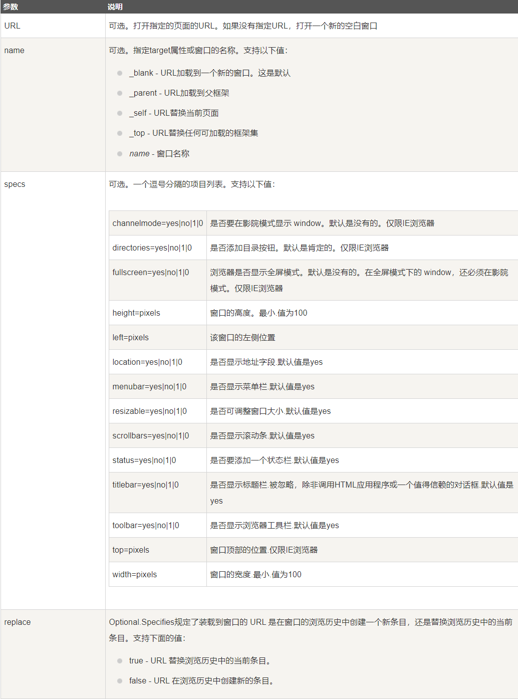

[参考博客](https://blog.csdn.net/qq_38490457/article/details/109257751)
# 变量：
## 定义：
- let: 定义变量，常用
  - 可以直接赋值
  - 或者new一个下面变量类型的对象
- var: 声明变量，可以重复声明，但本身不常用
- const： 定义常量，不可修改
## 变量类型及一些常用方法：
- 基本类型：
  - number: 数字,即不分整型、浮点型了
  - string: 字符串
    - 大部分和java一样
    - slice(start, end) 截取,   slice()也能作为深拷贝
    - substr(start, length) 
    - includes(str) 
  - boolean: 布尔值
  - array: 数组 这个就可看做对象列表
    - 用push和pop对最后一个元素增删
    - 而shift和unshift对第一个元素增删
    - slice(start, end) 截取数组，返回一个新数组，原数组不变
    - splice(start, deleteCount, item1, item2, ...) 删除元素，并可以往start位置添加元素，返回一个新数组，原数组改变
    - concat(arr1, arr2,...) 合并数组，返回一个新数组，原数组不变
    - join(separator) 将数组转换为字符串，separator为分隔符，默认为逗号
    - reverse() sort() 
    - 自定义排序，重写sort方法，定义a和b，返回a-b为升序，b-a为降序
    - **map方法**：对数组中的每个元素执行你的函数，返回一个新数组，原数组不变 
      - 参数一：函数，该函数接受三个参数：
        - 参数一：当前元素
        - 参数二：当前元素的索引（可选）
        - 参数三：数组本身（可选）
      - 参数二：this指向（可选）
  - 对象：
    - 两种定义方式：
      ```js
      // 方式一
      var person = new Object();
      person.name = "孙悟空";
      person.age = 18;
      person.sayHello = function(){
          console.log("Hello");
      };
      // 方式二
      var person = {
          name: "孙悟空",
          age: 18,
          sayHello: function(){
              console.log("Hello");
          }
      };
      ```
    - call方法：
      - 可以用来调用对象的方法，如：
        ```js
        function fun(a, b) {
            console.log("a = " + a);
            console.log("b = " + b);
            console.log("fun = " + this);
        }

        var obj = {
            name: "obj",
            sayName: function () {
                console.log(this.name);
            }
        };

        fun(2, 3);
        console.log("===============");
        fun.call(obj, 2, 3);
        ```
    - 对象遍历：
        ```js
        for (var key in person) {
            console.log(key + " = " + person[key]);
        }
        for(const [key,value] of Object.entries(a)){
            console.log(key,value)
        }
        ```    
    - **arguments**对象，可以用来获取函数的参数，类型java的mian方法的args一样，我们函数所接受的参数都存在这里面
  - map:
    - size(): 获取map的大小
    - get(key): 获取key对应的值
    - set(key, value): 设置key对应的值
    - has(key): 判断map中是否存在key
    - delete(key): 删除key对应的值
    - clear(): 清空map
  - undefined: 未定义
  - null: 空值
  - symbol: 唯一值
  - iterator: 迭代器
    - 获取迭代器：`let iterator = arr[Symbol.iterator]();`
    - 常用方法：
      - next(): 返回一个对象，包含value和done两个属性，value为当前元素，done为是否遍历完
      - value: 当前元素
      - done: 是否遍历完
    - 遍历结果形式为：{value: 当前元素, done: 是否遍历完}
    - 常用于自定义遍历：
      ```js
      class CustomArray {
          constructor() {
              this.items = [];
          }

          add(item) {
              this.items.push(item);
          }

          // 实现 Symbol.iterator 方法
          [Symbol.iterator]() {
              let index = 0;
              return {
                  next: () => {
                      if (index < this.items.length) {
                          return { value: this.items[index++], done: false };
                      }
                      return { done: true };
                  }
              };
          }
      }

      const customArray = new CustomArray();
      customArray.add('apple');
      customArray.add('banana');
      customArray.add('cherry');

      // 使用 for...of 循环遍历自定义数组
      for (const item of customArray) {
          console.log(item);
      }
      ``` 
  - yeild: 生成器
    - 用于依次执行某个函数，返回一个迭代器对象，如下：
      ```js
      function * gen() { //这里必须用*号
          /*代码1开始执行*/
          console.log("代码1执行了");
          yield "一只没有耳朵";  //如果函数有参数，这里可以用yeild定义参数，如这里改成let a = yield "一只没有耳朵"; 那么a函数就可以接收yeild的参数且具有yeild的作用
          /*代码2开始执行*/
          console.log("代码2执行了");
          yield "一只没有尾巴";
          /*代码3开始执行*/
          console.log("代码3执行了");
          return "真奇怪";
      }

      let iterator = gen();
      console.log(iterator.next());
      console.log(iterator.next());
      console.log(iterator.next());
      ```    
  - Date：日期
  - Math：数学 无需new 可看作里面都是静态方法
  - ***class***: 以上对象的使用都可以用class实现，class就是传统的面对对象，不同的是js的class声明变量和无需let等关键字，构造函数为constructor而不是和类名同名
  - 正则表达式：
    - var 变量名 = new RegExp("正则表达式","匹配模式");
    - 匹配模式：
      - i: 忽略大小写
      - g: 全局匹配
      - m: 多行匹配
    - 常用方法：
      - test(str): 测试字符串是否匹配正则表达式，返回true或false
      - exec(str): 执行正则表达式，返回一个数组，数组中包含匹配的字符串
      - match(str): 执行正则表达式，返回一个数组，数组中包含匹配的字符串
      - search(str): 执行正则表达式，返回匹配的位置
    - 详细见正则表达式文件夹 
## 数值转换：
1. 转字符串：
   - toString(): 转换为字符串,但不能转换null和undefined
   - String(): 转换为字符串,可以转换null和undefined
   - 任意类型用+连接: 转换为字符串,可以转换null和undefined
2. 转数字
   - number(): 转换为数字,空串和null转换为0,undefined及其他不合法的转换为NaN  
   - parseInt(): 专门用来字符串转整数,不合法同上
   - parseFloat() ：专门用来字符串转浮点数,不合法同上
3. 转布尔值
   - Boolean(): 转换为布尔值,除了0、NaN、空串、null、undefined、false,其他都为true
   - !: 取反,同上
   - !!: 取反两次,同上
# 关键字（java里没有的）：
- typeof: 返回变量的类型,如typeof 1或 type(1) 返回number 
- debugger: 调试器,在浏览器中打开控制台，在代码中加入debugger，会在控制台中停止执行，方便调试
- delete: 删除变量
- export: 导出变量
- yeld: 生成器，用来生成迭代器
- in: 判断属性是否在对象中,如"name" in person 返回true，，等同hasOwnProperty()方法，形式类似于python
# 运算符：
大部分和java一样，但是有一些不同：
- ==和===: ==是值相等，===是值和类型都相等
- !=和!==: 同上
- 和python一样可以用，隔开来多次定义变量
 
# 条件、循环、函数：
多数和java一样，但是有一些不同：
- 遍历：
  - 可以用for...of来遍历对象，类似python
  - 还可以用forEach来遍历数组，但是不能用break和continue且只支持IE9+
- 函数定义用function定义
- 另外js一般用不到class，而用对象来代替，同样里面写属性和方法，但我们可以不用定义如以上介绍对象的例子，故封装一般用对象来代替，如：
  ```js
  // 使用构造函数来创建对象
    function Person(name, age) {
        // 设置对象的属性
        this.name = name;
        this.age = age;
        // 设置对象的方法，略
    }
  ```
但如果想更灵活，我们可以原型链来实现，原理是获取类原型来设置方法和属性：
```js
// 使用构造函数来创建对象
function Person(name, age) {
    // 设置对象的属性
    this.name = name;
    this.age = age;  
}
// 设置对象的方法
Person.prototype.sayHello = function() {
    console.log("Hello, my name is " + this.name + " and I am " + this.age + " years old.");
};
```
也可以设置属性一样的形式
# 继承：
常用继承形式如下：
```js
function Person(name, age) {
    this.name = name;
    this.age = age;
}

Person.prototype.setName = function (name) {
    this.name = name;
};

function Student(name, age, price) {
    Person.call(this, name, age); // 为了得到父类型的实例属性和方法，this指向子类，固定写法
    this.price = price;
}

Student.prototype = new Person(); // 为了得到父类型的原型属性和方法
Student.prototype.constructor = Student; // 修正constructor属性指向
Student.prototype.setPrice = function (price) { // 添加子类型私有的方法，没什么特别的
    this.price = price;
};
```
# 输出：
# 垃圾回收：
将不用的变量设置为null即可，等待垃圾回收器回收
# ***对于web交互***
前言：
- web浏览器重要部分
  - Window：代表的是整个浏览器的窗口，同时window也是网页中的全局对象
  - Navigator：代表的当前浏览器的信息，通过该对象可以来识别不同的浏览器
  - Location：代表当前浏览器的地址栏信息，通过Location可以获取地址栏信息，或者操作浏览器跳转页面
  - History：代表浏览器的历史记录，可以通过该对象来操作浏览器的历史记录，由于隐私原因，该对象不能获取到具体的历史记录，只能操作浏览器向前或向后翻页，而且该操作只在当次访问时有效
  - Screen：代表用户的屏幕的信息，通过该对象可以获取到用户的显示器的相关的信息
- 引入js的方式：
  - 内联：在html标签中直接写js代码
  - 外联：在html标签中引入js文件
    - 内部写入和外部引入都可以写在以下位置：
      - head标签中，适用那些需要在页面加载前就执行的js代码
      - body标签底部，最常用，适用那些需要在页面加载后才执行的js代码
  - 动态：在js中创建标签，然后插入到html中
    - defer: 延迟执行，即等页面加载完后再执行
    - async: 异步执行，即加载完后立即执行,但不保证脚本执行顺序，适用于那些有独立性的js代码
## DOM：
1. 对文档元素操作：
   - document对象 指整个文档 以下方法都可以用document.方法名来调用 
   - 查找元素：
     - getElementById(id)：根据id查找元素，返回元素对象
     - querySelector(CSS选择器)：根据CSS选择器查找元素，返回元素对象
     - querySelectorAll(CSS选择器)：根据CSS选择器查找元素，返回元素对象列表  
     - getElementsByTagName(tagName)：根据标签名查找元素，返回元素对象列表
     - getElementsByClassName(className)：根据类名查找元素，返回元素对象列表
     - 关于元素属性：
       - getAttribute(name)：获取元素的属性值
       - setAttribute(name, value)：设置元素的属性值
       - removeAttribute(name)：删除元素的属性值
       - hasAttribute(name)：判断元素是否有指定的属性
       - 以上方法都可以用元素.属性名来调用
   - 修改,常用于添加html代码：
      - createElement(tagName)：创建元素，返回元素对象
      - createAttribute(name)：创建属性，返回属性对象
      - createTextNode(text)：创建文本节点，返回文本节点对象
      - 元素节点.appendChild(Element)：添加子节点，返回添加的元素对象
      - 元素节点.removeChild(Element)：删除子节点，返回删除的元素对象
      - 元素节点.replaceChild(newElement, oldElement)：替换子节点，返回替换的元素对象
      - 元素节点.insertBefore(newElement, referenceElement)：在指定元素之前插入新元素，返回插入的元素对象
      - 不多举例，就下面一个创造一个列表的例子：
      ```js
        var ul = document.createElement("ul");

        var li1 = document.createElement("li");
        var text1 = document.createTextNode("列表项1");
        li1.appendChild(text1);
        ul.appendChild(li1);

        var li2 = document.createElement("li");
        var text2 = document.createTextNode("列表项2");
        li2.appendChild(text2);
        ul.appendChild(li2);
        //省略重复代码

        document.getElementsByTagName("body")[0].appendChild(ul);
      ```
   - 通过结构找元素：用元素.属性名来调用
     - parentNode parentElement：父节点和父元素
     - childNodes children：子节点和子元素
     - firstChild firstElementChild：第一个子节点和第一个子元素
     - lastChild lastElementChild：最后一个子节点和最后一个子元素
     - previousSibling previousElementSibling：前一个兄弟节点和前一个兄弟元素
     - nextSibling nextElementSibling：后一个兄弟节点和后一个兄弟元素 
2. 对文档元素值操作： 
   - 查找及修改：这个是元素.方法名来调用
     - innerHTML：获取或设置元素的HTML内容
     - innerText：获取或设置元素的文本内容
     - 属性：获取元素的属性值
     - value：获取或设置表单元素的值
     - textContent：获取或设置元素的文本内容    
## 事件：
- addEventListener("事件类型", 事件处理函数)
  - 常见事件类型：
    - 通用事件
      - blur focus 失去焦点、获得焦点
      - change 元素改变时
      - load 页面加载完成时 unload 页面卸载时
      - resize 窗口大小改变时
      - DOMContentLoaded ：DOM加载完成时
    - 键盘事件
      - keydown keyup keypress 键盘按下、抬起、按下并松开
      - 触发某个事件时可以获得以下值
        - crtlKey altKey shiftKey 这些键是否按下
    - 鼠标事件
      - mousedown mouseup mousemove 鼠标按下、抬起、移动在
      - mouseover mouseout 鼠标移入、移出，不能阻止冒泡
      - mouseenter mouseleave 鼠标移入、移出，能阻止冒泡
      - mousewheel 鼠标滚轮滚动
      - contextmenu 鼠标右键菜单
      - click dbclick 点击和双击
      - 触发某个事件时可以获得以下值
        - clientX clientY 鼠标在页面上的X、Y坐标
        - SreenX ScreenY 鼠标在屏幕上的X、Y坐标
    - 表单事件
      - submit 表单提交
      - input 元素获得输入时 select 元素选择时
      - invalid 元素验证失败时 valid 元素验证成功时
  - 事件处理函数就是监听到事件后要执行的函数，一般直接匿名函数
  - 可设置多个事件监听，监听到事件后会依次执行
- removeEventListener("事件类型", 事件处理函数) 移除事件监听
- **事件处理器**，相对addaddEventListener更简洁：
  - on事件类型 = 事件处理函数
  - 只能设置一个事件监听，监听到事件后会依次执行
  - 移除事件监听：on事件类型 = null
- 事件对象固定一般参数为event、evt 或 e等等，事件处理函数内部可以使用事件对象的属性和方法
- preventDefault() 阻止表单提交，用于在表单不合法时阻止表单提交
- **事件冒泡：**
  1. 在父元素上监听事件，子元素也会触发事件
  2. 冒泡顺序：子元素 -> 父元素 -> 祖先元素，不好理解看[例子](https://developer.mozilla.org/zh-CN/docs/Learn_web_development/Core/Scripting/Event_bubbling)()方法来阻止事件冒泡
- 事件捕获：  
  1. 事件捕获一般是由于很少用一般是禁用的，我们要用capture: true来开启
  2. 事件捕获就是事件冒泡的相反顺序，祖先元素 -> 父元素 -> 子元素
  3. 由于捕获顺序，可能会导致一些问题，我们可以用事件对象的stopPropagation()方法来阻止事件冒泡
- **事件委托：**
  - 即利用事件冒泡的原理，在父元素上监听事件，子元素也会触发事件，这样就可以避免多个子元素的事件监听，提高性能
## JSON:
1. 语法及数据类型：
   - 数据类型时除了函数、日期和undefined外的其他js数据类型
   - josn定义用键值对，键必须是字符串，值可以是任意类型，如`var person = {"name": "zhangsan", "age": 62, "city": "BeiJing"};`
     - json的值为对象时：` "employee": {"name": "Bill Gates", "age": 62, "city": "Seattle"}`
     - json值为数组时:` "employees": ["Bill", "Steve", "David"]`
     - 其他如null、boolen等等略
2. js对象转json字符串：
```js
var obj = {name: "猪八戒", age: 28, gender: "男"};
var jsonStr = JSON.stringify(obj);
``` 
1. json字符串转js对象：
```js
var jsonStr = '{"name":"猪八戒","age":28,"gender":"男"}';
var obj = JSON.parse(jsonStr);
```
## AJAX(涉及前后端数据交互使用)：
前言：传统的web交互是用户触发一个http请求服务器，然后服务器收到之后，在做出响应到用户，并且返回一个新的页面，每当服务器处理客户端提交的请求时，客户都只能空闲等待，并且哪怕只是一次很小的交互、只需从服务器端得到很简单的一个数据，都要返回一个完整的HTML页，而用户每次都要浪费时间和带宽去重新读取整个页面。这个做法浪费了许多带宽，由于每次应用的交互都需要向服务器发送请求，应用的响应时间就依赖于服务器的响应时间，这导致了用户界面的响应比本地应用慢得多。

AJAX 的出现,刚好解决了传统方法的缺陷，AJAX 是一种用于创建快速动态网页的技术，通过在后台与服务器进行少量数据交换，AJAX 可以使网页实现异步更新，这意味着可以在不重新加载整个网页的情况下，对网页的某部分进行更新。
XMLHttpRequest对象是AJAX的核心，接下来介绍XMLHttpRequest对象的使用：
1. 创建XMLHttpRequest对象：为了因对兼容性，一般用以下方式创建：
```js
var xhttp;
if (window.XMLHttpRequest) {
    xhttp = new XMLHttpRequest();
} else {
    //为了兼容IE5和IE6
    xhttp = new ActiveXObject("Microsoft.XMLHTTP");
}
```
2. 常用方法
- abort()	取消当前请求
- getAllResponseHeaders()	返回头部信息
- getResponseHeader()	返回特定的头部信息，包括Content-Type、Date、Server等
- open(method, url, async, user, psw)	规定请求method：请求类型 GET 或 POST
  - async：true（异步）或 false（同步）
  - user：可选的用户名称
  - psw：可选的密码
- send()	将请求发送到服务器，用于GET请求
- send(string)	将请求发送到服务器，用于 POST 请求
- setRequestHeader()	向要发送的报头添加标签/值对
- responseType	规定响应的类型
3. 常用属性：
- onreadystatechange：定义当 readyState 属性发生变化时被调用的函数
- readyState：保存 XMLHttpRequest 的状态。
  - 0：请求未初始化
  - 1：服务器连接已建立
  - 2：请求已收到
  - 3：正在处理请求
  - 4：请求已完成且响应已就绪
- responseText：以字符串返回响应数据
- responseXML：以 XML 数据返回响应数据
- status：返回请求的状态号
  - 200: 找到
  - 403: 禁止
  - 404: 未找到
  - 等等，自行查找
4. **GET请求：**
```js
//步骤一：创建异步对象
var ajax = new XMLHttpRequest();
//步骤二：设置请求的url参数，参数一是请求的类型，参数二是请求的url
ajax.open("get", "users.json");
//步骤三：发送请求
ajax.send();
//步骤四：注册事件 onreadystatechange 状态改变就会调用
ajax.onreadystatechange = function () {
    if (ajax.readyState == 4 && ajax.status == 200) {
        //步骤五：如果能够进到这个判断，说明数据完美的回来了，并且请求的页面是存在的
        console.log(ajax.responseText);//输入响应的内容
    }
};
``` 
5. **POST请求：**
```js
//步骤一：创建异步对象
var ajax = new XMLHttpRequest();
//步骤二：设置请求的类型及url，注意：post请求一定要添加请求头才行不然会报错
ajax.open("post", "users.json");
ajax.setRequestHeader("Content-type", "application/x-www-form-urlencoded");
//步骤三：发送请求
ajax.send();
//步骤四：注册事件 onreadystatechange 状态改变就会调用
ajax.onreadystatechange = function () {
    //步骤五：如果能够进到这个判断，说明数据完美的回来了，并且请求的页面是存在的
    if (ajax.readyState == 4 && ajax.status == 200) {
        console.log(ajax.responseText);//输入响应的内容
    }
};
``` 
6. ***fetch + async/await*** :
  1. 概述： 这是对ajax的简化甚至替代，还能处理put、delete等请求
  2. GET请求：
  ```js
    async function getUsers() {
      try {
          let response = await fetch("https://jsonplaceholder.typicode.com/users");
          if (!response.ok) throw new Error(`HTTP 错误！状态码: ${response.status}`);
          
          let data = await response.json();
          console.log(data);
      } catch (error) {
          console.error("请求失败:", error);
      }
  }
  getUsers();
  ```  
  2. POST请求:
  ```js
    async function createUser() {
      let newUser = {
          name: "Tom",
          email: "tom@example.com",
      };

      try {
          let response = await fetch("https://jsonplaceholder.typicode.com/users", {
              method: "POST",
              headers: {
                  "Content-Type": "application/json", // 发送 JSON
              },
              body: JSON.stringify(newUser), // 转换对象为 JSON 字符串
          });

          let data = await response.json();
          console.log("用户创建成功:", data);
      } catch (error) {
          console.error("请求失败:", error);
      }
  }
  createUser();
  ``` 
  3. 其他请求参考以上两个 
***关于Content-Type：***
- text/plain：表明传输的数据是纯文本，编码格式一般是 UTF - 8。
- text/html：意味着传输的数据是 HTML 文档。
- application/json：说明传输的数据是 JSON 格式，在前后端交互里使用频率较高。
- application/x-www-form-urlencoded：常用于表单数据的提交，数据会被编码成键值对形式，键和值都会进行 URL 编码。
- multipart/form-data：主要用于表单中包含文件上传的情况。
关于接受参数遍历，可以如下简化：
```js
let tableContent = json.map(user => `
    <tr>
        <td><input type="checkbox"></td>
        <td>${user.username}</td>
        <td>${user.sex}</td>
        <td>${user.phone}</td>
        <td>${user.email}</td>
    </tr>
`).join("");
tableData.innerHTML = tableContent;
```
***关于请求头和响应头：***
1. 实体首部字段
   - Content-Type：指定请求体的媒体类型
   - Content-Length：指定请求体的长度
   - Content-Encoding：指定请求体的编码方式
   - Content-Language：指定请求体的语言
   - Content-Location：指定请求体的位置
   - 等等
2. 请求首部字段：
  1. 内容协商类:
    - Accept：指定客户端可以接受的媒体类型
    - Accept-Charset：指定客户端可以接受的字符集
    - Accept-Encoding：指定客户端可以接受的编码方式
    - Accept-Language：指定客户端可以接受的语言
  2. 用户信息类：
    - User-Agent：指定客户端的用户代理字符串
    - Referer：指定请求的来源地址  
  3. 认证类:Authorization：指定客户端的认证信息
  4. cookie类:Cookie：指定客户端的cookie信息    
  5. 其他 Host：指定请求的主机和端口号，响应头为server
  6. 通用类:
    - Connection：指定客户端与服务器之间的连接类型
    - Cache-Control：指定缓存控制策略
    - Date：指定请求的日期和时间
      - getDate() getDay() getMonth() getFullYear() getHours() getMinutes() getSeconds() getTime() 获取日期、星期、月份、年份、小时、分钟、秒、时间戳
      - 对应的set方法
    - Pragma：指定请求的优先级 
***Promise: ***
用来封装异步操作，调用then函数返回异步操作是否成功。使用方法如下：
```js
const p = new Promise((resolve, reject) => {
    // 这里写异步操作以上的ajax和await fetch都是异步操作，其实不封装也可以，封装只是为了更好的管理异步操作
})
//然后可以用then函数来调用
p.then((data) => {
    //这里写异步操作成功后的操作
}, (error) => {
    //这里写异步操作失败后的操作
})
//如果只想调用失败的操作，可以用catch函数来调用
p.catch((error) => {
    //这里写异步操作失败后的操作
})
```
**关于Http状态码：**
- 1xx 信息性状态码：表示请求已被接收，继续处理
  - 100 Continue：客户端应当继续发送请求。这个状态码表示服务器已经接收到请求的第一部分，正在等待其余部分。例如在使用 HTTP/1.1 协议的长连接时，客户端可能会先发送一个包含请求头的部分请求，服务器返回 100 Continue 后，客户端再发送请求体。
- 2xx 成功状态码：表示请求已成功被服务器接收、理解并处理。
  - 200 OK：请求成功，这是最常见的成功状态码。
  - 201 Created：请求成功，并且服务器创建了新的资源。常用于 POST 或 PUT 请求创建新资源的场景，例如用户注册成功后，服务器返回 201 Created，同时在响应头中包含新创建资源的 URL。
  - 204 No Content：请求成功，但服务器没有返回任何内容。常用于 DELETE 请求成功删除资源，或者某些不需要返回具体数据的操作场景。例如客户端发送删除某个文件的 DELETE 请求，服务器成功删除后返回 204 No Content。
- 3xx 重定向状态码：表示要完成请求，需要进一步操作。通常用于将客户端重定向到其他 URL。
  - 301 Moved Permanently：请求的资源已被永久移动到新位置，以后应使用新的 URL 访问该资源。
  - 302 Found（HTTP/1.0 中为 302 Moved Temporarily）：请求的资源临时移动到其他位置，客户端应使用原 URL 继续访问该资源。常用于临时调整页面位置或负载均衡场景，例如服务器进行维护时，临时将某个页面重定向到一个提示页面。
  - 304 Not Modified：客户端发送了一个带条件的请求（如使用了 If-Modified-Since 或 If-None-Match 头信息），且服务器资源未被修改，服务器返回此状态码，让客户端使用本地缓存的资源。这可以减少数据传输，提高性能，例如客户端缓存了某个图片，再次请求时服务器发现图片未更新，返回 304 Not Modified，客户端直接使用本地缓存的图片。
- 4xx 客户端错误状态码：表示客户端发送的请求有错误。
  - 400 Bad Request：客户端请求存在语法错误，服务器无法理解。
  - 401 Unauthorized：请求要求身份验证。
  - 403 Forbidden：服务器理解请求，但拒绝执行该请求。这与 401 不同，401 是因为未授权，而 403 是已授权但权限不足。例如普通用户尝试访问管理员才能访问的页面，服务器返回 403 Forbidden。
  - 404 Not Found：服务器找不到请求的资源。这是最常见的错误状态码之一，可能是因为 URL 输入错误、资源被删除或未创建。
- 5xx 服务器错误状态码：表示服务器在处理请求时发生了错误。
  - 500 Internal Server Error：服务器内部发生错误，无法完成请求。这是一个通用的服务器错误状态码，通常是由于服务器端代码出现异常（如未捕获的异常、数据库连接错误等）导致的。例如服务器端的 Java 代码抛出了一个未处理的 NullPointerException，服务器返回 500 Internal Server Error。
  - 503 Service Unavailable：服务器目前无法处理请求，通常是因为服务器过载或正在维护。
## BOM:  
1. **window对象**:以下方法都是window.方法名来调用
  - 弹出框：
    - alert: 警告框
    - confirm: 确认框
    - prompt: 提示框
    - open: 打开新窗口
  - 延时事件：
    - setTimeout(要执行的方法，延时时间单位毫秒): 延时执行，只执行一次
    - setInterval: 定时执行，定时重复执行，参数同上
  - 常用窗口属性：
    - innerHeight innerWidth: 窗口的高度和宽度
    - outerHeight outerWidth: 窗口的高度和宽度，包括边框和滚动条
    - scrollTop scrollLeft: 窗口的滚动条的位置
    - scrollTo(x, y): 窗口滚动到指定位置
  - 其他常用方法：
    - open  close: 打开和关闭窗口
    - on+事件：监听窗口事件要执行的方法
    - moveTo(x, y): 窗口移动到指定位置
    - resizeTo(width, height): 窗口调整大小
2. Navigator对象:以下方法都是navigator.方法名来调用
  - 常用属性：
    - appName: 浏览器名称
    - appVersion: 浏览器版本
    - platform: 操作系统
    - userAgent: 用户代理字符串
  - 常用方法：
    - javaEnabled(): 判断浏览器是否支持Java
    - cookieEnabled(): 判断浏览器是否支持Cookie
3. **Location对**象:以下方法都是window.location.方法名来调用
  - 常用属性：
    - href: 当前页面的URL  (改变相当于跳转，以下都可以改变)
    - origin: 当前页面的源
    - host: 当前页面的主机名
    - port: 当前页面的端口号
    - pathname: 当前页面的路径名
    - search: 当前页面的查询字符串
  - 常用方法：
    - reload(): 刷新当前页面
    - assign(url): 跳转到指定页面
    - replace(url): 替换当前页面
    - toString(): 返回当前页面的URL字符串
4. **History对象**:以下方法都是history.方法名来调用
  - 常用属性：
    - length: 历史记录的长度
  - 常用方法：
    - back(): 后退一页
    - forward(): 前进一页 
    - go(): 跳转到指定页面,参数为正数则前进，负数则后退
5. Screen对象:以下方法都是screen.方法名来调用
  - 常用属性：
    - width: 屏幕的宽度
    - height: 屏幕的高度
    - colorDepth: 屏幕的颜色深度
    - pixelDepth: 屏幕的像素深度
  - 常用方法：
    - availWidth availHeight: 屏幕的可用宽度和高度
## 异常：
只写和java里没有的异常
- EvalError	已在 eval() 函数中发生的错误
- RangeError	已发生超出数字范围的错误
- ReferenceError	已发生非法引用
- SyntaxError	已发生语法错误
- TypeError	已发生类型错误
- URIError	在 encodeURI() 中已发生的错误
自定义异常：如下例：
```js
/*自定义错误*/
function MyError(message) {
    this.message = "注意：这是自定义的错误"
    this.name = "自定义错误";
}
MyError.prototype = new Error();

try {
    throw new MyError("注意：这是自定义错误类型")
} catch (error) {
    console.log(error.message)
}
```
## cookie：
概念：cookie是一种存储在用户本地的小型文本文件，用于存储用户的信息。cookie由**名称、值、过期时间和路径组成**。  

cookie使用：
1. 创建cookie：`document.cookie = "username=zhangsan; expires=Thu, 18 Dec 2043 12:00:00 GMT; path=/";` 过期时间和路径组成都是可选的，由于的数据是键值对，故可以进行下面几点操作
2. 获取cookie：let一个变量接受`document.cookie`即可
   - 获取cookie函数：
    ```js
    function getCookie(cname) {
        var name = cname + "=";
        var ca = document.cookie.split(';');
        for (var i = 0; i < ca.length; i++) {
            var c = ca[i].trim();
            if (c.indexOf(name) == 0) return c.substring(name.length, c.length);
        }
        return "";
    }
    ```
3. 修改cookie：覆盖即可
   - 设置cookie函数：
    ```js
    function setCookie(cname, cvalue, exdays) {
      var d = new Date();
      d.setTime(d.getTime() + (exdays * 24 * 60 * 60 * 1000));
      var expires = "expires=" + d.toGMTString();
      document.cookie = cname + "=" + cvalue + "; " + expires;
    }
    ```
4. 删除cookie：设置过期时间为过去即可
## webStorage：
1. localStorage：本地存储，永久存储，除非手动删除
   - setItem(key, value): 保存单个数据
   - getItem(key): 读取单个数据
   - removeItem(key): 删除单个数据
   - clear(): 删除所有数据
2. sessionStorage：会话存储，关闭浏览器即删除，方法同上
这些用于cookie实在无法存下的情况
## ***关于#{}和${}***
1. 在js中：
  - #{}：不是内置对象，只当文本处理
  - ${}：是一个占位符，用于替换变量的值，在模板字符串中可以用反引号`来包裹，模板字符串为字符串与变量的拼接，如`${name} is ${age}`
2. java中
  - ${}: 适用于 Spring 的 @Value("${}") 读取 application.properties 或 application.yml 配置
  - #{}: 无特殊含义
3. Mybatis： 
  - ${}: 直接拼接sql，不是用户输入而是开发者进行动态sql拼接，但是会有sql注入风险
  - #{}: 主要用于传递参数，防止SQL注入。MyBatis 会自动把#{}里的参数解析为?占位符，然后绑定变量。