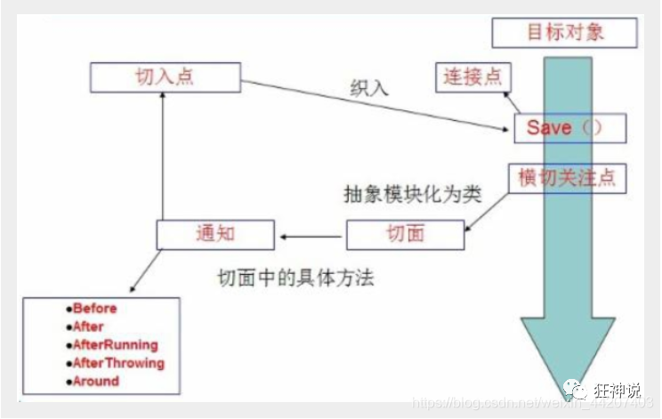

[参考](https://blog.csdn.net/weixin_44207403/article/details/106736102?ops_request_misc=%257B%2522request%255Fid%2522%253A%252232d38a872bc9357d21ce37e50a5b0faf%2522%252C%2522scm%2522%253A%252220140713.130102334..%2522%257D&request_id=32d38a872bc9357d21ce37e50a5b0faf&biz_id=0&utm_medium=distribute.pc_search_result.none-task-blog-2~all~top_positive~default-1-106736102-null-null.142^v102^pc_search_result_base8&utm_term=spring&spm=1018.2226.3001.4187)
[这个有步骤图](https://blog.csdn.net/weixin_68522070/article/details/141360851?ops_request_misc=%257B%2522request%255Fid%2522%253A%252232d38a872bc9357d21ce37e50a5b0faf%2522%252C%2522scm%2522%253A%252220140713.130102334..%2522%257D&request_id=32d38a872bc9357d21ce37e50a5b0faf&biz_id=0&utm_medium=distribute.pc_search_result.none-task-blog-2~all~top_positive~default-2-141360851-null-null.142^v102^pc_search_result_base8&utm_term=spring&spm=1018.2226.3001.4187)
# Spring Core
依赖：org.springframework.spring-webmvc
## IOC(控制反转)：
1. 基本概念
   - ***控制反转***IoC(Inversion of Control)，是一种设计思想，DI(依赖注入)是实现IoC的一种方法，也有人认为DI只是IoC的另一种说法。没有IoC的程序中 , 我们使用面向对象编程 , 对象的创建与对象间的依赖关系完全硬编码在程序中，对象的创建由程序自己控制，控制反转后将对象的创建转移给第三方。就如我们写service时，不需要实现Dao层，第三方帮我们是实现了，我们只需要new一个即可。
   - 控制反转是一种通过描述（XML或注解）并通过第三方去生产或获取特定对象的方式。在Spring中实现控制反转的是IoC容器，其实现方法是***依赖注入***（Dependency Injection,DI）。
2. 接下来通过例子理解控制反转和依赖注入，先是控制反转：
- 首先写个bean.xml(resources下):
```xml
<?xml version="1.0" encoding="UTF-8"?>
<beans xmlns="http://www.springframework.org/schema/beans"
       xmlns:xsi="http://www.w3.org/2001/XMLSchema-instance"
       xsi:schemaLocation="http://www.springframework.org/schema/beans
       http://www.springframework.org/schema/beans/spring-beans.xsd">

    <!-- id是bean的id是唯一的 name是bean名字可重复，未设置id可用name来
    找bean class是实体类位置前面两个都没设置可以用实体类名.class来找 属性里是实体类的名字和值 -->
    <bean id="person" name="person" class="com.CloudWhite.Entity.Person">
        <property name="name" value="张三"></property>
        <property name="age" value="18"></property>
    </bean>
</beans>
``` 
- 然后写个测试类：
```java
//解析beam文件
ApplicationContext context = new ClassPathXmlApplicationContext("beans.xml");
Person person = (Person) context.getBean("person");//getBean参数是bean的id
person.show();
```
可以发现new。而是用bean的id来new的，这就是控制反转。由此
Person对象是谁创建的 ? Person对象是由Spring创建的
Person对象的属性是怎么设置的 ? Person对象的属性是由Spring容器设置的
这个过程就叫控制反转
控制:谁来控制对象的创建,传统应用程序的对象是由程序本身控制创建的,使用Spring后,对象是由Spring来创建的
反转:程序本身不创建对象, 变成被动的接收对象
- 补充一下构造函数，无参构造函数xml无需改动，而有参则要加入如下：
```xml
<!-- 第一种根据index参数下标设置 -->
<bean id="person" class="com.CloudWhite.Entity.Person">
   <!-- index指构造方法 , 下标从0开始 -->
   <constructor-arg index="0" value="kuangshen2"/>
</bean>
<!-- 第二种根据参数名字设置 -->
<bean id="person" class="com.CloudWhite.Entity.Person">
   <!-- name指参数名 -->
   <constructor-arg name="name" value="kuangshen2"/>
</bean>
<!-- 第三种根据参数类型设置 -->
<bean id="person" class="com.CloudWhite.Entity.Person">
   <constructor-arg type="java.lang.String" value="kuangshen2"/>
</bean>
```
## 依赖注入：
我们分set注入和构造注入两种，构造器注入就是我前面解释控制反转的例子，不说了
**set注入**（重点）： 
- 要求被注入的属性,必须有set方法,set方法的方法名由set+属性首字母大写,如果属性是boolean类型,没有set方法，则方法名由is + 属性首字母大写
- 注入方法同上xml，这里再说一下一些特殊形式的注入：
  - collection注入，比如数组：
  ```xml
  <property name="books">
         <array>
             <value>西游记</value>
             <value>红楼梦</value>
             <value>水浒传</value>
         </array>
     </property>
  ``` 
  - Map注入：
  ```xml
  <map>
        <entry key="中国邮政" value="456456456465456"/>
        <entry key="建设" value="1456682255511"/>
    </map>
  ```  
  - null注入:`<property name="wife"><null/></property>`
  - props注入：
  ```xml
  <props>
         <prop key="学号">20190604</prop>
         <prop key="性别">男</prop>
     </props>
  ```
  - p命名空间注入：先导入`xmlns:p="http://www.springframework.org/schema/p"`，然后`<bean id="user" class="..." p:name="狂神" p:age="18"/>`
  - c命名空间注入，先导入`xmlns:c="http://www.springframework.org/schema/c"`,然后`<bean id="user" class="..." c:name="狂神" c:age="18"/>`
## **关于其他xml配置**：
  - `<!--设置别名：在获取Bean的时候可以使用别名获取--><alias name="person" alias="me"/>`
  - `import resource="beans.xml" 导入其他xml文件`
  - `<!--设置作用域：singleton(单例)、prototype(多例)、session、request --><bean id="user" class="..." scope="singleton"/>`
    - singleton：当一个bean的作用域为Singleton，那么Spring IoC容器中只会存在一个共享的bean实例，并且所有对bean的请求，只要id与该bean定义相匹配，则只会返回bean的同一实例。Singleton是单例类型，就是在创建起容器时就同时自动创建了一个bean的对象，不管你是否使用，他都存在了，每次获取到的对象都是同一个对象。
    - prototype：当一个bean的作用域为Prototype，表示一个bean定义对应多个对象实例。Prototype作用域的bean会导致在每次对该bean请求（将其注入到另一个bean中，或者以程序的方式调用容器的getBean()方法）时都会创建一个新的bean实例。Prototype是原型类型，它在我们创建容器的时候并没有实例化，而是当我们获取bean的时候才会去创建一个对象，而且我们每次获取到的对象都不是同一个对象。
    - 根据经验，对有状态的bean应该使用prototype作用域，而对无状态的bean则应该使用singleton作用域。
    - request：当一个bean的作用域为request，表示该bean会为每一次HTTP请求创建一个新实例。即每次HTTP请求将会有各自的bean实例，它们依据某个bean定义创建而成。该作用域仅在基于Web的Spring ApplicationContext情形下有效。
    - session：当一个bean的作用域为session，表示该bean为每一次HTTP Session创建一个新实例。即执行过程中同个session内的bean是同一个实例。仅在基于Web的Spring ApplicationContext情形下有效。
  - `<!--设置自动装配：byName(根据名称)、byType(根据类型)--><bean id="user" class="..." autowire="byName"/>`
  - `<!--设置延迟加载：true(延迟加载)、false(非延迟加载)--><bean id="user" class="..." lazy-init="true"/>`
  - `<!--设置初始化方法和销毁方法--><bean id="user" class="..."init-method="init" destroy-method="destroy"/>`
  - `<!--设置工厂方法--><bean id="user" class="..." factory-method="getInstance"/>`
  - `<!--设置工厂Bean--><bean id="user" class="..." factory-bean="factory"/>`
## ***自动注入***： 
***这里只自动注入其他bean，即需要注入的实体类有其他有其他的类，不自动注入基本数据类型***
1. 原理：
   - 组件扫描(component scanning)：spring会自动发现应用上下文中所创建的bean；
   - 自动装配(autowiring)：spring自动满足bean之间的依赖，也就是我们说的IoC/DI；
2. **这里推荐使用注解而不是使用xml**，但我们还是先介绍一下用xml：
   1. byName：bean标签里加`autowire="byName"`，这里要保证该bean里同类型的对象只有一个，否则报错
   2. byType：bean标签里加`autowire="byType"`，这里无需保证同类型的对象只有一个
3. **注解**：
   1. 现在xml头部改成如下：
   ```xml
   <beans xmlns="http://www.springframework.org/schema/beans"
       xmlns:xsi="http://www.w3.org/2001/XMLSchema-instance"

       xmlns:context="http://www.springframework.org/schema/context"

       xsi:schemaLocation="
       http://www.springframework.org/schema/context
       http://www.springframework.org/schema/context/spring-context.xsd

       http://www.springframework.org/schema/beans
       http://www.springframework.org/schema/beans/spring-beans.xsd">
   ```
   2. ***注解自动注入***： 先再xml加上`<context:annotation-config/>`
      - @Autowired(required=true或true，及是否必须注入，一般不用默认必须注入，下面两个都有)：按类型自动转配的，不支持id匹配，*使用时删除原有的set方法*，相当于bytype
      - @Qualifier：按id匹配的，*使用时删除原有的set方法*，相当于byname
      - @Resource(可选的默认name)：这里如果有指定name就按指定name，没有就按byname，还没有就bytype，*使用时删除原有的set方法*，*以上对于删除set方法，也不可以删，在set方法上注解即可，下面的也同理。*
      - 但以上都直接使用可能会让依赖关系变得混乱（对于团体协作而言），对于简单的需要注入的Bean，可以直接用在字段注解，多了就在构造方法上注解，在复杂就建议用配置类来管理，再在构造函数上注解。
   3. ***其他配置，以下就不止是只注入其他bean，具体自行看下面理解***
      - `<context:component-scan base-package="com.CloudWhite.Entity"/>`: 配置要扫描的包. 然后在指定包里的类加上注解@Component("可写的bean的id")，就相当于xml里的bean标签
      - @value("可选的默认赋值")：给属性赋值，这里就可以去掉基本数据类型的set方法
      - @Component有三个衍生注解，即@Controller、@Service、@Repository，分别对应控制层、业务层、持久层，使用了就将其交给spring管理。
## 基于Java类进行配置(配置类)：
以下一个例子了解注解作用：
```java
//先写一个实体类
@Component  //将这个类自动注入为bean，上面有说
public class Dog {
   public String name = "dog";
}
//然后来看配置类，注意两个注解
@Configuration  //代表这是一个配置类
public class MyConfig {

   @Bean //通过方法注册一个bean，这里的返回值就Bean的类型，方法名就是bean的id！
   public Dog dog(){
       return new Dog();
  }
}
@Import(MyConfig2.class)//想导入其他配置类，用这个注解也写在类外部
```
# Spring AOP
## 代理模式：
1. 静态代理：比如你要租房，你去找中介，中介就是代理，你不用去找房东，房东就是目标对象。那么现在有一个接口是租房，实现他的类就是房东，再写一个类真正实现租房接口就是中介即代理对象，代理对象代替房东实现接口，以及可能需要的新方法。
2. 动态代理：就是代理对象是动态生成的,下例就是动态代理：
```java
interface Rent {
    public void rent();
 }
 
//真实角色: 房东，房东要出租房子
class Host implements Rent{
    public void rent() {
        System.out.println("房屋出租");
   }
 }
 

public class ProxyInvocationHandler implements InvocationHandler {
    private Rent rent;
    public void setRent(Rent rent) {
        this.rent = rent;
   }
    //生成代理类，重点是第二个参数，获取要代理的抽象角色！之前都是一个角色，现在可以代理一类角色,且代理的是接口
    public Object getProxy(){
        return Proxy.newProxyInstance(this.getClass().getClassLoader(),
                rent.getClass().getInterfaces(),this);
   }
    // proxy : 代理类 method : 代理类的调用处理程序的方法对象.
    // 处理代理实例上的方法调用并返回结果
    @Override
    public Object invoke(Object proxy, Method method, Object[] args) throws Throwable {
        seeHouse();
        //核心：本质利用反射实现！
        Object result = method.invoke(rent, args);
        fare();
        return result;
   }
    //看房
    public void seeHouse(){
        System.out.println("带房客看房");
   }
    //收中介费
    public void fare(){
        System.out.println("收中介费");
   }
 }
 //租客
class Client {
    public static void main(String[] args) {
        //真实角色
        Host host = new Host();
        //代理实例的调用处理程序
        ProxyInvocationHandler pih = new ProxyInvocationHandler();
        pih.setRent(host); //将真实角色放置进去！
        Rent proxy = (Rent)pih.getProxy(); //动态生成对应的代理类！
        proxy.rent();
   }
 }
```
## AOP
依赖：org.aspectj.aspectjweaver
1. 概述：
- AOP(Aspect Oriented Programming)意为面向切面编程，通过预编译方式和运行期动态代理实现程序功能的统一维护的一种技术。AOP是OOP的延续，是软件开发中的一个热点，也是Spring框架中的一个重要内容，是函数式编程的一种衍生范型。利用AOP可以对业务逻辑的各个部分进行隔离，从而使得业务逻辑各部分之间的耦合度降低，提高程序的可重用性，同时提高了开发的效率。[跳转到图](../photo/3.png)
- spring中的aop：
  - 先了解一下几个概念：
    - 横切关注点：跨越应用程序多个模块的方法或功能。即是，与我们业务逻辑无关的，但是我们需要关注的部分，就是横切关注点。如日志 , 安全 , 缓存 , 事务等等 …
    - 切面（ASPECT）：横切关注点 被模块化 的特殊对象。即，它是一个类。
    - 通知（Advice）：切面必须要完成的工作。即，它是类中的一个方法。
    - 目标（Target）：被通知对象。
    - 代理（Proxy）：向目标对象应用通知之后创建的对象。
    - 切入点（PointCut）：切面通知 执行的 “地点”的定义。
    - 连接点（JointPoint）：与切入点匹配的执行点。 
  - 以及,[spring的五种通知](../photo/4.png)
2. AOP非注解实现： 
   1. 接口：`public interface testImpl { public void test();}`
   2. 服务类:`public class testService implements testImpl { public void test(){System.out.println("测试的好啊！1");}}`
   3. 增强类：
   ```java
   public class beforeLog implements MethodBeforeAdvice {
      //method : 要执行的目标对象的方法
      //objects : 被调用的方法的参数
      //Object : 目标对象
      @Override
      public void before(Method method, Object[] objects, Object o) throws Throwable {
         System.out.println( o.getClass().getName() + "的" + method.getName() + "方法被执行了");
      }
   }
   public class afterLog implements AfterReturningAdvice {
    //returnValue 返回值
    //method被调用的方法
    //args 被调用的方法的对象的参数
    //target 被调用的目标对象
    @Override
      public void afterReturning(Object returnValue, Method method, Object[] args, Object target) throws Throwable {
         System.out.println("执行了" + target.getClass().getName()
                  +"的"+method.getName()+"方法,"
                  +"返回值："+returnValue);
      }
   }
   ```
   4. beans.xml:
   ```xml
   <?xml version="1.0" encoding="UTF-8"?>
   <beans xmlns="http://www.springframework.org/schema/beans"
         xmlns:xsi="http://www.w3.org/2001/XMLSchema-instance"

         xmlns:context="http://www.springframework.org/schema/context"
         xmlns:aop="http://www.springframework.org/schema/aop"

         xsi:schemaLocation="
         http://www.springframework.org/schema/context
         http://www.springframework.org/schema/context/spring-context.xsd

         http://www.springframework.org/schema/beans
         http://www.springframework.org/schema/beans/spring-beans.xsd
         http://www.springframework.org/schema/aop
         http://www.springframework.org/schema/aop/spring-aop.xsd">


      <bean id="service" class="com.CloudWhite.Service.testService"></bean>
      <bean id="beforeLog" class="com.CloudWhite.Log.beforeLog"></bean>
      <bean id="afterLog" class="com.CloudWhite.Log.afterLog"></bean>
      <!--aop的配置-->
      <aop:config>
         <!--切入点 expression:表达式匹配要执行的方法-->
         <aop:pointcut id="pointcut" expression="execution(* com.CloudWhite.Service.testService.*(..))"/>
         <!--执行环绕; advice-ref执行方法 . pointcut-ref切入点-->
         <aop:advisor advice-ref="beforeLog" pointcut-ref="pointcut"/>
         <aop:advisor advice-ref="afterLog" pointcut-ref="pointcut"/>
      </aop:config>
   </beans>
   ```
   5. 测试类：`testImpl testService = (testImpl) context.getBean("service");testService.test();`
3. ***注解实现： ***
   1. 接口、服务类同上
   2. 增强类：
   ```java
   @Aspect
   @Component
   public class Log{
      @Before("execution(* com.CloudWhite.Service.testService.*(..))")
      public void before(){
         System.out.println("方法被执行前!");
      }

      @After("execution(* com.CloudWhite.Service.testService.*(..))")
      public void afterReturning(){
         System.out.println("方法被执行后!");
      }

      @Around("execution(* com.CloudWhite.Service.testService.*(..))")//先around，然后通过类型如下jp.proceed() ，执行before，然后继续around，最后执行after，当然也不宜不写这个，这个是为了区分多个方法
      public Object around(ProceedingJoinPoint jp) throws Throwable {
         System.out.println("环绕前");
         System.out.println("签名:"+jp.getSignature());//执行方法的返回类型、完整方法路径名
         Object proceed = jp.proceed();//执行目标方法proceed的返回值，有这个才会执行before
         System.out.println("环绕后");
         System.out.println(proceed);
         return proceed;//特别注意，这里通常需要返回值，否则mybatis的返回值可能错误  
      }
   }
   ```
   3. 最后bean.xml只要加上`<aop:aspectj-autoproxy/> `(其他如依赖注入记得开启组件扫描或手动注入)
# Spring MVC
就是spring加mvc设计模式，主要是controller层，service层，dao层，model层，view层，其中controller层是核心，其他都是辅助。
## MVC：
- 模型(Model)：模型是应用程序中用于处理数据的部分。即实体类。
- 视图(View)：视图是应用程序中处理数据的显示部分。
- 控制器(Controller)：控制器作用于模型和视图上。它控制数据流向模型对象，并在数据变化时更新视图。它使视图与模型分离开。
- DAO：数据访问对象
- Service：业务逻辑
## ***Mybatis-Spring***
例子见SpringTest，是Spring AOP + Mybatis + Spring Core的整合
1. 在先前xml基础上加上如下：
```xml
<aop:aspectj-autoproxy/>
<!-- 加载外部属性配置文件 -->
<context:property-placeholder location="classpath:db.properties"/>
<!--配置数据源：数据源有非常多，可以使用第三方的，也可使使用Spring的-->
<bean id="dataSource" class="org.springframework.jdbc.datasource.DriverManagerDataSource">
   <!-- 也可以不加载外部资源直接载value里写 -->
   <property name="driverClassName" value="${jdbc.driver}"/>
   <property name="url" value="${jdbc.url}"/>
   <property name="username" value="${jdbc.username}"/>
   <property name="password" value="${jdbc.password}"/>
</bean>
<!-- 声明SqlSessionFactoryBean，在这个类的内部，创建SqlSessionFactory对象，之后就可以获取SqlSession对象 -->
<bean id="sqlSessionFactory" class="org.mybatis.spring.SqlSessionFactoryBean">
   <!-- 获取数据源 -->
   <property name="dataSource" ref="dataSource" />
   <!-- 获取其他配置，虽然数据源帮忙做了属性设置mybatis-config不用在写了，但其他配置如typeAlias等配置还是要加载mybatis-config。当然如果有mybatis-config之外的其他配置也可以在下面写注入到SqlSessionFactoryBean -->
   <property name="configLocation" value="classpath:mybatis-config.xml"/>
</bean>

<!-- 声明MapperScannerConfigurer -->
<!--
   MapperScannerConfigurer作用：
      循环basePackage所表示的包，把包中的每个接口都找到，调用SqlSession.getMapper(XXXDao.class)
      把每个dao接口都创建出对应的dao代理对象，将dao代理对象放在容器中。对于StudentDao接口，其代理对象为 studentDao,即我们不用mybatis的传统的用接口代理，而是用spring的getBean()动态代理接口
-->
<bean class="org.mybatis.spring.mapper.MapperScannerConfigurer">
   <!-- 指定SqlSessionFactory对象的名称 -->
   <property name="sqlSessionFactoryBeanName" value="sqlSessionFactory"/>
   <!-- 指定基本包，dao接口所在的包名 -->
   <property name="basePackage" value="com.CloudWhite.Dao"/>
</bean>
```
2. Dao接口，即mapper层：
```java
@Mapper//如果你不想用MapperScannerConfigurer可以用mapper注解，然后在启动类加上mapper扫描的注解，但这一般用在SpringBoot，后面再说
public interface testDao {
    List<UserInfo> selectAll();
}
```
3，Service层：
```java
//service接口，也可以不写，但一般写
public interface testImpl {
    List<UserInfo> selectAllUserInfo();
}
//接口实现类，主要为了调用dao层的方法，然后返回给controller层
@Service("testService")
public class testService implements testImpl {
    private testDao testDao;
    @Autowired
    public void setTestDao(com.CloudWhite.Dao.testDao testDao) {
        this.testDao = testDao;
    }
    @Override
    public List<UserInfo> selectAllUserInfo(){
        List<UserInfo> list = testDao.selectAll();
        return list;
    }
}
```
4. Controller层：调用service层的方法，返回给前端，另外从以上层次可看出，service依赖dao，controller依赖service，那么可以通过依赖注入来代替getBean()，当然用注解注入击得开启三个层级的扫描。
## ***Spring MVC:***
[]()
springBoot可以直接创建Spring MVC项目，即创建SpringBoot项目，勾选web即可  
[参考](https://blog.csdn.net/m0_64338546/article/details/132071506?ops_request_misc=%257B%2522request%255Fid%2522%253A%2522f4ba18099d6a0a7452cdecb50b53c40e%2522%252C%2522scm%2522%253A%252220140713.130102334..%2522%257D&request_id=f4ba18099d6a0a7452cdecb50b53c40e&biz_id=0&utm_medium=distribute.pc_search_result.none-task-blog-2~all~top_positive~default-1-132071506-null-null.142^v102^pc_search_result_base8&utm_term=Spring%20mvc&spm=1018.2226.3001.4187)
1. 路由映射（就是访问地址）：
   - @RequestMapping(/路由地址,方法类型可以不写不写就是任意方法格式为method = RequestMethod.方法名，ContentType内容，以及三个不常用的属性略)：
     - @RequestMapping注解可以修饰类，也可以修饰方法，当修饰类和方法时，访问的地址是类＋方法。
     - @RequestMapping注解可以处理任何HTTP方法的请求，包括GET、POST、PUT、DELETE等。
     - @RequestMapping注解可以使用method属性来进行限定处理请求的HTTP方法。
   - PostMapping(/路由地址)：
     - @PostMapping注解通常用于修饰控制器类中的方法，而不是类本身。
     - @PostMapping注解只可以处理HTTP POST请求映射到处理方法上。
   - GetMapping(/路由地址)：
     - @GetMapping注解通常用于修饰控制器类中的方法，而不是类本身。
     - @GetMapping注解只可以处理HTTP GET请求映射到处理方法上。
2. 路由获取参数：
   - 单个普通参数：当路由地址前加了一个value属性时就代表指定参数值，路由地址就变成了`路由地址?参数值=参数值`，此时的参数就是方法里定义的参数。如果想指定参数值则可用@RequestParam，如`test(@RequestParam("username") String name)`
   - 普通对象参数：同上
   - json对象：用@RequestBody注解标注对应对象即可，spring会自动将json转为对象
   - 获取url参数：即获取路由地址里的参数，如`路由地址/{参数名}`，此时的参数就是方法里定义的参数，用@PathVariable注解标注参数即可，如`test(@PathVariable("username") String name)`
   - 获取上传文件参数：使用@RequestParam注解，如`test(@RequestParam("file") MultipartFile file)`
   - 获取请求头：使用@RequestHeader注解，如`test(@RequestHeader("User-Agent") String userAgent)`
   - 获取cookie：使用@CookieValue注解，如`test(@CookieValue("JSESSIONID") String sessionId)`
   - 获取session：使用@SessionAttribute注解，如`test(@SessionAttribute("user") User user)`
3. 返回：
   1. 视图：直接return 视图名，这里视图名加`/`在更目录找，不加在当前目录找
   2. @RestController(这个注解是类的，是ReponseBody和Controller的组合)：直接return数据，这里返回的数据会自动转为json格式
   3. 其他略
# Spring Boot
[参考](https://blog.csdn.net/cuiqwei/article/details/118188540?ops_request_misc=%257B%2522request%255Fid%2522%253A%25228981b59ad7bb535f1826580f08582080%2522%252C%2522scm%2522%253A%252220140713.130102334..%2522%257D&request_id=8981b59ad7bb535f1826580f08582080&biz_id=0&utm_medium=distribute.pc_search_result.none-task-blog-2~all~top_positive~default-1-118188540-null-null.142^v102^pc_search_result_base8&utm_term=springBoot&spm=1018.2226.3001.4187)
## 一些配置可能的配置：
这里可以用properties文件，也可以用yml文件，内容一样只是格式不一样，prop就不说了，下面用yml演示
1. logback配置：
```yml
logging:
  config: logback.xml  # 指定logback配置文件路径
  level:
    com.CloudWhite.SpringMvcTest.Dao: trace # 指定包路径下的日志级别
```
1. 配置微服务：
```yml
server: port=8080 # 端口号
address: localhost # 地址
url: http://localhost:8002 # 这里可以在分个层写别名
# 微服务的地址,微服务如用户名，密码等等略
```
这里配置了的话，就可以在其他类里用`@Value("${url}")`来获取配置的url
## 集成mybatis：**这里注意版本兼容，非常重要**
1. 依赖：`org.mybatis.mybatis`和`org.mybatis.mybatis-spring `
2. 配置(可以对照着xml理解)：
```yml
# 服务端口号
server:
  port: 8080
 
# 数据库地址
datasource:
  url: localhost:3306/usermanage
 
spring:
  datasource: # 数据库配置
    driver-class-name: com.mysql.jdbc.Driver
    url: jdbc:mysql://localhost:3306/usermanagesystem?useUnicode=true&characterEncoding=utf-8&useSSL=false&serverTimezone=Asia/Shanghai
    username: root
    password: 123456
    hikari: #连接池，可不用
      maximum-pool-size: 10 # 最大连接池数
      max-lifetime: 1770000
 
mybatis:
  # 指定别名设置的包为所有entity
  type-aliases-package: com.itcodai.course10.entity
  configuration:
    map-underscore-to-camel-case: true # 驼峰命名规范
  mapper-locations: # mapper映射文件位置
    - classpath:mapper/*.xml
  config-location: classpath:mybatis-config.xml #可以导入mybits主配置文件来配置其他内容 
```
这里没有配置MapperScannerConfigurer，因为springBoot可以在启动类加@MapperScan("mapper所在的包")来扫描mapper，也可以在mapper层加@Mapper注解来扫描mapper，但这样要每个mapper写一遍
此时整合了mybatis的springboot的控制器就可以直接调用service层的方法了，但注意此时不用getBean()了，所以只能用依赖注入了获取service层的方法，当然这样更简单。
## 集成swagger：
swagger主要是为了接口文档，便于代码理解和测试
1. 依赖：
2. 常用注解：
   - 实体类的
     - @ApiModel 注解用于实体类，表示对类进行说明，用于参数用实体类接收。
     - @ApiModelProperty 注解用于类中属性，表示对 model 属性的说明或者数据操作更改。
   - controller的:
     - @Api 注解用于类上，表示标识这个类是 swagger 的资源。
     - @ApiOperation 注解用于方法，表示一个 http 请求的操作。
     - @ApiParam 注解用于参数上，用来标明参数信息。
- 配置类：
```java
import org.springframework.context.annotation.Bean;
import org.springframework.context.annotation.Configuration;
import springfox.documentation.builders.ApiInfoBuilder;
import springfox.documentation.builders.PathSelectors;
import springfox.documentation.builders.RequestHandlerSelectors;
import springfox.documentation.service.ApiInfo;
import springfox.documentation.spi.DocumentationType;
import springfox.documentation.spring.web.plugins.Docket;
import springfox.documentation.swagger2.annotations.EnableSwagger2;
 
/**
 * @author shengwu ni
 */
@Configuration
@EnableSwagger2
public class SwaggerConfig {
 
    @Bean
    public Docket createRestApi() {
        return new Docket(DocumentationType.SWAGGER_2)
                // 指定构建api文档的详细信息的方法：apiInfo()
                .apiInfo(apiInfo())
                .select()
                // 指定要生成api接口的包路径，这里把controller作为包路径，生成controller中的所有接口
                .apis(RequestHandlerSelectors.basePackage("com.itcodai.course06.controller"))
                .paths(PathSelectors.any())
                .build();
    }
 
    /**
     * 构建api文档的详细信息
     * @return
     */
    private ApiInfo apiInfo() {
        return new ApiInfoBuilder()
                // 设置页面标题
                .title("Spring Boot集成Swagger2接口总览")
                // 设置接口描述
                .description("跟一起学Spring Boot第06课")
                // 设置联系方式
                .contact("测试，" + "www.baidu.com")
                // 设置版本
                .version("1.0")
                // 构建
                .build();
    }
}
```
但目前swagger2和springboot3.x版本不兼容，所以要把springboot版本降到2.x，不然会报错
如果用springboot3.x,可以用Springdoc - OpenAPI，如上五个注解如api对应Tag、apimodel和apimodelproperties对应Schema，这些参数变成了name和description，ApiOperation对应Operation，参数变成了summary和description，ApiParam对应Parameter，参数变成description和是否必填，yml可以加一些配置：
```yml
springdoc:
  api-docs:
    path: /api-docs
  swagger-ui:
    path: /swagger-ui.html
```
##  
# Spring Data
# Spring Security
# Spring Cloud
# Spring webflux