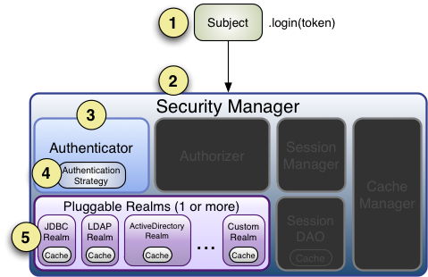
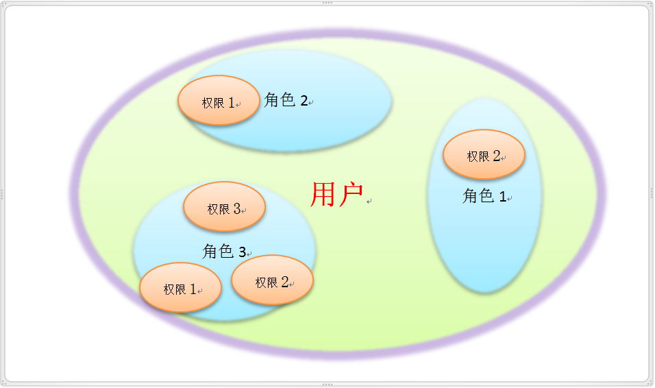
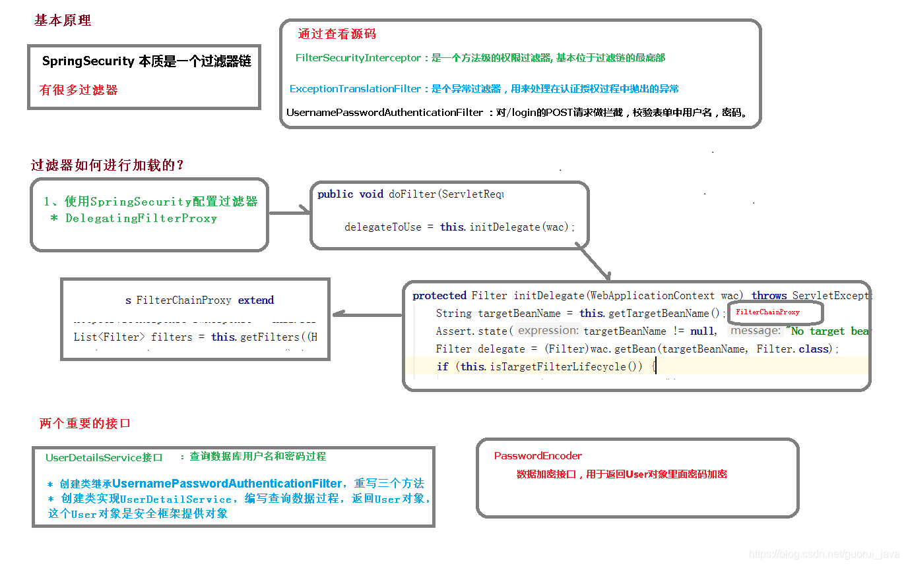
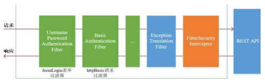
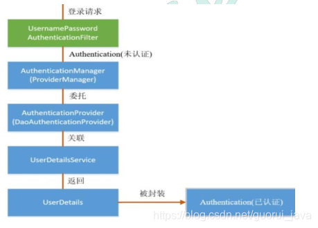

[参考](https://blog.csdn.net/weixin_44207403/article/details/106736102?ops_request_misc=%257B%2522request%255Fid%2522%253A%252232d38a872bc9357d21ce37e50a5b0faf%2522%252C%2522scm%2522%253A%252220140713.130102334..%2522%257D&request_id=32d38a872bc9357d21ce37e50a5b0faf&biz_id=0&utm_medium=distribute.pc_search_result.none-task-blog-2~all~top_positive~default-1-106736102-null-null.142^v102^pc_search_result_base8&utm_term=spring&spm=1018.2226.3001.4187)
[这个有步骤图](https://blog.csdn.net/weixin_68522070/article/details/141360851?ops_request_misc=%257B%2522request%255Fid%2522%253A%252232d38a872bc9357d21ce37e50a5b0faf%2522%252C%2522scm%2522%253A%252220140713.130102334..%2522%257D&request_id=32d38a872bc9357d21ce37e50a5b0faf&biz_id=0&utm_medium=distribute.pc_search_result.none-task-blog-2~all~top_positive~default-2-141360851-null-null.142^v102^pc_search_result_base8&utm_term=spring&spm=1018.2226.3001.4187)
# Spring Core
依赖：org.springframework.spring-webmvc
## IOC(控制反转)：
1. 基本概念
   - ***控制反转***IoC(Inversion of Control)，是一种设计思想，DI(依赖注入)是实现IoC的一种方法，也有人认为DI只是IoC的另一种说法。没有IoC的程序中 , 我们使用面向对象编程 , 对象的创建与对象间的依赖关系完全硬编码在程序中，对象的创建由程序自己控制，控制反转后将对象的创建转移给第三方。就如我们写service时，不需要实现Dao层，第三方帮我们是实现了，我们只需要new一个即可。
   - 控制反转是一种通过描述（XML或注解）并通过第三方去生产或获取特定对象的方式。在Spring中实现控制反转的是IoC容器，其实现方法是***依赖注入***（Dependency Injection,DI）。
2. 接下来通过例子理解控制反转和依赖注入，先是控制反转：
- 首先写个bean.xml(resources下):
```xml
<?xml version="1.0" encoding="UTF-8"?>
<beans xmlns="http://www.springframework.org/schema/beans"
       xmlns:xsi="http://www.w3.org/2001/XMLSchema-instance"
       xsi:schemaLocation="http://www.springframework.org/schema/beans
       http://www.springframework.org/schema/beans/spring-beans.xsd">

    <!-- id是bean的id是唯一的 name是bean名字可重复，未设置id可用name来
    找bean class是实体类位置前面两个都没设置可以用实体类名.class来找 属性里是实体类的名字和值 -->
    <bean id="person" name="person" class="com.CloudWhite.Entity.Person">
        <property name="name" value="张三"></property>
        <property name="age" value="18"></property>
    </bean>
</beans>
```
- 然后写个测试类：
```java
//解析beam文件
ApplicationContext context = new ClassPathXmlApplicationContext("beans.xml");
Person person = (Person) context.getBean("person");//getBean参数是bean的id
person.show();
```
可以发现new。而是用bean的id来new的，这就是控制反转。由此
Person对象是谁创建的 ? Person对象是由Spring创建的
Person对象的属性是怎么设置的 ? Person对象的属性是由Spring容器设置的
这个过程就叫控制反转
控制:谁来控制对象的创建,传统应用程序的对象是由程序本身控制创建的,使用Spring后,对象是由Spring来创建的
反转:程序本身不创建对象, 变成被动的接收对象
- 补充一下构造函数，无参构造函数xml无需改动，而有参则要加入如下：
```xml
<!-- 第一种根据index参数下标设置 -->
<bean id="person" class="com.CloudWhite.Entity.Person">
   <!-- index指构造方法 , 下标从0开始 -->
   <constructor-arg index="0" value="kuangshen2"/>
</bean>
<!-- 第二种根据参数名字设置 -->
<bean id="person" class="com.CloudWhite.Entity.Person">
   <!-- name指参数名 -->
   <constructor-arg name="name" value="kuangshen2"/>
</bean>
<!-- 第三种根据参数类型设置 -->
<bean id="person" class="com.CloudWhite.Entity.Person">
   <constructor-arg type="java.lang.String" value="kuangshen2"/>
</bean>
```
## 依赖注入：
我们分set注入和构造注入两种，构造器注入就是我前面解释控制反转的例子，不说了
**set注入**（重点）： 
- 要求被注入的属性,必须有set方法,set方法的方法名由set+属性首字母大写,如果属性是boolean类型,没有set方法，则方法名由is + 属性首字母大写
- 注入方法同上xml，这里再说一下一些特殊形式的注入：
  - collection注入，比如数组：
  ```xml
  <property name="books">
         <array>
             <value>西游记</value>
             <value>红楼梦</value>
             <value>水浒传</value>
         </array>
     </property>
  ```
  - Map注入：
  ```xml
  <map>
        <entry key="中国邮政" value="456456456465456"/>
        <entry key="建设" value="1456682255511"/>
    </map>
  ```
  - null注入:`<property name="wife"><null/></property>`
  - props注入：
  ```xml
  <props>
         <prop key="学号">20190604</prop>
         <prop key="性别">男</prop>
     </props>
  ```
  - p命名空间注入：先导入`xmlns:p="http://www.springframework.org/schema/p"`，然后`<bean id="user" class="..." p:name="狂神" p:age="18"/>`
  - c命名空间注入，先导入`xmlns:c="http://www.springframework.org/schema/c"`,然后`<bean id="user" class="..." c:name="狂神" c:age="18"/>`
## **关于其他xml配置**：
  - `<!--设置别名：在获取Bean的时候可以使用别名获取--><alias name="person" alias="me"/>`
  - `import resource="beans.xml" 导入其他xml文件`
  - `<!--设置作用域：singleton(单例)、prototype(多例)、session、request --><bean id="user" class="..." scope="singleton"/>`
    - singleton：当一个bean的作用域为Singleton，那么Spring IoC容器中只会存在一个共享的bean实例，并且所有对bean的请求，只要id与该bean定义相匹配，则只会返回bean的同一实例。Singleton是单例类型，就是在创建起容器时就同时自动创建了一个bean的对象，不管你是否使用，他都存在了，每次获取到的对象都是同一个对象。
    - prototype：当一个bean的作用域为Prototype，表示一个bean定义对应多个对象实例。Prototype作用域的bean会导致在每次对该bean请求（将其注入到另一个bean中，或者以程序的方式调用容器的getBean()方法）时都会创建一个新的bean实例。Prototype是原型类型，它在我们创建容器的时候并没有实例化，而是当我们获取bean的时候才会去创建一个对象，而且我们每次获取到的对象都不是同一个对象。
    - 根据经验，对有状态的bean应该使用prototype作用域，而对无状态的bean则应该使用singleton作用域。
    - request：当一个bean的作用域为request，表示该bean会为每一次HTTP请求创建一个新实例。即每次HTTP请求将会有各自的bean实例，它们依据某个bean定义创建而成。该作用域仅在基于Web的Spring ApplicationContext情形下有效。
    - session：当一个bean的作用域为session，表示该bean为每一次HTTP Session创建一个新实例。即执行过程中同个session内的bean是同一个实例。仅在基于Web的Spring ApplicationContext情形下有效。
  - `<!--设置自动装配：byName(根据名称)、byType(根据类型)--><bean id="user" class="..." autowire="byName"/>`
  - `<!--设置延迟加载：true(延迟加载)、false(非延迟加载)--><bean id="user" class="..." lazy-init="true"/>`
  - `<!--设置初始化方法和销毁方法--><bean id="user" class="..."init-method="init" destroy-method="destroy"/>`
  - `<!--设置工厂方法--><bean id="user" class="..." factory-method="getInstance"/>`
  - `<!--设置工厂Bean--><bean id="user" class="..." factory-bean="factory"/>`
## ***自动注入***： 
***这里只自动注入其他bean，即需要注入的实体类有其他有其他的类，不自动注入基本数据类型***
1. 原理：
   - 组件扫描(component scanning)：spring会自动发现应用上下文中所创建的bean；
   - 自动装配(autowiring)：spring自动满足bean之间的依赖，也就是我们说的IoC/DI；
2. **这里推荐使用注解而不是使用xml**，但我们还是先介绍一下用xml：
   1. byName：bean标签里加`autowire="byName"`，这里要保证该bean里同类型的对象只有一个，否则报错
   2. byType：bean标签里加`autowire="byType"`，这里无需保证同类型的对象只有一个
3. **注解**：
   1. 现在xml头部改成如下：
   ```xml
   <beans xmlns="http://www.springframework.org/schema/beans"
       xmlns:xsi="http://www.w3.org/2001/XMLSchema-instance"
   
       xmlns:context="http://www.springframework.org/schema/context"
   
       xsi:schemaLocation="
       http://www.springframework.org/schema/context
       http://www.springframework.org/schema/context/spring-context.xsd
   
       http://www.springframework.org/schema/beans
       http://www.springframework.org/schema/beans/spring-beans.xsd">
   ```
   2. ***注解自动注入***： 先再xml加上`<context:annotation-config/>`
      - @Autowired(required=true或true，及是否必须注入，一般不用默认必须注入，下面两个都有)：按类型自动转配的，不支持id匹配，*使用时删除原有的set方法*，相当于bytype
      - @Qualifier：按id匹配的，*使用时删除原有的set方法*，相当于byname
      - @Resource(可选的默认name)：这里如果有指定name就按指定name，没有就按byname，还没有就bytype，*使用时删除原有的set方法*，*以上对于删除set方法，也不可以删，在set方法上注解即可，下面的也同理。*
      - 但以上都直接使用可能会让依赖关系变得混乱（对于团体协作而言），对于简单的需要注入的Bean，可以直接用在字段注解，多了就在构造方法上注解，在复杂就建议用配置类来管理，再在构造函数上注解。
   3. ***其他配置，以下就不止是只注入其他bean，具体自行看下面理解***
      - `<context:component-scan base-package="com.CloudWhite.Entity"/>`: 配置要扫描的包. 然后在指定包里的类加上注解@Component("可写的bean的id")，就相当于xml里的bean标签
      - @value("可选的默认赋值")：给属性赋值，这里就可以去掉基本数据类型的set方法
      - @Component有三个衍生注解，即@Controller、@Service、@Repository，分别对应控制层、业务层、持久层，使用了就将其交给spring管理。
## ***一些重要使用说明***
了解的自动注入，那我们注入的对象是什么呢？一般为了方便灵活实现方法，我们一般注入接口（击得给实现类注入bean）。当然如果该类已经稳定我们也可以注入实现类。  
那么注入好处是什么？注入是将注入的对象交给spring管理，这样我们就不用自己去实例化了，我们可以直接声明被注入的对象，然后进行注入就能使用了。
## 基于Java类进行配置(配置类)：
以下一个例子了解注解作用：
```java
//先写一个实体类
@Component  //将这个类自动注入为bean，上面有说
public class Dog {
   public String name = "dog";
}
//然后来看配置类，注意两个注解
@Configuration  //代表这是一个配置类
public class MyConfig {

   @Bean //通过方法注册一个bean，这里的返回值就Bean的类型，方法名就是bean的id！
   public Dog dog(){
       return new Dog();
  }
}
@Import(MyConfig2.class)//想导入其他配置类，用这个注解也写在类外部
```
# Spring AOP
## 代理模式：
1. 静态代理：比如你要租房，你去找中介，中介就是代理，你不用去找房东，房东就是目标对象。那么现在有一个接口是租房，实现他的类就是房东，再写一个类真正实现租房接口就是中介即代理对象，代理对象代替房东实现接口，以及可能需要的新方法。
2. 动态代理：就是代理对象是动态生成的,下例就是动态代理：
```java
interface Rent {
    public void rent();
 }
 
//真实角色: 房东，房东要出租房子
class Host implements Rent{
    public void rent() {
        System.out.println("房屋出租");
   }
 }
 

public class ProxyInvocationHandler implements InvocationHandler {
    private Rent rent;
    public void setRent(Rent rent) {
        this.rent = rent;
   }
    //生成代理类，重点是第二个参数，获取要代理的抽象角色！之前都是一个角色，现在可以代理一类角色,且代理的是接口
    public Object getProxy(){
        return Proxy.newProxyInstance(this.getClass().getClassLoader(),
                rent.getClass().getInterfaces(),this);
   }
    // proxy : 代理类 method : 代理类的调用处理程序的方法对象.
    // 处理代理实例上的方法调用并返回结果
    @Override
    public Object invoke(Object proxy, Method method, Object[] args) throws Throwable {
        seeHouse();
        //核心：本质利用反射实现！
        Object result = method.invoke(rent, args);
        fare();
        return result;
   }
    //看房
    public void seeHouse(){
        System.out.println("带房客看房");
   }
    //收中介费
    public void fare(){
        System.out.println("收中介费");
   }
 }
 //租客
class Client {
    public static void main(String[] args) {
        //真实角色
        Host host = new Host();
        //代理实例的调用处理程序
        ProxyInvocationHandler pih = new ProxyInvocationHandler();
        pih.setRent(host); //将真实角色放置进去！
        Rent proxy = (Rent)pih.getProxy(); //动态生成对应的代理类！
        proxy.rent();
   }
 }
```
## AOP
依赖：org.aspectj.aspectjweaver
1. 概述：
- AOP(Aspect Oriented Programming)意为面向切面编程，通过预编译方式和运行期动态代理实现程序功能的统一维护的一种技术。AOP是OOP的延续，是软件开发中的一个热点，也是Spring框架中的一个重要内容，是函数式编程的一种衍生范型。利用AOP可以对业务逻辑的各个部分进行隔离，从而使得业务逻辑各部分之间的耦合度降低，提高程序的可重用性，同时提高了开发的效率。[跳转到图](../photo/3.png)
- spring中的aop：
  - 先了解一下几个概念：
    - 横切关注点：跨越应用程序多个模块的方法或功能。即是，与我们业务逻辑无关的，但是我们需要关注的部分，就是横切关注点。如日志 , 安全 , 缓存 , 事务等等 …
    - 切面（ASPECT）：横切关注点 被模块化 的特殊对象。即，它是一个类。
    - 通知（Advice）：切面必须要完成的工作。即，它是类中的一个方法。
    - 目标（Target）：被通知对象。
    - 代理（Proxy）：向目标对象应用通知之后创建的对象。
    - 切入点（PointCut）：切面通知 执行的 “地点”的定义。
    - 连接点（JointPoint）：与切入点匹配的执行点。 
  - 以及,[spring的五种通知](../photo/4.png)
2. AOP非注解实现： 
   1. 接口：`public interface testImpl { public void test();}`
   2. 服务类:`public class testService implements testImpl { public void test(){System.out.println("测试的好啊！1");}}`
   3. 增强类：
   ```java
   public class beforeLog implements MethodBeforeAdvice {
      //method : 要执行的目标对象的方法
      //objects : 被调用的方法的参数
      //Object : 目标对象
      @Override
      public void before(Method method, Object[] objects, Object o) throws Throwable {
         System.out.println( o.getClass().getName() + "的" + method.getName() + "方法被执行了");
      }
   }
   public class afterLog implements AfterReturningAdvice {
    //returnValue 返回值
    //method被调用的方法
    //args 被调用的方法的对象的参数
    //target 被调用的目标对象
    @Override
      public void afterReturning(Object returnValue, Method method, Object[] args, Object target) throws Throwable {
         System.out.println("执行了" + target.getClass().getName()
                  +"的"+method.getName()+"方法,"
                  +"返回值："+returnValue);
      }
   }
   ```
   4. beans.xml:
   ```xml
   <?xml version="1.0" encoding="UTF-8"?>
   <beans xmlns="http://www.springframework.org/schema/beans"
         xmlns:xsi="http://www.w3.org/2001/XMLSchema-instance"
   
         xmlns:context="http://www.springframework.org/schema/context"
         xmlns:aop="http://www.springframework.org/schema/aop"
   
         xsi:schemaLocation="
         http://www.springframework.org/schema/context
         http://www.springframework.org/schema/context/spring-context.xsd
   
         http://www.springframework.org/schema/beans
         http://www.springframework.org/schema/beans/spring-beans.xsd
         http://www.springframework.org/schema/aop
         http://www.springframework.org/schema/aop/spring-aop.xsd">
       <bean id="service" class="com.CloudWhite.Service.testService"></bean>
       <bean id="beforeLog" class="com.CloudWhite.Log.beforeLog"></bean>
       <bean id="afterLog" class="com.CloudWhite.Log.afterLog"></bean>
       <!--aop的配置-->
       <aop:config>
        <!--切入点 expression:表达式匹配要执行的方法-->
        <aop:pointcut id="pointcut" expression="execution(* com.CloudWhite.Service.testService.*(..))"/>
        <!--执行环绕; advice-ref执行方法 . pointcut-ref切入点-->
        <aop:advisor advice-ref="beforeLog" pointcut-ref="pointcut"/>
        <aop:advisor advice-ref="afterLog" pointcut-ref="pointcut"/>
       </aop:config>
   </beans>
   
   ```
   5. 测试类：`testImpl testService = (testImpl) context.getBean("service");testService.test();`
3. ***注解实现： ***
   1. 接口、服务类同上
   2. 增强类：
   ```java
   @Aspect
   @Component
   public class Log{
      @Before("execution(* com.CloudWhite.Service.testService..*.*(..))")
      public void before(){
         System.out.println("方法被执行前!");
      }
   
      @After("execution(* com.CloudWhite.Service.testService..*.*(..))")
      public void afterReturning(){
         System.out.println("方法被执行后!");
      }
   
      @Around("execution(* com.CloudWhite.Service.testService..*.*(..))")//先around，然后通过类型如下jp.proceed() ，执行before，然后继续around，最后执行after，当然也不宜不写这个，这个是为了区分多个方法
      public Object around(ProceedingJoinPoint jp) throws Throwable {
         System.out.println("环绕前");
         System.out.println("签名:"+jp.getSignature());//执行方法的返回类型、完整方法路径名
         Object proceed = jp.proceed();//执行目标方法proceed的返回值，有这个才会执行before
         System.out.println("环绕后");
         System.out.println(proceed);
         return proceed;//特别注意，这里通常需要返回值，否则mybatis的返回值可能错误  
      }
   }
   ```
   3. 最后bean.xml只要加上`<aop:aspectj-autoproxy/> `(其他如依赖注入记得开启组件扫描或手动注入)
# Spring MVC
就是spring加mvc设计模式，主要是controller层，service层，dao层，model层，view层，其中controller层是核心，其他都是辅助。
## MVC：
- 模型(Model)：模型是应用程序中用于处理数据的部分，主要有实体类。但除了实体类还有很多用处，可以封装各种bean，如统一json数据等等。
- 视图(View)：视图是应用程序中处理数据的显示部分。
- 控制器(Controller)：控制器作用于模型和视图上。它控制数据流向模型对象，并在数据变化时更新视图。它使视图与模型分离开。
- DAO：数据访问对象
- Service：业务逻辑
## ***Mybatis-Spring***
例子见SpringTest，是Spring AOP + Mybatis + Spring Core的整合
1. 在先前xml基础上加上如下：
```xml
<aop:aspectj-autoproxy/>
<!-- 加载外部属性配置文件 -->
<context:property-placeholder location="classpath:db.properties"/>
<!--配置数据源：数据源有非常多，可以使用第三方的，也可使使用Spring的-->
<bean id="dataSource" class="org.springframework.jdbc.datasource.DriverManagerDataSource">
   <!-- 也可以不加载外部资源直接载value里写 -->
   <property name="driverClassName" value="${jdbc.driver}"/>
   <property name="url" value="${jdbc.url}"/>
   <property name="username" value="${jdbc.username}"/>
   <property name="password" value="${jdbc.password}"/>
</bean>
<!-- 声明SqlSessionFactoryBean，在这个类的内部，创建SqlSessionFactory对象，之后就可以获取SqlSession对象 -->
<bean id="sqlSessionFactory" class="org.mybatis.spring.SqlSessionFactoryBean">
   <!-- 获取数据源 -->
   <property name="dataSource" ref="dataSource" />
   <!-- 获取其他配置，虽然数据源帮忙做了属性设置mybatis-config不用在写了，但其他配置如typeAlias等配置还是要加载mybatis-config。当然如果有mybatis-config之外的其他配置也可以在下面写注入到SqlSessionFactoryBean -->
   <property name="configLocation" value="classpath:mybatis-config.xml"/>
</bean>

<!-- 声明MapperScannerConfigurer -->
<!--
   MapperScannerConfigurer作用：
      循环basePackage所表示的包，把包中的每个接口都找到，调用SqlSession.getMapper(XXXDao.class)
      把每个dao接口都创建出对应的dao代理对象，将dao代理对象放在容器中。对于StudentDao接口，其代理对象为 studentDao,即我们不用mybatis的传统的用接口代理，而是用spring的getBean()动态代理接口
-->
<bean class="org.mybatis.spring.mapper.MapperScannerConfigurer">
   <!-- 指定SqlSessionFactory对象的名称 -->
   <property name="sqlSessionFactoryBeanName" value="sqlSessionFactory"/>
   <!-- 指定基本包，dao接口所在的包名 -->
   <property name="basePackage" value="com.CloudWhite.Dao"/>
</bean>
```
2. Dao接口，即mapper层：
```java
@Mapper//如果你不想用MapperScannerConfigurer可以用mapper注解，然后在启动类加上mapper扫描的注解，但这一般用在SpringBoot，后面再说
public interface testDao {
    List<UserInfo> selectAll();
}
```
3，Service层：
```java
//service接口，也可以不写，但一般写
public interface testImpl {
    List<UserInfo> selectAllUserInfo();
}
//接口实现类，主要为了调用dao层的方法，然后返回给controller层
@Service("testService")
public class testService implements testImpl {
    private testDao testDao;
    @Autowired
    public void setTestDao(com.CloudWhite.Dao.testDao testDao) {
        this.testDao = testDao;
    }
    @Override
    public List<UserInfo> selectAllUserInfo(){
        List<UserInfo> list = testDao.selectAll();
        return list;
    }
}
```
4. Controller层：调用service层的方法，返回给前端，另外从以上层次可看出，service依赖dao，controller依赖service，那么可以通过依赖注入来代替getBean()，当然用注解注入击得开启三个层级的扫描。
## ***Spring MVC:***
[]()
springBoot可以直接创建Spring MVC项目，即创建SpringBoot项目，勾选web即可  
[参考](https://blog.csdn.net/m0_64338546/article/details/132071506?ops_request_misc=%257B%2522request%255Fid%2522%253A%2522f4ba18099d6a0a7452cdecb50b53c40e%2522%252C%2522scm%2522%253A%252220140713.130102334..%2522%257D&request_id=f4ba18099d6a0a7452cdecb50b53c40e&biz_id=0&utm_medium=distribute.pc_search_result.none-task-blog-2~all~top_positive~default-1-132071506-null-null.142^v102^pc_search_result_base8&utm_term=Spring%20mvc&spm=1018.2226.3001.4187)
1. 路由映射（就是访问地址）：
   - @RequestMapping(/路由地址,方法类型可以不写不写就是任意方法格式为method = RequestMethod.方法名，ContentType内容，以及三个不常用的属性略)：
     - @RequestMapping注解可以修饰类，也可以修饰方法，当修饰类和方法时，访问的地址是类＋方法。
     - @RequestMapping注解可以处理任何HTTP方法的请求，包括GET、POST、PUT、DELETE等。
     - @RequestMapping注解可以使用method属性来进行限定处理请求的HTTP方法。
   - PostMapping(/路由地址)：
     - @PostMapping注解通常用于修饰控制器类中的方法，而不是类本身。
     - @PostMapping注解只可以处理HTTP POST请求映射到处理方法上。
   - GetMapping(/路由地址)：
     - @GetMapping注解通常用于修饰控制器类中的方法，而不是类本身。
     - @GetMapping注解只可以处理HTTP GET请求映射到处理方法上。
2. 路由获取参数：
   - 单个普通参数：当路由地址前加了一个value属性时就代表指定参数值，路由地址就变成了`路由地址?参数值=参数值`，此时的参数就是方法里定义的参数。如果想指定参数值则可用@RequestParam，如`test(@RequestParam("username") String name)`
   - 普通对象参数：同上
   - json对象：用@RequestBody注解标注对应对象即可，spring会自动将json转为对象，**当你不用时，它默认接受的表单数据**。
   - 获取url参数：即获取路由地址里的参数，如`路由地址/{参数名}`，此时的参数就是方法里定义的参数，用@PathVariable注解标注参数即可，如`test(@PathVariable("username") String name)`
   - 获取上传文件参数：使用@RequestParam注解，如`test(@RequestParam("file") MultipartFile file)`
   - 获取请求头：使用@RequestHeader注解，如`test(@RequestHeader("User-Agent") String userAgent)`
   - 获取cookie：使用@CookieValue注解，如`test(@CookieValue("JSESSIONID") String sessionId)`
   - 获取session：使用@SessionAttribute注解，如`test(@SessionAttribute("user") User user)`
3. 返回：
   1. 视图：直接return 视图名，这里视图名加`/`在更目录找，不加在当前目录找
   2. @RestController(这个注解是类的，是ReponseBody和Controller的组合)：直接return数据，这里返回的数据会自动转为json格式
   3. 其他略
# Spring Boot
[参考](https://blog.csdn.net/cuiqwei/article/details/118188540?ops_request_misc=%257B%2522request%255Fid%2522%253A%25228981b59ad7bb535f1826580f08582080%2522%252C%2522scm%2522%253A%252220140713.130102334..%2522%257D&request_id=8981b59ad7bb535f1826580f08582080&biz_id=0&utm_medium=distribute.pc_search_result.none-task-blog-2~all~top_positive~default-1-118188540-null-null.142^v102^pc_search_result_base8&utm_term=springBoot&spm=1018.2226.3001.4187)
## 项目结构
1. java: 存放后端java代码，满足mvc的结构并进行扩展，略
2. resources: 存放配置文件以及静态资源和模板文件，重点说明这两个:
   - 静态资源：如js、html、css等等，静态资源可被直接通过名字访问，不需要经过controller，如果controller返回需要加后缀。而要在后端获取静态资源要用到Resource接口，下面说。
   - 模板文件：当你集成了类似thymeleaf这样的模板引擎时，模板文件会被放置在这个目录下。模板文件通常用于生成动态的HTML页面，当然也可以放其他类型模板。模板视图可以被控制器返回，无需后缀名且为类路径，然后由模板引擎进行渲染。
   - Resource接口：  
     - 常用实现类：
       - ClassPathResource：用于加载类路径下的资源。
       - FileSystemResource：用于加载文件系统中的资源。
       - UrlResource：用于加载通过 URL 访问的资源，例如 HTTP、FTP 等。
       - ServletContextResource：用于加载 Servlet 上下文相关的资源。
     - 常用方法：
       - exists()：检查资源是否存在。
       - isReadable()：检查资源是否可读。
       - 各种get方法：获取资源的各种信息，如文件名、URL、输入输出流、文件内容、文本长度等。
       - ResourceLoader，spring常用的资源加载，用getResource()获取资源，其他用法类似上面。
   - 另外这里说明一下RestController和Controller的注解，RestController实际上是Controller和ResponseBody的组合，即返回的数据包括视图名都会自动转为json格式，对于返回json的数据可以直接写这个而不用一个个写ResponeBody。但对于需要返回试图名的控制器需要要Controller。
   - 返回视图加`/`是在当前目录找，不加是在更目录找
## 一些配置可能的配置：
这里可以用properties文件，也可以用yml文件，内容一样只是格式不一样，prop就不说了，下面用yml演示
1. logback配置：
```yml
logging:
  config: logback.xml  # 指定logback配置文件路径
  level:
    com.CloudWhite.SpringMvcTest.Dao: trace # 指定包路径下的日志级别
```
1. 配置微服务：
```yml
server: port=8080 # 端口号
address: localhost # 地址
url: http://localhost:8002 # 这里可以在分个层写别名
# 微服务的地址,微服务如用户名，密码等等略
```
这里配置了的话，就可以在其他类里用`@Value("${url}")`来获取配置的url
## 集成mybatis：**这里注意版本兼容，非常重要**
1. 依赖：`org.mybatis.mybatis`和`org.mybatis.mybatis-spring `
2. 配置(可以对照着xml理解)：
```yml
# 服务端口号
server:
  port: 8080 
spring:
  datasource: # 数据库配置
    driver-class-name: com.mysql.jdbc.Driver
    url: jdbc:mysql://localhost:3306/usermanagesystem?useUnicode=true&characterEncoding=utf-8&useSSL=false&serverTimezone=Asia/Shanghai
    username: root
    password: 123456
    hikari: #连接池，可不用
      maximum-pool-size: 10 # 最大连接池数
      max-lifetime: 1770000
 
mybatis:
  # 指定别名设置的包为所有entity
  type-aliases-package: com.itcodai.course10.entity
  configuration:
    map-underscore-to-camel-case: true # 驼峰命名规范
  mapper-locations: # mapper映射文件位置
    - classpath:mapper/*.xml
  config-location: classpath:mybatis-config.xml #可以导入mybits主配置文件来配置其他内容 
```
这里没有配置MapperScannerConfigurer，因为springBoot可以在启动类加@MapperScan("mapper所在的包")来扫描mapper，也可以在mapper层加@Mapper注解来扫描mapper，但这样要每个mapper写一遍
此时整合了mybatis的springboot的控制器就可以直接调用service层的方法了，但注意此时不用getBean()了，所以只能用依赖注入了获取service层的方法，当然这样更简单。
## 一些常用注解（上面或下面提到的略）
- @Scheduled：定时任务，需要在启动类加@EnableScheduling注解启用
  - fixedRate：指定任务执行的固定时间间隔，单位是毫秒
  - fixedDelay：指定任务执行完成后到下一次任务开始的固定时间间隔，单位为毫秒，和上面区别是fixedRate忽略了任务执行时间。
  - initialDelay：用来设置任务首次执行的延迟时间，单位是毫秒
  - cron：借助 Cron 表达式来指定任务的执行时间。Cron 表达式是一个字符串，由 6 或 7 个字段构成，分别表示秒、分、时、日、月、周、年（年为可选字段）。如`0 0 12 * * ?`每天中午 12 点触发
## 启动时执任务
1. 实现ApplicationRunner接口：
```java
@Component
public class exmaple implements ApplicationRunner {
    @Override
    public void run(ApplicationArguments args) {
       // 这里写要执行的任务代码
    }
}
```
2. 使用 @PostConstruct 初始化(推荐)
```java
@Component
public class BloomFilterInitializer {
    @PostConstruct
    public void initBloomFilter() {
        // 这里写要执行的任务代码
    }
}

```
3. 使用@EventListener(ApplicationReadyEvent.class)注解，同PostConstruct用法，这个可以启动后运行，这一解决一些Hiberate的问题
## 集成swagger：
swagger主要是为了接口文档，便于代码理解和测试
1. 依赖：
2. 常用注解：
   - 实体类的
     - @ApiModel 注解用于实体类，表示对类进行说明，用于参数用实体类接收。
     - @ApiModelProperty 注解用于类中属性，表示对 model 属性的说明或者数据操作更改。
   - controller的:
     - @Api 注解用于类上，表示标识这个类是 swagger 的资源。
     - @ApiOperation 注解用于方法，表示一个 http 请求的操作。
     - @ApiParam 注解用于参数上，用来标明参数信息。
- 配置类：
```java
@Configuration
@EnableSwagger2
public class SwaggerConfig {
 
    @Bean
    public Docket createRestApi() {
        return new Docket(DocumentationType.SWAGGER_2)
                // 指定构建api文档的详细信息的方法：apiInfo()
                .apiInfo(apiInfo())
                .select()
                // 指定要生成api接口的包路径，这里把controller作为包路径，生成controller中的所有接口
                .apis(RequestHandlerSelectors.basePackage("com.itcodai.course06.controller"))
                .paths(PathSelectors.any())
                .build();
    }
 
    /**
     * 构建api文档的详细信息
     * @return
     */
    private ApiInfo apiInfo() {
        return new ApiInfoBuilder()
                // 设置页面标题
                .title("Spring Boot集成Swagger2接口总览")
                // 设置接口描述
                .description("跟一起学Spring Boot第06课")
                // 设置联系方式
                .contact("测试，" + "www.baidu.com")
                // 设置版本
                .version("1.0")
                // 构建
                .build();
    }
}
```
但目前swagger2和springboot3.x版本不兼容，所以要把springboot版本降到2.x，不然会报错
如果用springboot3.x,可以用Springdoc - OpenAPI，如上五个注解如api对应Tag、apimodel和apimodelproperties对应Schema，这些参数变成了name和description，ApiOperation对应Operation，参数变成了summary和description，ApiParam对应Parameter，参数变成了description和是否必填，yml可以加一些配置：
```yml
springdoc:
  api-docs:
    path: /api-docs
  swagger-ui:
    path: /swagger-ui.html
```
## 集成thymeleaf
1. 依赖：
另外，在html页面上如果要使用thymeleaf模板，需要在页面标签中引入：`<html xmlns:th="http://www.thymeleaf.org">`
1. 配置：springboot已经默认级别配置好了，可能就一个受否开启页面缓存需要注意，默认是开启的，如要关闭：`spring.thymeleaf.cache=false #关闭缓存`
2. 使用：
访问静态界面，这里上面有说，一般由于写错误页面，如500、404等等，thymeleaf会自动识别并返回错误页面，当然也可以自己写。  
然后就是一些thymeleaf操作了，我们用一个例子说明：
```html
<form action="" th:each="blogger : ${list}" >
    用户编号：<input name="id" th:value="${blogger.id}"/><br>
    用户姓名：<input type="text" name="password" th:value="${blogger.name}"/><br>
    登录密码：<input type="text" name="username" th:value="${blogger.getPass()}"/>
</form>
```
可以看出thymeleaf可以用th:操作类型来进行操作，${}替换参数
以下是一些常见操作类型：
- th:object: 获取传递的对象
- th:属性名：设置属性 如value、style、src、on事件名、href、action等等
- th:if	th:case th:default ：相当于java中的switch case default	
- th:unless	条件判断和th:if相反	Login
此外，thymeleaf还允许内嵌一些java代码，如三元表达式、字符串连接等等  
除了`${}`可以替换参数，@{}可以替换url  
现在前端框架很成熟的进行动态渲染页面，**所以thymeleaf主要是用于静态页面的渲染**。
## 全局异常处理
1. 配置：
写一个配置类，只需在该类加上@ControllerAdvice注解即可检测全局异常，然后就可以写各种异常的处理方法，以下是一个请求缺失参数异常的例子：
```java
@ControllerAdvice
@RestController
public class GlobalException {
    // 打印log
    private static final Logger logger = LoggerFactory.getLogger(GlobalException.class);
    @ExceptionHandler(MissingServletRequestParameterException.class)//这里是异常类型
    @ResponseStatus(value = HttpStatus.BAD_REQUEST)//这里是返回状态码
    public JsonResult handleHttpMessageNotReadableException(
            MissingServletRequestParameterException ex) {
        logger.error("缺少请求参数，{}", ex.getMessage());
        return new JsonResult("400", "缺少必要的请求参数");
    }
}
```
然后当有控制器有异常就可以有logger打印出来你所配置的异常信息了。  
***然后就是自定义异常，只需要把我们自定义的异常写进全局异常类即可。对于自定义异常，需要继承Throwable类，这样当你定义的异常被抛出时，就会被全局异常类捕获。  ***
关于异常，以下是一些常见异常（指springboot的）：
- 启动类：
  - SpringApplicationRunException：启动异常
  - IllegalStateException：非法状态异常，启动时可能因为配置冲突或者上下文状态异常导致
- bean异常： 
  - BeanCreationException：Bean创建异常，可能是因为Bean的配置错误或者依赖关系问题导致
  - NoSuchBeanDefinitionException：找不到Bean定义异常，可能是因为Bean的名称或者类型错误导致
- 数据库异常： 
  - DataAccessException及其子类：数据访问异常，可能是因为数据库连接问题或者SQL语句错误导致
  - TransactionSystemException：事务系统异常，可能是因为事务配置错误或者事务状态异常导致
- 请求异常
  - HttpRequestMethodNotSupportedException：HTTP请求方法不支持异常，可能是因为请求的HTTP方法不被支持导致
  - HttpMediaTypeNotSupportedException：HTTP媒体类型不支持异常，可能是因为请求的媒体类型不被支持导致
  - MethodArgumentNotValidException：方法参数无效异常，可能是因为请求参数无效导致
  - MissingServletRequestParameterException：缺少请求参数异常，可能是因为请求缺少必要的参数导致
## 集成AOP
集成AOP方法在SpringAOP讲过，这里有一些新的注解
- Pointcut(切入点表达式)：写切入点表达式，以后就不用再每个都写了，只需要写该注解标注的函数名带扩号即可
- AfterReturning(切入点表达式，returning=返回的值)：在After之前，是After的增强注解，就是还能够获取返回值
- AfterThrowing(切入点表达式，throwing=异常名)：在After之前,是After的增强注解，就是还能够获取异常
## 事务：
SpringBoot的事务管理非常简单，只需要在方法上加上@Transactional(rollbackFor=异常类型)注解即可，但由于是自动的不是手动通过sqlseeion更灵活来来提交回滚，所以这里有一些注意的问题：
1. SpringBoot默认只有遇到RuntimeException和error才会回滚，比如遇到SQL异常就不会回滚了，所以一定要指定异常
2. 当我们使用try-catch捕获异常但没有抛出时，会检测不到异常，所以要抛出异常
3. 事务的有范围的，比如我们改一个方法锁，那此时事务的范围比锁大，此时方法被锁了事务检测不到异常自然也无法回滚，此时我们应该把锁定义到更大的范围如类上。故我们应该注意事务范围
## 监听器及各种上下文
### 我们先了解一下各种上下文：
1. ApplicationContext接口：
   1. 作用：
      - Bean 管理：ApplicationContext负责创建、配置和管理应用中的所有 Bean 对象。
      - 资源加载：可以加载各种资源，如文件、URL、类路径下的资源等。通过资源加载功能，应用可以方便地获取外部资源，如配置文件、图片等。
      - 事件发布与监听：支持事件机制，允许应用程序发布和监听事件。当某个事件发生时ApplicationContext 会将事件通知给所有注册的监听器，从而实现组件之间的解耦。
      - 国际化支持：提供国际化支持，允许应用根据不同的语言环境显示不同的文本信息。
   2. 常用实现类：
      - AnnotationConfigApplicationContext：用于加载基于注解的配置类，通常用于 Spring Boot 应用程序。
      - ClassPathXmlApplicationContext：用于加载类路径下的 XML 配置文件。
      - FileSystemXmlApplicationContext：用于加载文件系统中的 XML 配置文件。 
   3. 常用方法：
      - getBean()：通过bean名称、类名.class获取bean实例
      - getResource(指定路径)：获取资源
      - 以及各种get方法
      - containsBean():判断是否包含bean 各种is方法
      - publishEvent(事件)：发布事件 
2. ServletContext类： 
   1. 作用
   - 共享数据：ServletContext 提供了一个在整个 Web 应用程序中共享数据的机制。多个 Servlet、Filter 或其他 Web 组件可以通过 ServletContext 来存储和获取共享数据，实现不同组件之间的信息传递和交互。
   - 访问资源：它允许Servlet访问Web应用程序的资源，如配置文件、静态资源等。通ServletContext，可以获取资源的输入流，从而读取资源的内容。
   - 获取服务器信息：ServletContext 提供了获取服务器相关信息的方法。
   1. 常用方法：
      - get/setAttribute()：获取/设置属性
      - removeAttribute()：移除属性
      - getRealPath()：获取资源的真实路径
      - getResourceAsStream()：获取资源的输入流
      - getInitParameter()：获取初始化参数
      - getRequestDispatcher：获取请求调度器
      - 等等  
### 监听器    
1. 监听servlet上下文，我们要实现ApplicationListener接口，然后重写onApplicationEvent方法，然后在方法里写我们要监听的事件。我们来举个例子，比如我们对于一些需要实时更新但不频繁的信息，我们在每次刷新时把当前页面信息存入ServletContext，即Aplication存储，这种机制叫缓存，之后我们直接从缓存中获取即可，这样大大减少了数据库到的开销。对应监听器如下：
```java
@Component
public class ContextRefreshedEventListener implements ApplicationListener<ContextRefreshedEvent> {
    @Override
    public void onApplicationEvent(ContextRefreshedEvent event) {
        ApplicationContext applicationContext = event.getApplicationContext();
        userService userService = applicationContext.getBean(userService.class);
        List<userInfo> userInfos = userService.showAllUserInfo();
        ServletContext application = applicationContext.getBean(ServletContext.class);
        application.setAttribute("userInfos",userInfos);
    }
}
```
**这里可以看到ApplicationListener是一个泛型，我们可以监听很多不同事件，还可以用来自定义监听器。**
1. 自定义监听器：  
显然我们只要自定义监听事件然后实现ApplicationListener接口即可。这里自定义事件只要继承ApplicationEvent类即可，这里构造函数有一个参数即数据源，即监听的对象。
1. 监听sesion：
当我们要监听session时，如需要session存储登录人数，我们需要实现HttpSessionListener接口，然后重写sessionCreated和sessionDestroyed方法，然后在方法里写我们要监听的事件。以下是一个例子：
```java
@Component
public class SessionListener implements HttpSessionListener {
    private static int OnlineCount;
    @Override
    public void sessionCreated(HttpSessionEvent event){
        HttpSession session = event.getSession();
        OnlineCount++;
        session.getServletContext().setAttribute("我登陆了",OnlineCount);
        //session.setAttribute("我登陆了",OnlineCount);
    }

    @Override
    public void sessionDestroyed(HttpSessionEvent event){
        HttpSession session = event.getSession();
        OnlineCount--;
        session.getServletContext().setAttribute("我下线了",OnlineCount);
        //session.setAttribute("我登陆了",OnlineCount);
    }
}
```
1. 监听ServletRequest：
都是一个道理，直接贴代码：
```java
@Component
public class servletRequestListener implements ServletRequestListener {
    @Override
    public void requestInitialized(ServletRequestEvent event){
        HttpServletRequest request = (HttpServletRequest) event.getServletRequest();
        System.out.println("请求sessionId："+request.getRequestedSessionId());
        System.out.println("请求url："+request.getRequestURL());
        request.setAttribute("url",request.getRequestURL());
    }

    public void requestDestroyed(ServletRequestEvent event){
        HttpServletRequest request = (HttpServletRequest) event.getServletRequest();
        System.out.println("来自："+request.getAttribute("uel")+"请求已销毁");
    }
}
```
***最后对于监听事件，有以下常见事件（可以额外了解一下生命周期）：***
- ApplicationStartingEvent：应用程序启动事件，用于系统级别初始化
- ApplicationEnvironmentPreparedEvent：应用程序的Environment（环境配置）准备好但上下文还未创建，用于在此时修改配置环境
- ApplicationContextInitializedEvent：应用程序上下文初始化完成，但还未加载任何bean，用于在此时修改应用程序上下文
- ApplicationPreparedEvent：应用程序准备好，此时可以访问bean，但还未刷新上下文，对上下文进行最后一次更改
- ApplicationStartedEvent：应用程序启动完成，用于初始化
- ApplicationReadyEvent：当 CommandLineRunner 和 ApplicationRunner 已经调用，应用程序已经准备好接收外部请求时触发。可以在这个阶段进行一些健康检查、发送通知等操作。
- ContextRefreshedEvent：应用程序上下文刷新完成，所有bean都已加载并初始化
- ContextClosedEvent：应用程序上下文关闭事件，在应用程序关闭时触发
- ApplicationClosedEvent：应用程序关闭事件，在应用程序关闭时触发,比ContextClosedEvent先触发
- RequestHandledEvent：在请求处理完成后触发，用于记录请求处理的详细信息
- SessionCreatedEvent 和 SessionDestroyedEvent：用于处理会话创建和销毁事件
## 拦截器及定义注解
1. 定义拦截器，实现HandlerInterceptor接口，重写preHandle、postHandle、afterCompletion方法。  
这里三个方法的区别：
   - preHandle：该方法的执行时机是，当某个 url 已经匹配到对应的 Controller 中的某个方法，且在这个方法执行之前。此时可以做一些判断然后决定是否拦截。
   - postHandle：在请求处理之后，视图渲染之前调用。
   - afterCompletion：在整个请求处理完成之后调用，即在视图渲染完成之后。  
那现在我们来举个例子： 
```java
public class MyInterceptor implements HandlerInterceptor{
    @Override
    public boolean preHandle(HttpServletRequest request, HttpServletResponse response, Object handler){
        HandlerMethod handlerMethod = (HandlerMethod) handler;
        Method method = handlerMethod.getMethod();
        System.out.println("方法执行前，确认是否拦截————");
        //这里返回false则拦截，true就不拦截
        return false;
    }
    @Override
    public void postHandle(HttpServletRequest request, HttpServletResponse response, Object handler, ModelAndView modelAndView){
        System.out.println("方法已经执行，准备渲染视图————");
    }
    @Override
    public void afterCompletion(HttpServletRequest request, HttpServletResponse response, Object handler, Exception ex){
        System.out.println("方法完成，抛出异常");
    }
}
```
这里时拦截的是请求故有request和response，而handler是拦截的对象，即拦截的方法。而postHandle在视图渲染之前，故有一个ModelAndView参数，即视图渲染之前的模型和视图。而afterCompletion在整个请求处理完成之后，故要抛出异常。  
这里有个HandlerMethod类，里面封装了请求的各种方法信息。  
***这里重点说一下HandlerMethod：HandlerMethod类是在springmvc中用于表示处理程序方法的类。它封装了一个方法对象和一个控制器对象，提供了对方法的各种操作和信息的访问。也叫是说只要是springmvc请求，基本都会有一个HandlerMethod对象。*** 而如果只是普通方法，除非自定义否则是不会自动把方法信息封装成一对象的。
1. 配置拦截器：
```java
@Configuration
public class interceptionConfig extends WebMvcConfigurationSupport {
    @Override
    protected void addInterceptors(InterceptorRegistry registry) {
        registry.addInterceptor(new MyInterceptor()).addPathPatterns("/**");
        super.addInterceptors(registry);
    }}
```
**这里的addPathPatterns是拦截的路径，`/**`是拦截所有路径**，一般就是拦截所有请求，具体视情况而定。  
但是这里有个问题，就是拦截器是全局的，即所有请求都会被拦截，静态资源也会被拦截，即视图都无法显示，所以即使我们拦截所有请求也要防止拦截静态资源。这里有两个方法：

```java
//方法一为重写addResourceHandlers方法，指定不拦截某些资源更灵活
@Override
    protected void addResourceHandlers(ResourceHandlerRegistry registry) {
        registry.addResourceHandler("/**").addResourceLocations("classpath:/static/");
        super.addResourceHandlers(registry);
    }
//方法二，直接改成实现WebMvcConfigurer接口，一劳永逸，对于没有额外要求的拦截器可以用这个
@Configuration
public class MyInterceptorConfig implements WebMvcConfigurer {
    @Override
    public void addInterceptors(InterceptorRegistry registry) {
        // 实现WebMvcConfigurer不会导致静态资源被拦截
        registry.addInterceptor(new MyInterceptor()).addPathPatterns("/**");
    }
}
```
1. 让特定方法不被拦截
```java
//定义这个注解，在不席位被拦截的方法上加上这个注解即可，这样更方便、更灵活，可与上面合使用
@Target(ElementType.METHOD)
@Retention(RetentionPolicy.RUNTIME)
public @interface UnInterception {
}
```
但注意这里还要在拦截器里加上判断：
```java
if (handler instanceof HandlerMethod) {
            HandlerMethod handlerMethod = (HandlerMethod) handler;
            Method method = handlerMethod.getMethod();
            // 检查方法是否有 @UnInterception 注解
            if (method.isAnnotationPresent(UnInterception.class)) {
                System.out.println("方法标记了 @UnInterception 注解，不进行拦截");
                return true; // 有 @UnInterception 注解，不拦截
            }
        }
```
这里有个isAnnotationPresent 方法，用于判断方法是否有指定注解。  
那么现在就可以来看如何定义注解：

      1. @interface关键字修饰方法
            2.2. 定义元注解，以下是常用元注解：

- @Target：指定注解的作用目标，如方法（ElementType.METHOD）、类接口或枚举类(.TYPE)、成员变量(.FIELD)、方法参数（.PARAMETER）、构造方法(.CONSTRUCTOR)、局部变量(.LOCAL_VARIABLE)上。 
- @Retention：指定注解的保留策略，如运行时（RetentionPolicy.RUNTIME，最常用的写法）、编译时（.CLASS，运行时不可读）、源文件(.SOURCE，编译后消失)等等
- @Documented：指定注解是否包含在 JavaDoc 文档中
- @Inherited：指定注解是否可继承
- @Repeatable：指定注解是否可重复使用等等
  3. 定义注解的属性，在方法里定义，格式为`lei'x属性名() default "默认值";`

## 跨域
当接收请求的接口和请求的页面不在同一个域名下时，就会出现跨域问题，除了微服务、使用第三方API外，现代的前后端分离也经常需要跨域，所以我们要解决跨域问题。
在局部情况下，我们用`@CrossOrigin`注解来解决跨域问题，该注解参数如下（都为可选参数）：

- origins：指定允许访问的源地址列表，默认为 *。你可以指定一个或多个允许的跨域请求的源地址（多个逗号隔开即可）。
- methods：指定允许的 HTTP 方法列表，默认为 *。你可以指定一个或多个允许的 HTTP 方法（RequestMethod.Get、Post、Put等等）。
- allowedHeaders：指定允许的请求头列表，默认为 *。你可以指定一个或多个允许的请求头。
- exposedHeaders：指定允许暴露给客户端的响应头列表，默认为 *。你可以指定一个或多个允许暴露给客户端的响应头
- allowCredentials：指定是否允许发送凭据（如 Cookies），默认为 false。
- maxAge：指定预检请求的最大有效时间（以秒为单位），默认为 1800 秒（30 分钟）。
当需要较多配置时，我们可以使用@Configuration注解来创建一个配置类，然后在配置类上加上@EnableWebMvc注解来开启WebMvc，然后在配置类里加上@CrossOrigin注解来解决跨域问题，如下：
```java
@Configuration
public class CorsConfig {
    @Bean
    public CorsFilter corsFilter() {
        // 创建 CORS 配置对象
        CorsConfiguration config = new CorsConfiguration();
        // 允许的跨域请求源，可以使用具体的域名，也可以使用通配符 "*" 允许所有源
        // 注意：在生产环境中，建议使用具体的域名，避免使用通配符，以增强安全性
        config.addAllowedOriginPattern("*");
        // 允许的请求方法，如 GET、POST、PUT、DELETE 等
        config.addAllowedMethod("*");
        // 允许的请求头，如 Content-Type、Authorization 等
        config.addAllowedHeader("*");
        // 允许浏览器获取的响应头
        config.addExposedHeader("*");
        // 是否允许携带凭证，如 Cookie、HTTP 认证信息等
        config.setAllowCredentials(true);
        // 预检请求的缓存时间（秒），在此时间内，相同的预检请求将不再发送
        config.setMaxAge(3600L);
        // 创建基于 URL 的 CORS 配置源
        UrlBasedCorsConfigurationSource source = new UrlBasedCorsConfigurationSource();
        // 对所有接口都应用 CORS 配置
        source.registerCorsConfiguration("/**", config);
        // 创建并返回 CORS 过滤器
        return new CorsFilter(source);
    }
}    
```
## 集成redis
### 介绍及使用场景
Redis 是一种非关系型数据库（NoSQL），NoSQL 是以 key-value 的形式存储的，和传统的关系型数据库不一样，不一定遵循传统数据库的一些基本要求，比如说 SQL 标准，ACID 属性，表结构等等，这类数据库主要有以下特点：非关系型的、分布式的、开源的、水平可扩展的。
NoSQL 使用场景有：对数据高并发读写、对海量数据的高效率存储和访问、对数据的高可扩展性和高可用性等等。
Redis 的 key 可以是字符串、哈希、链表、集合和有序集合。value 类型很多，包括 String、list、set、zset。这些数据类型都支持 push/pop、add/remove、取交集和并集以及更多更丰富的操作，Redis 也支持各种不同方式的排序。为了保证效率，数据都是在缓存在内存中，它也可以周期性的把更新的数据写入磁盘或者把修改操作写入追加的记录文件中。
Redis 集群和 Mysql 是同步的，首先会从 redis 中获取数据，如果 redis 挂了，再从 mysql 中获取数据，这样网站就不会挂掉。
也就是说，对于一下短期热点数据，我们可以把它存到 redis 中，这样可以提高访问速度，减少数据库的访问量，从而提高网站的性能。对于需要长期保存的数据，我们可以把它存到 mysql 中，这样可以保证数据的安全性。两者之间的数据，我们两者都存，可以通过定时任务来同步。
### 集成redis
1. 下载配置redis，加上redis依赖：
2. 配置：
```yml
spring:
  #ridis配置
  data:
    redis:
      database: 5
      host: 192.168.202.1 #自己的地址
      port: 6379 #redis监听端口，默认6379
      password: 123456
      jedis:
        pool:
          max-idle: 1000 # 连接池中的最大空闲连接，默认值是8。
          min-idle: 0 # 连接池中的最小空闲连接，默认值是0
          max-active: -1 #最大jedis是隶属，-1为不限制
          max-wait: 5000 #最大连接等待时间，单位ms，默认-1为不限制
```
### redis使用（直介绍最常用的，其他自己去查）：
有两个 redis 模板：RedisTemplate 和 StringRedisTemplate。我们不使用 RedisTemplate，RedisTemplate 提供给我们操作对象，操作对象的时候，我们通常是以 json 格式存储，但在存储的时候，会使用 Redis 默认的内部序列化器；导致我们存进里面的是乱码之类的东西。当然了，我们可以自己定义序列化，但是比较麻烦，所以使用 StringRedisTemplate 模板。StringRedisTemplate 主要给我们提供字符串操作，我们可以将实体类等转成 json 字符串即可，这里用jackson库等处理即可。  
1. redis:string:
```java
@Resource //注入stringRedisTemplate
private StringRedisTemplate stringRedisTemplate;
//opsForValue来获取ValueOperations对象即可进行各种操作了
public void setString(String key,String value){
    ValueOperations<String,String> valueOperations = stringRedisTemplate.opsForValue();
    valueOperations.set(key,value);  //这里set方法还可以设置过期时间和时间单位，不设置的话默认不过期
}

public String getString(String key){
    ValueOperations valueOperations = stringRedisTemplate.opsForValue();
    valueOperations.get(key);
}
//对于不用注解，可以接上面，存为字符串后用Jason库处理未JSON字符串即可，如下
String json = objectMapper.writeValueAsString(obj);
```
2. hash:这个就是上面的在加一个key（即hash的key）,将Operations换成HashOperations、opsForValue换成opsForHash即可，get和set变成了put和get 
3. list：将Operations换成ListOperations、opsForValue换成opsForList即可，get和set变成了leftPush和rightPop  
*这里注意之最后都会返回一个json字符串，所以要在设置时进行数值转换*
### 相关注解
1. @Cacheable：方法执行前先查缓存，有则返回，无则执行方法并缓存结果
   - value: 缓存的名称，每个缓存名称下面可以有多个 key。
   - key: 缓存的 key，支持 SpEL 表达式。
   - condition: 缓存的条件，只有当条件为 true 时才缓存，支持 SpEL 表达式。
   - unless: 方法执行完后判断是否缓存结果，返回 true 不缓存
   - sync: 是否异步执行，默认为 false。
2. @putCache：这个始终会执行方法，然后将结果放入缓存中。显然用于和@Scheduled搭配使用，定时更新缓存
   - 支持value、key、condition
3. @CacheEvict：清除缓存
   - 支持value、key、condition
   - allEntries：是否清除所有缓存，默认为 false（指清除整个value而不是整个redis数据库）。
   - beforeInvocation：是否在方法执行前清除缓存，默认为 false。 
4. @Chaching: 组合注解，可以同时使用多个@Cacheable、@CachePut、@CacheEvict，如`@Caching(evict = {@CacheEvict(value = "userCache", key = "#userId"),@CacheEvict(value = "postCache", key = "#userId")})`
5. @EnableCaching ：开启缓存功能，在启动类上加上这个注解即可
6. 这里注意，用注解的话系统会自动进行JDK序列化，但我们一般对于基本数值类型和字符串我们是直接存的，而对象我们使用JSON序列化，所以我们要在配置类里加上：
```java
@Configuration
public class redisConfig {
    @Bean
    public CacheManager cacheManager(RedisConnectionFactory factory) {
        RedisCacheConfiguration config = RedisCacheConfiguration.defaultCacheConfig()
                .entryTtl(Duration.ofHours(1))  // 缓存过期时间，可自定义
                .serializeKeysWith(RedisSerializationContext.SerializationPair.fromSerializer(new StringRedisSerializer()))
                .serializeValuesWith(RedisSerializationContext.SerializationPair.fromSerializer(new GenericJackson2JsonRedisSerializer()));

        return RedisCacheManager.builder(factory)
                .cacheDefaults(config)
                .build();
    }

    @Bean
    public RedisTemplate<String, Object> redisTemplate(RedisConnectionFactory connectionFactory) {
        RedisTemplate<String, Object> template = new RedisTemplate<>();
        template.setConnectionFactory(connectionFactory);

        // key 用 String 序列化
        StringRedisSerializer stringSerializer = new StringRedisSerializer();
        template.setKeySerializer(stringSerializer);
        template.setHashKeySerializer(stringSerializer);

        // value 用 GenericJackson2JsonRedisSerializer（自动处理类型信息）
        ObjectMapper mapper = new ObjectMapper();
        mapper.setVisibility(PropertyAccessor.ALL, JsonAutoDetect.Visibility.ANY);
        mapper.activateDefaultTyping(
                BasicPolymorphicTypeValidator.builder()
                        .allowIfSubType("com.CloudWhite")
                        .build(),
                ObjectMapper.DefaultTyping.NON_FINAL
        );
        GenericJackson2JsonRedisSerializer serializer = new GenericJackson2JsonRedisSerializer(mapper);

        template.setValueSerializer(serializer);
        template.setHashValueSerializer(serializer);

        template.afterPropertiesSet();
        return template;
    }
}
```
## 基础WebSocket
### 介绍：
WebSocket协议是基于TCP的一种新的网络协议。它实现了浏览器与服务器全双工(full-duplex)通信——允许服务器主动发送信息给客户端。  
初次接触 WebSocket 的人，都会问同样的问题：我们已经有了 HTTP 协议，为什么还需要另一个协议？它能带来什么好处？答案很简单，因为 HTTP 协议有一个缺陷：**通信只能由客户端发起**，HTTP 协议做不到服务器主动向客户端推送信息。  
很简单的例子就是实时通信，要想知道有没有消息发来只能是客户端不断地向服务器发送请求，资源消耗和性能消耗都很大。当客户端发送一个 WebSocket 请求时，服务器将发送一个协议响应以确认请求。在握手期间，客户端和服务器将协商使用的协议版本、支持的子协议、支持的扩展选项等。一旦握手完成，连接将保持打开状态，客户端和服务器就可以在连接上实时地传递数据。  
- WebSocket有如下生命周期：  
  1. 连接建立阶段（Connection Establishment）： 在这个阶段，客户端和服务器之间的 WebSocket 连接被建立。客户端发送一个  WebSocket 握手请求，服务器响应一个握手响应，然后连接就被建立了。  
  2. 连接开放阶段（Connection Open）： 在这个阶段，WebSocket 连接已经建立并开放，客户端和服务器可以在连接上互相发送数据。
  3. 连接关闭阶段（Connection Closing）： 在这个阶段，一个 WebSocket 连接即将被关闭。它可以被客户端或服务器发起，通过发送一个关闭帧来关闭连接。
  4. 连接关闭完成阶段（Connection Closed）： 在这个阶段，WebSocket 连接已经完全关闭。客户端和服务器之间的任何交互都将无效。
- WebSocket的消息格式
WebSocket的消息格式与 HTTP 请求和响应的消息格式有所不同。WebSocket 的消息格式可以是文本或二进制数据，并且 WebSocket 消息的传输是在一个已经建立的连接上进行的，因此不需要再进行 HTTP 请求和响应的握手操作。  
WebSocket 消息格式由两个部分组成：消息头和消息体。
1. 消息头包含以下信息：
   - FIN： 表示这是一条完整的消息，一般情况下都是1。
   - RSV1、RSV2、RSV3： 暂时没有使用，一般都是0。
   - Opcode： 表示消息的类型，包括文本消息、二进制消息等。
   - Mask： 表示消息是否加密。
   - Payload length： 表示消息体的长度。
   - Masking key： 仅在消息需要加密时出现，用于对消息进行解密。
2. 消息体就是实际传输的数据，可以是文本或二进制数据。
### 集成
依赖`org.springframework.boot.spring-boot-starter-websocket`  
几种还有自带的jakata实现的websocket，我们先说这个：
```java
//先写一个WebSocket服务器
@ServerEndpoint("/websocket")
public class WebSocketServer {
    private static final Set<Session> sessions = Collections.synchronizedSet(new HashSet<Session>());
    @OnOpen
    public void onOpen(Session session) {
        System.out.println("Connection opened: " + session.getId());
        sessions.add(session);
    }

    @OnMessage
    public void onMessage(Session session, String message) throws IOException {
        System.out.println("Received message: " + message);
        session.getBasicRemote().sendText("Server received: " + message);
    }

    @OnClose
    public void onClose(Session session) {
        System.out.println("Connection closed: " + session.getId());
        sessions.remove(session);
    }
}
//然后启用它
@Configuration
public class WebSocketEndpointExporterConfig {
    @Bean
    public ServerEndpointExporter serverEndpointExporter() {
        return new ServerEndpointExporter();
    }
}
```
而SpringBoot的webscoket更常用，更适合大规模业务扩展，配置如下：
```java
// 同样先写一个WebSocket服务器
public class WebSocketHandler extends TextWebSocketHandler {
    @Override
    public void afterConnectionEstablished(WebSocketSession session) {
        System.out.println("Connected: " + session.getId());
    }

    @Override
    protected void handleTextMessage(WebSocketSession session, TextMessage message) throws Exception {
        System.out.println("Received: " + message.getPayload());
        session.sendMessage(new TextMessage("Server received: " + message.getPayload()));
    }

    @Override
    public void afterConnectionClosed(WebSocketSession session, CloseStatus status) {
        System.out.println("Disconnected: " + session.getId());
    }
}
//然后配置启用
@Configuration
@EnableWebSocket
public class WebSocketConfig implements WebSocketConfigurer {
    @Override
    public void registerWebSocketHandlers(WebSocketHandlerRegistry registry) {
        registry.addHandler(new WebSocketHandler(), "/websocket").setAllowedOrigins("*");
    }
}
```
然后直接在浏览器里访问`ws://localhost:8080/websocket`即可连接，然后就可以进行通信了。
## 集成Shiro
### 介绍：
1. Shiro 三大核心组件：
   1. Subject：认证主体。它包含两个信息：Principals和Credentials,这俩具体是：
      - Principals：身份。可以是用户名，邮件，手机号码等等，用来标识一个登录主体身份；
      - Credentials：凭证。常见有密码，数字证书等等。   
       简单来说，就是用户的认证信息。
   2. SecurityManager：安全管理员。这是 Shiro 架构的核心，它就像 Shiro 内部所有原件的保护伞一样。我们在项目中一般都会配置 SecurityManager，开发人员大部分精力主要是在 Subject 认证主体上面。我们在与 Subject 进行交互的时候，实际上是 SecurityManager 在背后做一些安全操作。
   3. Realms：Realms 是一个域，它是连接 Shiro 和具体应用的桥梁，当需要与安全数据交互的时候，比如用户账户、访问控制等，Shiro 就会从一个或多个 Realms 中去查找。我们一般会自己定制 Realm，这在下文会详细说明。
2. Shiro 身份和权限认证  
 
- Step1：应用程序代码在调用 Subject.login(token) 方法后，传入代表最终用户的身份和凭证的 AuthenticationToken 实例 token。
- Step2：将 Subject 实例委托给应用程序的 SecurityManager（Shiro的安全管理）来开始实际的认证工作。这里开始真正的认证工作了。
- Step3，4，5：然后 SecurityManager 就会根据具体的 realm 去进行安全认证了。 从图中可以看出，realm 可以自定义（Custom Realm）。
1. Shiro 权限认证:  
权限认证，也就是访问控制，即在应用中控制谁能访问哪些资源。在权限认证中，最核心的三个要素是：权限，角色和用户。
   - 权限（permission）：即操作资源的权利，比如访问某个页面，以及对某个模块的数据的添加，修改，删除，查看的权利；
   - 角色（role）：指的是用户担任的的角色，一个角色可以有多个权限；
   - 用户（user）：在 Shiro 中，代表访问系统的用户，即上面提到的 Subject 认证主体
   
一个用户可以有多个角色，而不同的角色可以有不同的权限，也可由有相同的权限。比如说现在有三个角色，1是普通角色，2也是普通角色，3是管理员，角色1只能查看信息，角色2只能添加信息，管理员都可以，而且还可以删除信息，类似于这样。

有上面的介绍，第一步自然是自定义域，我们可以继承AuthorizingRealm类，然后重写doGetAuthenticationInfo和doGetAuthorizationInfo方法，这里有一个例子：
```java
public class loginRealm extends AuthorizingRealm {
    @Autowired
    private userService userService;

    public static StringBuffer remindMessage;
    //用来登录前验证用户，获取认值信息
    @Override
    protected AuthenticationInfo doGetAuthenticationInfo(AuthenticationToken authenticationToken) throws AuthenticationException {
        //用authenticationToken.getPrincipal获取用户名
        String username = (String) authenticationToken.getPrincipal();
        //有用户名判断是否有该用户
        userInfo userInfo = userService.getUserInfoByUsername(username);
        if(userInfo!=null){
            //用SecurityUtils获取认证主体并将该用户存入session
            SecurityUtils.getSubject().getSession().setAttribute(userInfo.getUsername(),userInfo);
            //传入用户信息进行认证
            AuthenticationInfo  authenticationInfo = new SimpleAuthenticationInfo(userInfo.getUsername(),userInfo.getPassword(),"loginRealm");
            return authenticationInfo;
        }else {
            remindMessage.append("账号或密码错误！");
            return null;
        }
    }
    //用来登录后授予角色和权限
    @Override
    protected AuthorizationInfo doGetAuthorizationInfo(PrincipalCollection principalCollection){
        //用principalCollection.getPrimaryPrincipal()得到用户名
        String username = (String) principalCollection.getPrimaryPrincipal();
        SimpleAuthorizationInfo authorizationInfo = new SimpleAuthorizationInfo();
        //给该用户设置角色和权限
        authorizationInfo.setRoles(userService.getRoleNameByUsername(username));
        authorizationInfo.setStringPermissions(userService.getPremissionInfoByUsername(username));
        return authorizationInfo;
    }
}
```
然后在配置类将所有域传上去：
```java
@Configuration
public class RealmConfig {
    @Bean
    public loginRealm loginRealm() {
        loginRealm loginRealm = new loginRealm();
        System.out.println("Auth域注册完成————");
        return loginRealm;
    }}
```
在配置安全管理器托管域：
```java
@Bean
    public DefaultWebSecurityManager securityManager() {
        // 将自定义realm加进来
        DefaultWebSecurityManager securityManager = new DefaultWebSecurityManager(loginRealm());
        System.out.println("====securityManager注册完成====");
        return securityManager;
    }
```
最后配置shiroFilter：
```java
@Bean
    public ShiroFilterFactoryBean shiroFilter(DefaultWebSecurityManager securityManager) {
        // 定义shiroFactoryBean
        ShiroFilterFactoryBean shiroFilterFactoryBean=new ShiroFilterFactoryBean();

        // 设置自定义的securityManager
        shiroFilterFactoryBean.setSecurityManager(securityManager);

        // 设置默认登录的url，身份认证失败会访问该url
        shiroFilterFactoryBean.setLoginUrl("/login");
        // 设置成功之后要跳转的链接
        shiroFilterFactoryBean.setSuccessUrl("/index");
        // 设置未授权界面，权限认证失败会访问该url
        shiroFilterFactoryBean.setUnauthorizedUrl("/unauthorized");

        // LinkedHashMap是有序的，进行顺序拦截器配置
        Map<String,String> filterChainMap = new LinkedHashMap<>();

        // 配置可以匿名访问的地址，可以根据实际情况自己添加，放行一些静态资源等，anon表示放行
        filterChainMap.put("/css/**", "anon");
        filterChainMap.put("/imgs/**", "anon");
        filterChainMap.put("/js/**", "anon");
        filterChainMap.put("/swagger-*/**", "anon");
        filterChainMap.put("/swagger-ui.html/**", "anon");
        // 登录url 放行
        filterChainMap.put("/login", "anon");

        // “/user/admin” 开头的需要身份认证，authc表示要身份认证
        filterChainMap.put("/user/admin*", "authc");
        // “/user/student” 开头的需要角色认证，是“admin”才允许
        filterChainMap.put("/user/student*/**", "roles[admin]");
        // “/user/teacher” 开头的需要权限认证，是“user:create”才允许
        filterChainMap.put("/user/teacher*/**", "perms[\"user:create\"]");

        // 配置logout过滤器
        filterChainMap.put("/logout", "logout");

        // 设置shiroFilterFactoryBean的FilterChainDefinitionMap
        shiroFilterFactoryBean.setFilterChainDefinitionMap(filterChainMap);
        System.out.println("====shiroFilterFactoryBean注册完成====");
        return shiroFilterFactoryBean;
    }
```
可以看出要配置：
- 默认登录的 url：身份认证失败会访问该 url
- 认证成功之后要跳转的 url
- 权限认证失败会访问该 url
- 需要拦截或者放行的 url：这些都放在一个 map 中
在 map 中，针对不同的 url，有不同的权限要求，这里总结一下常用的几个权限：
- anon	开放权限，可以理解为匿名用户或游客，可以直接访问的
- authc	需要身份认证的
- logout	注销，执行后会直接跳转到 shiroFilterFactoryBean.setLoginUrl(); 设置的 url，即登录页面
- roles[admin]	参数可写多个，表示是某个或某些角色才能通过，多个参数时写 roles[“admin，user”]，当有多个参数时必须每个参数都通过才算通过
- perms[user]	参数可写多个，表示需要某个或某些权限才能通过，多个参数时写 perms[“user, admin”]，当有多个参数时必须每个参数都通过才算通过  
***特别注意：Springboot3.x和目前的Shiro的兼容性非常差，所以要用shiro要使用SpringBoot2.x版本。***
## 集成Lucence
1. 依赖
2. 使用：直接看例子
```java
public class Indexer {
    private IndexWriter indexWriter;
    //这里参数是存放索引的目录不是文件目录
    public Indexer(String indexDir) throws IOException {
        //建立索引目录
        Directory dir = FSDirectory.open(Paths.get(indexDir));
        //实现标准分词器，会自动去掉空格啊，is a the等单词
        Analyzer analyzer = new StandardAnalyzer();
        //将分词器放到写索引配置中
        IndexWriterConfig indexWriterConfig = new IndexWriterConfig(analyzer);
        //实例化写索引对象
        indexWriter = new IndexWriter(dir,indexWriterConfig);
    }
    //这是获取该目录下所有索引的方法
    public int indexAll(String dir) throws Exception {
        //获取目录下所以文件
        File[] files = new File(dir).listFiles();
        if (null != files) {
            for (File file : files) {
                //调用下面的indexFile方法，对每个文件进行索引
                indexFile(file);
            }
        }
        //返回索引的文件数
        return indexWriter.numDocs();
    }

    private void indexFile(File file) throws Exception {
        System.out.println("索引文件的路径：" + file.getCanonicalPath());
        //调用下面的getDocument方法，获取该文件的document
        Document doc = getDocument(file);
        //将doc添加到索引中
        indexWriter.addDocument(doc);
    }

    private Document getDocument(File file) throws IOException {
        Document document = new Document();
        //开始添加字段，先添加内容
        document.add(new TextField("contents", new FileReader(file)));
        //添加文件名，并把这个字段存到索引文件里
        document.add(new TextField("fileName", file.getName(), Field.Store.YES));
        //添加文件路径
        document.add(new TextField("fullPath", file.getCanonicalPath(), Field.Store.YES));
        return document;
    }
    //测试主类，略
```
```java
class Searcher {
    public static void search(String searchDir,String str) throws IOException, ParseException {
        //获取搜素目录，即索引目录
        Directory dir = FSDirectory.open(Paths.get(searchDir));
        //用IndexReader读取索引
        IndexReader indexReader = DirectoryReader.open(dir);
        //构建IndexSearcher
        IndexSearcher indexSearcher = new IndexSearcher(indexReader);
        //标准分词器
        Analyzer analyzer = new StandardAnalyzer();
        //查询解析器
        QueryParser queryParser = new QueryParser("contents",analyzer);
        //通过解析要查询的String，获取查询对象，str为传进来的待查的字符串
        Query query = queryParser.parse(str);

        long startTime = System.currentTimeMillis();
        //开始搜素,这里查询前十条记录
        TopDocs docs = indexSearcher.search(query,10);
        long endTime = System.currentTimeMillis();
        long searchTime = endTime - startTime;
        System.out.println("匹配" + str + "共耗时" + searchTime + "毫秒");
        System.out.println("查询到" + docs.totalHits + "条记录");

        //取出每条查询结果
        for(ScoreDoc scoreDoc : docs.scoreDocs) {
            //scoreDoc.doc相当于docID,根据这个docID来获取文档
            Document doc = indexSearcher.doc(scoreDoc.doc);
            //fullPath是刚刚建立索引的时候我们定义的一个字段，表示路径。也可以取其他的内容，只要我们在建立索引时有定义即可。
            System.out.println(doc.get("fullPath"));
        }
        indexReader.close();
    }
    //测试主类，略
```
## 关于返回状态码和响应实体的定义

我们对于复杂的请求，一般不仅仅返回结果，还可以返回状态码（这个一般会返回）、响应体（这个就是结果）、头部（看情况看需不需要）等等，那么我们这是就可以封装一个响应实体来统一处理。

这里响应体类型是Object（适应不同结果），状态码是HttpStatus（属性是状态码的英文），头是HttpHeaders（通过add添加响应头信息）

## 关于JWT

以下是一个常用生成JWT方法例子

```java
import io.jsonwebtoken.Jwts;
import io.jsonwebtoken.SignatureAlgorithm;
public class JwtUtils {
    // 签名密钥（应该放到配置文件中）
    private static final String SECRET_KEY = "设置一个密匙，这是用来防止被攻击的";

    // 生成 access_token，即短期的token
    public static String createAccessToken(String username, String userId, long expiration) {
        return Jwts.builder()
                .setSubject(username) //这个是用户的核心标识符，如用户名、用户ID等等
                .claim("userId", userId)  // 可自定义你需要的 claim，即可写几个claim
                .setIssuedAt(new Date())  //JWT签发时间，就是生成时间
                .setExpiration(new Date(System.currentTimeMillis() + expiration))  // 设置过期时间
                .signWith(SignatureAlgorithm.HS512, SECRET_KEY)  // 使用 HS512 算法签名
                .compact(); //返回最终的字符串
    }

    // 生成 refresh_token（即长期token，可以不设置过期时间，或设置较长的过期时间）
    public static String createRefreshToken(String username, String userId) {
        return Jwts.builder()
                .setSubject(username)
                .claim("userId", userId)
                .setIssuedAt(new Date())
                .signWith(SignatureAlgorithm.HS512, SECRET_KEY)
                .compact();
    }
}
```

然后是解析JWT方法

```java
import io.jsonwebtoken.Claims;
import io.jsonwebtoken.Jwts;

public class JwtUtils {
    // 解析 JWT Token
    public static Claims parseToken(String token) {
        return Jwts.parser()
                .setSigningKey(SECRET_KEY) //设置密匙
                .parseClaimsJws(token)  //解析Claim
                .getBody();  //返回一个claim对象，claim可以向访问map一样访问它
    }
    // 获取用户 ID（示例）
    public static String getUserIdFromToken(String token) {
        Claims claims = parseToken(token);
        return claims.get("userId", String.class);
    }
    // 获取用户名（示例）
    public static String getUsernameFromToken(String token) {
        Claims claims = parseToken(token);
        return claims.getSubject();
    }
}
```

验证JWT是否有效

```java
import io.jsonwebtoken.ExpiredJwtException;
import io.jsonwebtoken.SignatureException;

public class JwtUtils {

    // 验证 JWT 是否有效
    public static boolean validateToken(String token) {
        try {
            Claims claims = parseToken(token); // 解析 token
            Date expiration = claims.getExpiration();
            return !expiration.before(new Date());  // 判断是否过期
        } catch (ExpiredJwtException e) {
            // token 已过期
            return false;
        } catch (SignatureException e) {
            // token 签名无效
            return false;
        } catch (Exception e) {
            return false;
        }
    }
}
```

刷新token

```java
public class JwtUtils {

    // 刷新 access_token，基于有效的 refresh_token
    public static String refreshAccessToken(String refreshToken) {
        // 假设刷新 token 时，仍然能解析出 userId 和 username
        Claims claims = parseToken(refreshToken);
        String userId = claims.get("userId", String.class);
        String username = claims.getSubject();
        // 重新生成一个新的 access_token
        return createAccessToken(username, userId, 15 * 60 * 1000);  // 15 分钟的有效期
    }
}
```

# Spring Data

## 概述：
Spring Data 它主要是用于做数据存储的，用在数据持久层。mybatis主要是用来操作像mysql这种关系型数据库，而除了这些外，**Spring Data 还可以操作非关系型数据库**，如Redis、MongoDB、Elasticsearch、Neo4j等。随着时代发展单一数据库已经无法满足实际开发需求了，因为用户量越来越大了。这时候项目就需要多种数据库，可每种数据库都有自己的语言，学习成本大，而**Spring Data将不同的这个数据存储进行了统一 提升了我们的开发效率，降低了我们的学习成本**，这就是我们学习Spring Data的原因。而常用的springdata模块如下：
- Spring Data common - 用于支持每个Spring Data模块的核心公共模块。
- Spring Data JDBC - 对 JDBC 的 Spring Data 存储库支持。
- Spring Data JPA - 对 JPA 的 Spring Data 存储库支持。
- Spring Data MongoDB - 基于 Spring 的对象文档支持和 MongoDB 存储库。
- Spring Data Redis - 从 Spring 应用程序轻松配置和访问 Redis。
- spring Data REST - 将 Spring Data 存储库导出为超媒体驱动的 RESTful 资源。
其中常用的是Spring Data JPA和Spring Data Redis。
## Spring Data JPA（内含DTO和VO）
先导入依赖  
***然后这里特别注意：要使用jpa，实体类需要用@Entity注解标注，主键用@Id注解标注，表名用@Table注解标注，字段用@Column注解标注，外键用@JoinColumn注解标注（除了主键和实体类其他为选择标记），这里当你没有用@Column注解标注时，jpa会自动将驼峰命名法转换为下划线命名法，如`userId`会自动转为`user_id`，如果想用其他名字就要我前面说到的注解。***  
***然后关于外键，常在封装其他实体类时使用，对于封装的其实体类，应该用像一对一（@OneToOne）这样的关系注解标注且需要标注外键。另外，如果有外键就不能用@Column注解标注，要用@JoinColumn注解标注，这里用了封装实体类就不需要再加封装实体类里有的字段，不然会映射冲突，最后外键主键也不能用@Column注解标注,而用@PrimaryKeyJoinColumn注解标注。***  
当你只是用到引入对象只需要其主键时，我们就可以只保存主键。如果特殊情况需要访问user表的其他字段，我们可以引入他并且用如@OneToOne这样的关系注解标注，**我们加上参数`fetch = FetchType.LAZY`，这样只有当你需要访问其他字段时才会访问user表，否则不会访问user表，**这样就可以减少数据库的访问次数，提高效率。其默认值是`FetchType.EAGER`，即立即加载，适用于一定需要访问其他字段的情况。当你使用了懒加载时，**如果你用的Jackson，那么你需要忽略懒加载属性，因为Jackson不知道怎么对懒加载属性进行序列化**，会报错。方法有以下三中：
1. 在实体类上添加`@JsonIgnoreProperties({"hibernateLazyInitializer", "handler"})`注解，参数也可以直接是参数列表
2. 在属性上添加`@JsonIgnore`注解
3. 通过自定义序列化器来实现，如果项目无特殊要求一律忽略懒加载属性，那可以将自定义序列化器封装到配置类里，如下：
```java
// 自定义序列化器
class LazyAwareSerializer extends JsonSerializer<Object> {
    @Override
    public void serialize(Object value, JsonGenerator gen, SerializerProvider serializers) throws IOException {
        if (Hibernate.isInitialized(value)) {
            gen.writeObject(value);
        } else {
            gen.writeNull();
        }}}
// 配置类
@Configuration
public class JacksonConfig {
    @Bean
    public ObjectMapper objectMapper() {
        ObjectMapper mapper = new ObjectMapper();
        SimpleModule module = new SimpleModule();
        // 注册自定义序列化器
        module.addSerializer(Object.class, new LazyAwareSerializer());
        mapper.registerModule(module);
        return mapper;
    }}    
```
那么该怎么使用栏加载的属性呢，有以下几种方法：
1. 直接使用，如`user.getOrder().getOrderId()`，这是加载整个order对象，简单好用，但对于大量数据来说，这是非常不划算的。
2. 使用Hibernate.initialize()方法，如`Hibernate.initialize(user.getOrder())`，这样会更灵活的使用懒加载属性而不是整个对象，对于大量数据更推荐，如下例：
```java
user user = entityManager.find(com.CloudWhite.PersonalBlog.Entity.user.class, userId);
        if (user != null) { //如果之前发起过包含懒加载属性的查询就不为空了
            if (user.getRole() != null) {  //如果想访问角色
                Hibernate.initialize(user.getRole());  // 初始化角色
                // 若角色关联了权限，继续初始化权限
                if (user.getRole().getPermission() != null) {  
                    Hibernate.initialize(user.getRole().getPermission());
                }
            }
        }
        return user;
```
3. 用mybatis进行精细查询，但这样会封装太多方法
其实懒加载就是为了对不必要的数据进行懒加载，即只有当你需要访问其他字段时才会访问user表，否则不会访问user表，这样就可以减少数据库的访问次数，提高效率。那其实就对应到了我们的DTO和VO设计模式，相对实体类，***DTO和VO就是对实体类的封装，实体类对应数据库的所有信息，但我们实际功能可能不需要这些所有信息，即封装只封装实体类中我们需要的字段，而不需要的字段我们就不封装。这样就可以减少数据库的访问次数，提高效率***。DTO和VO的区别在于：
- DTO：数据传输对象，用于在不同层之间传输数据，比如前端和后端。
- VO：值对象，用于在业务逻辑中封装数据，比如在Service层中。 
spring data jpa有以下核心接口：
- Repository接口
- CrudRepository接口
- PagingAndSortingRepository接口
- JpaRepository接口
- JPASpecificationExecutor接口
这里Repository、CrudRepository、PagingAndSortingRepository、JpaRepository、JPASpecificationExecutor接口是继承关系，所以我们可以直接使用JpaRepository接口，它集合了上面所有的接口。
1. jpaRepository接口
我们可以通过继承jpaRepository<T,ID>接口来创建自定义的jpaRepository接口，这里的T泛型是实体类类型，ID是主键类型。  
接下来看常用方法：
- save(entity) saveAll(entitySet)：保存实体对象和实体对象集合，当保存数据库没有的数据时，即为插入，此时实体无需写主键。保存有的即主键相同的数据时，即为更新，自然必须写主键。
- findById(id) findAll() findAllById(id)：根据主键查询实体对象、查询所有实体对象和根据主键集合
查询实体对象集合
- findBy...(属性名) findAllBy...(属性名) findBy...(属性名)And...(属性名)：根据属性名查询实体对象、查询所有实体对象和根据属性名查询实体对象集合
- findAll(Sort) findAll(Pageable)：根据排序规则查询实体对象集合和根据分页信息查询实体对象集合，**下面删改查基本都是这个格式，略了**
- deleteById(id) deleteAll() deleteAll(entitySet)：根据主键删除实体对象、删除所有实体对象和根据实体对象集合删除实体对象集合
- count()：查询实体对象的数量
- existsById(id)：判断是否存在指定主键的实体对象
- delete(entity) deleteById()：删除指定的实体对象和根据主键删除实体对象
- update(entity)：更新实体对象 更新实体对象集合 根据主键更新实体对象  
以上自定义方法需要在dao层定义，而非自定义方法可以直接调用，但其实又是我们需要封装是非自定义方法也要在dao层封装

2. JPASpecificationExecutor接口
   它提供了多条件查询的复杂查询，但建议还是用mybatis的动态sql来实现。但注意两个接口要分开使用，不然会报错。

最后，***JPA也又类似mybatis的注解形式，即`@Query`,这个就不区分是什么操作类型了直接写sql语句即可***。

## Spring Data Redis
就是上面的集成redis
# Spring Security
基本概念参考shrio，这里直接介绍原理
## 原理
1. 先来看一下常用过滤器
   1. **SecurityContextPersistenceFilter**：将Security上下文信息保存到Session中，在每次请求时，将Security上下文信息从Session中加载出来，这样就可以在整个请求过程中保持Security上下文信息的一致性。
   2. **UsernamePasswordAuthenticationFilter**：用于处理基于表单的登录请求，从表单获取用户名和密码。默认处理来自/login的请求，默认表单name值为username和password，可通过设置过滤器的usernameParameter和passwordParameter参数修改。
   3. **ExceptionTranslationFilter**：用于处理AccessDeniedException和AuthenticationException异常。
     
2. 然后看常见过滤器：
   - **WebAsyncManagerIntegrationFilter**：将Security上下文与Spring Web中用于处理异步请求映射的WebAsyncManager进行集成。
   - **SecurityContextPersistenceFilter**：在每次请求处理之前将该请求相关的安全上下文信息加载到SecurityContextHolder中，请求处理完成后，将SecurityContextHolder中此次请求信息存储到“仓储”，并清除其中信息，比如Session中维护用户安全信息由该过滤器处理。 
   - **HeaderWriterFilter**：用于将头信息加入响应中。 
   - **CsrfFilter**：用于处理跨站请求伪造。 
   - **LogoutFilter**：用于处理退出登录。 
   -  **UsernamePasswordAuthenticationFilter**：用于处理基于表单的登录请求，从表单获取用户名和密码。默认处理来自/login的请求，默认表单name值为username和password，可通过设置过滤器的usernameParameter和passwordParameter参数修改。 
   - **DefaultLoginPageGeneratingFilter**：若未配置登录页面，系统初始化时配置此过滤器，用于在需要登录时生成登录表单页面。 
   - **BasicAuthenticationFilter**：检测和处理http basic认证。 
   - **RequestCacheAwareFilter**：用来处理请求的缓存。 
   - **SecurityContextHolderAwareRequestFilter**：主要包装请求对象request。 
   - **AnonymousAuthenticationFilter**：检测SecurityContextHolder中是否存在Authentication对象，若不存在则提供匿名Authentication。 
   - **SessionManagementFilter**：管理session的过滤器。 
   - **ExceptionTranslationFilter**：处理AccessDeniedException和AuthenticationException异常。 
   - **FilterSecurityInterceptor**：可看作过滤器链的出口。 
   - **RememberMeAuthenticationFilter**：当用户未登录访问资源时，从cookie找用户信息，若Spring Security能识别remember me cookie，用户无需填写用户名和密码直接登录，该过滤器默认不开启。 
3. 基本流程  
  
绿色部分是认证过滤器 ，需要自行配置，可配置多个。既可以选用 Spring Security 提供的认证过滤器，也能自定义（如短信验证过滤器 ）。必须在configure(HttpSecurity http)方法中进行配置，否则不生效。
1. 认证流程  

## springboot集成spring security
1. 导入依赖
2. yml配置
```yml
#  security:
#    user:
#      name: root
#      password: 123456
```
1. 然后正式开始
   1. 写一个服务类实现UserDetailsService接口重写loadUserByUsername方法
   ```java
   @Component
   public class userSecurityServiceImpl implements UserDetailsService {
       public static String remindMessage;
       @Autowired
       private jpaUserService jpaUserService;
       @Override
       public UserDetails loadUserByUsername(String username) throws UsernameNotFoundException{
           //通过用户名得到用户信息
           userInfo userInfo = jpaUserService.findByUsername(username);
           if(userInfo!=null){
               //获取角色
               String role = userInfo.getRole().getRoleName();
               //角色集合
               List<GrantedAuthority> authorities = new ArrayList<>();
               //角色必须加ROLE_，数据库没有就代码加
               authorities.add(new SimpleGrantedAuthority("ROLE_"+role));
               //这里User时spring security里面的
               return new User(userInfo.getUsername(),userInfo.getPassword(),authorities);
           }else{
               remindMessage = "用户不存在！";
               return null;}}}
   ```
    2. 写一个配置类加密密码并构建AuthenticationManager
   ```java
   @EnableWebSecurity//开启spring security
    @Configuration
    @EnableMethodSecurity//开启方法级别的权限控制
    public class SpringSecurityConfig{
        private UserDetailsService userDetailsService;
        @Autowired
        public SpringSecurityConfig(UserDetailsService userDetailsService) {
            this.userDetailsService = userDetailsService;
        }
   
        @Bean
        public PasswordEncoder PasswordEncoder(){
            //使用BCrypt方式加密
            return new BCryptPasswordEncoder();
        }
   
        @Bean
        public AuthenticationManager authenticationManager(HttpSecurity httpSecurity) throws Exception {
            AuthenticationManagerBuilder authenticationManagerBuilder = httpSecurity.getSharedObject(AuthenticationManagerBuilder.class);
            authenticationManagerBuilder.userDetailsService(userDetailsService)
                    .passwordEncoder(PasswordEncoder());
            return authenticationManagerBuilder.build();
        }}
   ```
   2. 最后再配置类配置过滤器链，一下列出常用配置    
   ```java
   @Bean
    public SecurityFilterChain securityFilterChain(HttpSecurity http) throws Exception {
        // 开启跨域配置 (如需前后端分离，请启用)
        // 直接配置跨域，无需额外方法返回 CorsConfigurationSource
        http.cors(cors -> cors.configurationSource(request -> {
            CorsConfiguration config = new CorsConfiguration();
            config.setAllowedOrigins(Arrays.asList("http://localhost:3000"));  // 允许的前端地址
            config.setAllowedMethods(Arrays.asList("GET", "POST", "PUT", "DELETE"));
            config.setAllowedHeaders(Arrays.asList("Authorization", "Content-Type"));
            config.setAllowCredentials(true);  // 允许携带 Cookie 进行跨域
            return config;
        }));
   
        // 关闭 CSRF 保护（默认关闭，可选开启）
        http.csrf(AbstractHttpConfigurer::disable);
   
        // 开启 CSRF 保护，如果需要则注释掉上面的关闭
        /*
        http.csrf(csrf -> csrf
                .csrfTokenRepository(CookieCsrfTokenRepository.withHttpOnlyFalse())
        );
        */
   
        // 会话管理（无状态，用于 JWT 认证时）
        http.sessionManagement(session ->
                session.sessionCreationPolicy(SessionCreationPolicy.STATELESS)
        );
   
        // 默认会话管理（有状态，如需 session 认证请启用）
        /*
        http.sessionManagement(session -> session
                .sessionFixation().migrateSession()
                .maximumSessions(1)
                .expiredUrl("/login?expired")
        );
        */
   
        // 认证授权配置
        http.authorizeHttpRequests(authz -> authz
                .requestMatchers("/admin/**").hasRole("ADMIN")        // 管理员权限
                .requestMatchers("/user/**").hasAnyRole("USER", "ADMIN") // 用户或管理员权限
                .requestMatchers("/api/auth/**").permitAll()           // 认证接口无需登录
                .anyRequest().authenticated()                           // 其他请求需要认证
        );
   
        // 表单登录配置
        http.formLogin(form -> form
                .loginPage("/login")                // 自定义登录页面
                .defaultSuccessUrl("/home", true)   // 登录成功重定向
                .permitAll()                        // 登录页面允许访问
        );
   
        // Basic 认证配置（如需要 Basic 认证启用）
        /*
        http.httpBasic(Customizer.withDefaults());
        */
   
        // JWT 认证过滤器（如有自定义 JWT 认证，请启用并配置过滤器）
        /*
        http.addFilterBefore(new JwtAuthenticationFilter(), UsernamePasswordAuthenticationFilter.class);
        */
   
        // 登出配置
        http.logout(logout -> logout
                .logoutUrl("/logout")
                .logoutSuccessUrl("/login?logout")
                .permitAll()
        );
   
        // 认证异常处理
        http.exceptionHandling(exception -> exception
                .authenticationEntryPoint((request, response, authException) ->
                        response.sendError(HttpServletResponse.SC_UNAUTHORIZED, "未认证，请登录"))
                .accessDeniedHandler((request, response, accessDeniedException) ->
                        response.sendError(HttpServletResponse.SC_FORBIDDEN, "权限不足，禁止访问"))
        );
   
        return http.build();
    }
   ```
   这里关于UserDetails：  
1. 获取用户信息：` UserDetails userDetails = (UserDetails) authentication.getPrincipal();`,然后getUsername()和getPassword()获取用户名和密码
2. 检查用户权限：`userDetails.getAuthorities().stream().anyMatch(authority -> authority.getAuthority().equals("ROLE_ADMIN")`
3. 获取用户权限等：
    1. ```java
        UserDetails userDetails = // 获取当前用户的UserDetails对象
        Collection<? extends GrantedAuthority> authorities = userDetails.getAuthorities();
        for (GrantedAuthority authority : authorities) {
            System.out.println("用户权限: " + authority.getAuthority());
        }
       ```
    2. 控制器里用如下：
    ```java
        Authentication authentication = SecurityContextHolder.getContext().getAuthentication();
        if (authentication != null && authentication.getPrincipal() instanceof UserDetails) {
            UserDetails userDetails = (UserDetails) authentication.getPrincipal();
            Collection<? extends GrantedAuthority> authorities = userDetails.getAuthorities();
            return authorities.stream().map(GrantedAuthority::getAuthority).collect(Collectors.toList());
        }
    ```
    关于权限控制：  
1. 基于注解的权限控制：
    1. @PreAuthorize 和 @PostAuthorize：用于方法级别，用于在方法执行前和执行后进行权限检查。参数有 permitAll、hasRole、hasAnyRole、hasPermission、hasAnyPermission等，表示允许所有用户、具有特定角色、具有满足任一角色、具有特定权限、具有满足任一权限。
    2. @Secured：用于方法级别，用于指定方法的访问权限,这个要加上ROLE_前缀，可以不用1的参数直接写权限
2. 代码自定义，略（不代表不重要） 
# Spring Cloud
# Spring webflux