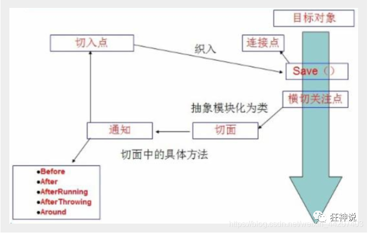
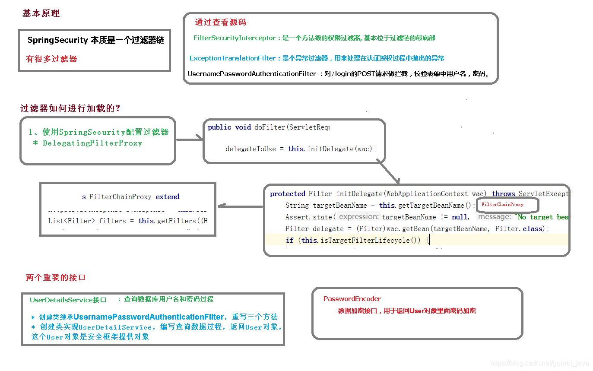
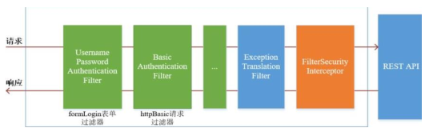
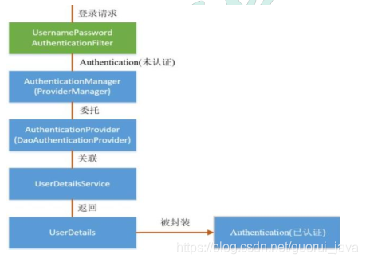
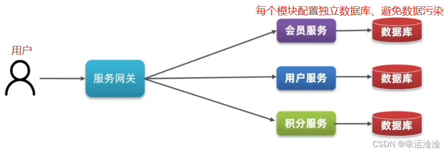
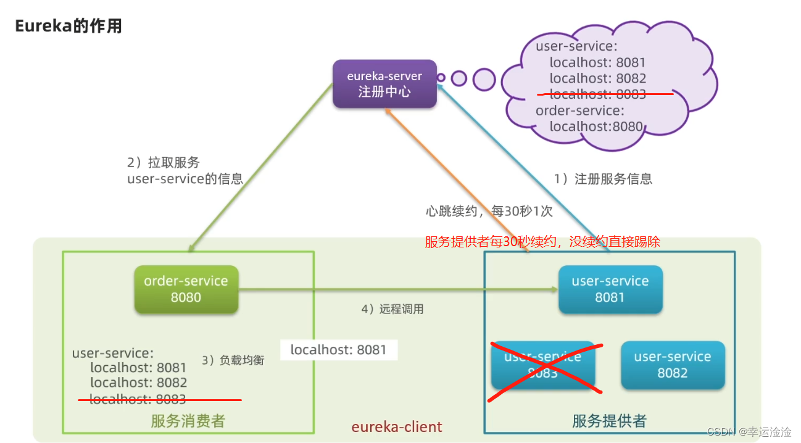
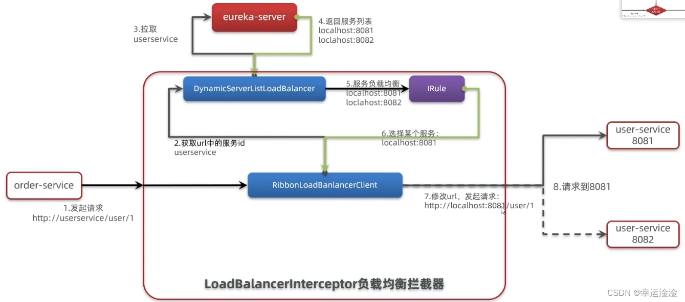
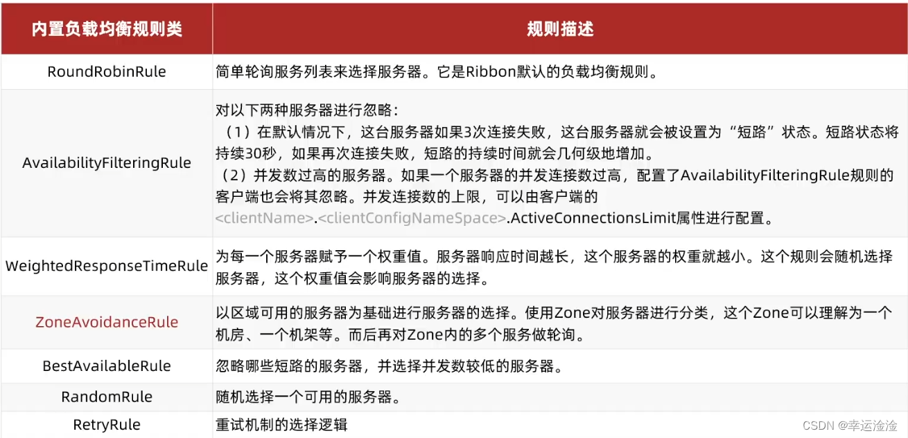
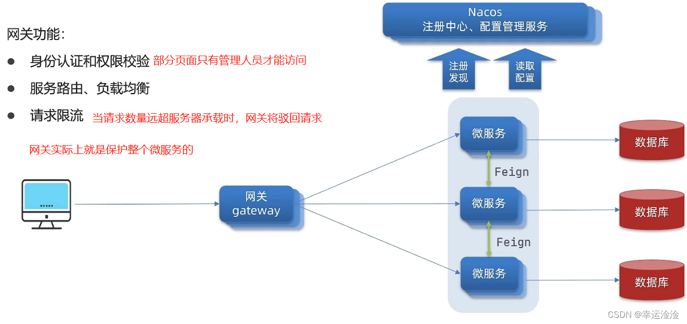

[参考](https://blog.csdn.net/weixin_44207403/article/details/106736102?ops_request_misc=%257B%2522request%255Fid%2522%253A%252232d38a872bc9357d21ce37e50a5b0faf%2522%252C%2522scm%2522%253A%252220140713.130102334..%2522%257D&request_id=32d38a872bc9357d21ce37e50a5b0faf&biz_id=0&utm_medium=distribute.pc_search_result.none-task-blog-2~all~top_positive~default-1-106736102-null-null.142^v102^pc_search_result_base8&utm_term=spring&spm=1018.2226.3001.4187)
[这个有步骤图](https://blog.csdn.net/weixin_68522070/article/details/141360851?ops_request_misc=%257B%2522request%255Fid%2522%253A%252232d38a872bc9357d21ce37e50a5b0faf%2522%252C%2522scm%2522%253A%252220140713.130102334..%2522%257D&request_id=32d38a872bc9357d21ce37e50a5b0faf&biz_id=0&utm_medium=distribute.pc_search_result.none-task-blog-2~all~top_positive~default-2-141360851-null-null.142^v102^pc_search_result_base8&utm_term=spring&spm=1018.2226.3001.4187)
# Spring Core
依赖：org.springframework.spring-webmvc
## IOC(控制反转)：
1. 基本概念
   - ***控制反转***IoC(Inversion of Control)，是一种设计思想，DI(依赖注入)是实现IoC的一种方法，也有人认为DI只是IoC的另一种说法。没有IoC的程序中 , 我们使用面向对象编程 , 对象的创建与对象间的依赖关系完全硬编码在程序中，对象的创建由程序自己控制，控制反转后将对象的创建转移给第三方。就如我们写service时，不需要实现Dao层，第三方帮我们是实现了，我们只需要new一个即可。
   - 控制反转是一种通过描述（XML或注解）并通过第三方去生产或获取特定对象的方式。在Spring中实现控制反转的是IoC容器，其实现方法是***依赖注入***（Dependency Injection,DI）。
2. 接下来通过例子理解控制反转和依赖注入，先是控制反转：
- 首先写个bean.xml(resources下):
```xml
<?xml version="1.0" encoding="UTF-8"?>
<beans xmlns="http://www.springframework.org/schema/beans"
       xmlns:xsi="http://www.w3.org/2001/XMLSchema-instance"
       xsi:schemaLocation="http://www.springframework.org/schema/beans
       http://www.springframework.org/schema/beans/spring-beans.xsd">

    <!-- id是bean的id是唯一的 name是bean名字可重复，未设置id可用name来
    找bean class是实体类位置前面两个都没设置可以用实体类名.class来找 属性里是实体类的名字和值 -->
    <bean id="person" name="person" class="com.CloudWhite.Entity.Person">
        <property name="name" value="张三"></property>
        <property name="age" value="18"></property>
    </bean>
</beans>
```
- 然后写个测试类：
```java
//解析beam文件
ApplicationContext context = new ClassPathXmlApplicationContext("beans.xml");
Person person = (Person) context.getBean("person");//getBean参数是bean的id
person.show();
```
可以发现new。而是用bean的id来new的，这就是控制反转。由此
Person对象是谁创建的 ? Person对象是由Spring创建的
Person对象的属性是怎么设置的 ? Person对象的属性是由Spring容器设置的
这个过程就叫控制反转
控制:谁来控制对象的创建,传统应用程序的对象是由程序本身控制创建的,使用Spring后,对象是由Spring来创建的
反转:程序本身不创建对象, 变成被动的接收对象
- 补充一下构造函数，无参构造函数xml无需改动，而有参则要加入如下：
```xml
<!-- 第一种根据index参数下标设置 -->
<bean id="person" class="com.CloudWhite.Entity.Person">
   <!-- index指构造方法 , 下标从0开始 -->
   <constructor-arg index="0" value="kuangshen2"/>
</bean>
<!-- 第二种根据参数名字设置 -->
<bean id="person" class="com.CloudWhite.Entity.Person">
   <!-- name指参数名 -->
   <constructor-arg name="name" value="kuangshen2"/>
</bean>
<!-- 第三种根据参数类型设置 -->
<bean id="person" class="com.CloudWhite.Entity.Person">
   <constructor-arg type="java.lang.String" value="kuangshen2"/>
</bean>
```
## 依赖注入：
我们分set注入和构造注入两种，构造器注入就是我前面解释控制反转的例子，不说了
**set注入**（重点）： 
- 要求被注入的属性,必须有set方法,set方法的方法名由set+属性首字母大写,如果属性是boolean类型,没有set方法，则方法名由is + 属性首字母大写
- 注入方法同上xml，这里再说一下一些特殊形式的注入：/
  - collection注入，比如数组：
  ```xml
  <property name="books">
         <array>
             <value>西游记</value>
             <value>红楼梦</value>
             <value>水浒传</value>
         </array>
     </property>
  ```
  - Map注入：
  ```xml
  <map>
        <entry key="中国邮政" value="456456456465456"/>
        <entry key="建设" value="1456682255511"/>
    </map>
  ```
  - null注入:`<property name="wife"><null/></property>`
  - props注入：
  ```xml
  <props>
         <prop key="学号">20190604</prop>
         <prop key="性别">男</prop>
     </props>
  ```
  - p命名空间注入：先导入`xmlns:p="http://www.springframework.org/schema/p"`，然后`<bean id="user" class="..." p:name="狂神" p:age="18"/>`
  - c命名空间注入，先导入`xmlns:c="http://www.springframework.org/schema/c"`,然后`<bean id="user" class="..." c:name="狂神" c:age="18"/>`
## **关于其他xml配置**：
  - `<!--设置别名：在获取Bean的时候可以使用别名获取--><alias name="person" alias="me"/>`
  - `import resource="beans.xml" 导入其他xml文件`
  - `<!--设置作用域：singleton(单例)、prototype(多例)、session、request --><bean id="user" class="..." scope="singleton"/>`
    - singleton：当一个bean的作用域为Singleton，那么Spring IoC容器中只会存在一个共享的bean实例，并且所有对bean的请求，只要id与该bean定义相匹配，则只会返回bean的同一实例。Singleton是单例类型，就是在创建起容器时就同时自动创建了一个bean的对象，不管你是否使用，他都存在了，每次获取到的对象都是同一个对象。
    - prototype：当一个bean的作用域为Prototype，表示一个bean定义对应多个对象实例。Prototype作用域的bean会导致在每次对该bean请求（将其注入到另一个bean中，或者以程序的方式调用容器的getBean()方法）时都会创建一个新的bean实例。Prototype是原型类型，它在我们创建容器的时候并没有实例化，而是当我们获取bean的时候才会去创建一个对象，而且我们每次获取到的对象都不是同一个对象。
    - 根据经验，对有状态的bean应该使用prototype作用域，而对无状态的bean则应该使用singleton作用域。
    - request：当一个bean的作用域为request，表示该bean会为每一次HTTP请求创建一个新实例。即每次HTTP请求将会有各自的bean实例，它们依据某个bean定义创建而成。该作用域仅在基于Web的Spring ApplicationContext情形下有效。
    - session：当一个bean的作用域为session，表示该bean为每一次HTTP Session创建一个新实例。即执行过程中同个session内的bean是同一个实例。仅在基于Web的Spring ApplicationContext情形下有效。
  - `<!--设置自动装配：byName(根据名称)、byType(根据类型)--><bean id="user" class="..." autowire="byName"/>`
  - `<!--设置延迟加载：true(延迟加载)、false(非延迟加载)--><bean id="user" class="..." lazy-init="true"/>`
  - `<!--设置初始化方法和销毁方法--><bean id="user" class="..."init-method="init" destroy-method="destroy"/>`
  - `<!--设置工厂方法--><bean id="user" class="..." factory-method="getInstance"/>`
  - `<!--设置工厂Bean--><bean id="user" class="..." factory-bean="factory"/>`
## ***自动注入***： 
***这里只自动注入其他bean，即需要注入的实体类有其他有其他的类，不自动注入基本数据类型***
1. 原理：
   - 组件扫描(component scanning)：spring会自动发现应用上下文中所创建的bean；
   - 自动装配(autowiring)：spring自动满足bean之间的依赖，也就是我们说的IoC/DI；
2. **这里推荐使用注解而不是使用xml**，但我们还是先介绍一下用xml：
   1. byName：bean标签里加`autowire="byName"`，这里要保证该bean里同类型的对象只有一个，否则报错
   2. byType：bean标签里加`autowire="byType"`，这里无需保证同类型的对象只有一个
3. **注解**：
   1. 现在xml头部改成如下：
   ```xml
   <beans xmlns="http://www.springframework.org/schema/beans"
       xmlns:xsi="http://www.w3.org/2001/XMLSchema-instance"
   
       xmlns:context="http://www.springframework.org/schema/context"
   
       xsi:schemaLocation="
       http://www.springframework.org/schema/context
       http://www.springframework.org/schema/context/spring-context.xsd
   
       http://www.springframework.org/schema/beans
       http://www.springframework.org/schema/beans/spring-beans.xsd">
   ```
   2. ***注解自动注入***： 先再xml加上`<context:annotation-config/>`
      - @Autowired(required=true或true，及是否必须注入，一般不用默认必须注入，下面两个都有)：按类型自动转配的，不支持id匹配，*使用时删除原有的set方法*，相当于bytype
      - @Qualifier：按id匹配的，*使用时删除原有的set方法*，相当于byname
      - @Resource(可选的默认name)：这里如果有指定name就按指定name，没有就按byname，还没有就bytype，*使用时删除原有的set方法*，*以上对于删除set方法，也不可以删，在set方法上注解即可，下面的也同理。*
      - 但以上都直接使用可能会让依赖关系变得混乱（对于团体协作而言），对于简单的需要注入的Bean，可以直接用在字段注解，多了就在构造方法上注解，在复杂就建议用配置类来管理，再在构造函数上注解。
   3. ***其他配置，以下就不止是只注入其他bean，具体自行看下面理解***
      - `<context:component-scan base-package="com.CloudWhite.Entity"/>`: 配置要扫描的包. 然后在指定包里的类加上注解@Component("可写的bean的id")，就相当于xml里的bean标签
      - @value("可选的默认赋值")：给属性赋值，这里就可以去掉基本数据类型的set方法
      - @Component有三个衍生注解，即@Controller、@Service、@Repository，分别对应控制层、业务层、持久层，使用了就将其交给spring管理。
## ***一些重要使用说明***
了解的自动注入，那我们注入的对象是什么呢？一般为了方便灵活实现方法，我们一般注入接口（击得给实现类注入bean）。当然如果该类已经稳定我们也可以注入实现类。  
那么注入好处是什么？注入是将注入的对象交给spring管理，这样我们就不用自己去实例化了，我们可以直接声明被注入的对象，然后进行注入就能使用了。
## 基于Java类进行配置(配置类)：
以下一个例子了解注解作用：
```java
//先写一个实体类
@Component  //将这个类自动注入为bean，上面有说
public class Dog {
   public String name = "dog";
}
//然后来看配置类，注意两个注解
@Configuration  //代表这是一个配置类
public class MyConfig {

   @Bean //通过方法注册一个bean，这里的返回值就Bean的类型，方法名就是bean的id！
   public Dog dog(){
       return new Dog();
  }
}
@Import(MyConfig2.class)//想导入其他配置类，用这个注解也写在类外部
```
# Spring AOP
## 代理模式：
1. 静态代理：比如你要租房，你去找中介，中介就是代理，你不用去找房东，房东就是目标对象。那么现在有一个接口是租房，实现他的类就是房东，再写一个类真正实现租房接口就是中介即代理对象，代理对象代替房东实现接口，以及可能需要的新方法。
2. 动态代理：就是代理对象是动态生成的,下例就是动态代理：
```java
interface Rent {
    public void rent();
 }
 
//真实角色: 房东，房东要出租房子
class Host implements Rent{
    public void rent() {
        System.out.println("房屋出租");
   }
 }
 

public class ProxyInvocationHandler implements InvocationHandler {
    private Rent rent;
    public void setRent(Rent rent) {
        this.rent = rent;
   }
    //生成代理类，重点是第二个参数，获取要代理的抽象角色！之前都是一个角色，现在可以代理一类角色,且代理的是接口
    public Object getProxy(){
        return Proxy.newProxyInstance(this.getClass().getClassLoader(),
                rent.getClass().getInterfaces(),this);
   }
    // proxy : 代理类 method : 代理类的调用处理程序的方法对象.
    // 处理代理实例上的方法调用并返回结果
    @Override
    public Object invoke(Object proxy, Method method, Object[] args) throws Throwable {
        seeHouse();
        //核心：本质利用反射实现！
        Object result = method.invoke(rent, args);
        fare();
        return result;
   }
    //看房
    public void seeHouse(){
        System.out.println("带房客看房");
   }
    //收中介费
    public void fare(){
        System.out.println("收中介费");
   }
 }
 //租客
class Client {
    public static void main(String[] args) {
        //真实角色
        Host host = new Host();
        //代理实例的调用处理程序
        ProxyInvocationHandler pih = new ProxyInvocationHandler();
        pih.setRent(host); //将真实角色放置进去！
        Rent proxy = (Rent)pih.getProxy(); //动态生成对应的代理类！
        proxy.rent();
   }
 }
```
## AOP
依赖：org.aspectj.aspectjweaver
1. 概述：
- AOP(Aspect Oriented Programming)意为面向切面编程，通过预编译方式和运行期动态代理实现程序功能的统一维护的一种技术。AOP是OOP的延续，是软件开发中的一个热点，也是Spring框架中的一个重要内容，是函数式编程的一种衍生范型。利用AOP可以对业务逻辑的各个部分进行隔离，从而使得业务逻辑各部分之间的耦合度降低，提高程序的可重用性，同时提高了开发的效率。[跳转到图](../photo/3.png)
- spring中的aop：
  - 先了解一下几个概念：
    - 横切关注点：跨越应用程序多个模块的方法或功能。即是，与我们业务逻辑无关的，但是我们需要关注的部分，就是横切关注点。如日志 , 安全 , 缓存 , 事务等等 …
    - 切面（ASPECT）：横切关注点 被模块化 的特殊对象。即，它是一个类。
    - 通知（Advice）：切面必须要完成的工作。即，它是类中的一个方法。
    - 目标（Target）：被通知对象。
    - 代理（Proxy）：向目标对象应用通知之后创建的对象。
    - 切入点（PointCut）：切面通知 执行的 “地点”的定义。
    - 连接点（JointPoint）：与切入点匹配的执行点。 
  - 以及,[spring的五种通知](../photo/4.png)
2. AOP非注解实现： 
   1. 接口：`public interface testImpl { public void test();}`
   2. 服务类:`public class testService implements testImpl { public void test(){System.out.println("测试的好啊！1");}}`
   3. 增强类：
   ```java
   public class beforeLog implements MethodBeforeAdvice {
      //method : 要执行的目标对象的方法
      //objects : 被调用的方法的参数
      //Object : 目标对象
      @Override
      public void before(Method method, Object[] objects, Object o) throws Throwable {
         System.out.println( o.getClass().getName() + "的" + method.getName() + "方法被执行了");
      }
   }
   public class afterLog implements AfterReturningAdvice {
    //returnValue 返回值
    //method被调用的方法
    //args 被调用的方法的对象的参数
    //target 被调用的目标对象
    @Override
      public void afterReturning(Object returnValue, Method method, Object[] args, Object target) throws Throwable {
         System.out.println("执行了" + target.getClass().getName()
                  +"的"+method.getName()+"方法,"
                  +"返回值："+returnValue);
      }
   }
   ```
   4. beans.xml:
   ```xml
   <?xml version="1.0" encoding="UTF-8"?>
   <beans xmlns="http://www.springframework.org/schema/beans"
         xmlns:xsi="http://www.w3.org/2001/XMLSchema-instance"
   
         xmlns:context="http://www.springframework.org/schema/context"
         xmlns:aop="http://www.springframework.org/schema/aop"
   
         xsi:schemaLocation="
         http://www.springframework.org/schema/context
         http://www.springframework.org/schema/context/spring-context.xsd
   
         http://www.springframework.org/schema/beans
         http://www.springframework.org/schema/beans/spring-beans.xsd
         http://www.springframework.org/schema/aop
         http://www.springframework.org/schema/aop/spring-aop.xsd">
       <bean id="service" class="com.CloudWhite.Service.testService"></bean>
       <bean id="beforeLog" class="com.CloudWhite.Log.beforeLog"></bean>
       <bean id="afterLog" class="com.CloudWhite.Log.afterLog"></bean>
       <!--aop的配置-->
       <aop:config>
        <!--切入点 expression:表达式匹配要执行的方法-->
        <aop:pointcut id="pointcut" expression="execution(* com.CloudWhite.Service.testService.*(..))"/>
        <!--执行环绕; advice-ref执行方法 . pointcut-ref切入点-->
        <aop:advisor advice-ref="beforeLog" pointcut-ref="pointcut"/>
        <aop:advisor advice-ref="afterLog" pointcut-ref="pointcut"/>
       </aop:config>
   </beans>
   
   ```
   5. 测试类：`testImpl testService = (testImpl) context.getBean("service");testService.test();`
3. ***注解实现： ***
   1. 接口、服务类同上
   2. 增强类：
   ```java
   @Aspect
   @Component
   public class Log{
      @Before("execution(* com.CloudWhite.Service.testService..*.*(..))")
      public void before(){
         System.out.println("方法被执行前!");
      }
   
      @After("execution(* com.CloudWhite.Service.testService..*.*(..))")
      public void afterReturning(){
         System.out.println("方法被执行后!");
      }
   
      @Around("execution(* com.CloudWhite.Service.testService..*.*(..))")//先around，然后通过类型如下jp.proceed() ，执行before，然后继续around，最后执行after，当然也不宜不写这个，这个是为了区分多个方法
      public Object around(ProceedingJoinPoint jp) throws Throwable {
         System.out.println("环绕前");
         System.out.println("签名:"+jp.getSignature());//执行方法的返回类型、完整方法路径名
         Object proceed = jp.proceed();//执行目标方法proceed的返回值，有这个才会执行before
         System.out.println("环绕后");
         System.out.println(proceed);
         return proceed;//特别注意，这里通常需要返回值，否则mybatis的返回值可能错误  
      }
   }
   ```
   3. 最后bean.xml只要加上`<aop:aspectj-autoproxy/> `(其他如依赖注入记得开启组件扫描或手动注入)
# Spring MVC
就是spring加mvc设计模式，主要是controller层，service层，dao层，model层，view层，其中controller层是核心，其他都是辅助。
## MVC：
- 模型(Model)：模型是应用程序中用于处理数据的部分，主要有实体类。但除了实体类还有很多用处，可以封装各种bean，如统一json数据等等。
- 视图(View)：视图是应用程序中处理数据的显示部分。
- 控制器(Controller)：控制器作用于模型和视图上。它控制数据流向模型对象，并在数据变化时更新视图。它使视图与模型分离开。
- DAO：数据访问对象
- Service：业务逻辑
## ***Mybatis-Spring***
例子见SpringTest，是Spring AOP + Mybatis + Spring Core的整合
1. 在先前xml基础上加上如下：
```xml
<aop:aspectj-autoproxy/>
<!-- 加载外部属性配置文件 -->
<context:property-placeholder location="classpath:db.properties"/>
<!--配置数据源：数据源有非常多，可以使用第三方的，也可使使用Spring的-->
<bean id="dataSource" class="org.springframework.jdbc.datasource.DriverManagerDataSource">
   <!-- 也可以不加载外部资源直接载value里写 -->
   <property name="driverClassName" value="${jdbc.driver}"/>
   <property name="url" value="${jdbc.url}"/>
   <property name="username" value="${jdbc.username}"/>
   <property name="password" value="${jdbc.password}"/>
</bean>
<!-- 声明SqlSessionFactoryBean，在这个类的内部，创建SqlSessionFactory对象，之后就可以获取SqlSession对象 -->
<bean id="sqlSessionFactory" class="org.mybatis.spring.SqlSessionFactoryBean">
   <!-- 获取数据源 -->
   <property name="dataSource" ref="dataSource" />
   <!-- 获取其他配置，虽然数据源帮忙做了属性设置mybatis-config不用在写了，但其他配置如typeAlias等配置还是要加载mybatis-config。当然如果有mybatis-config之外的其他配置也可以在下面写注入到SqlSessionFactoryBean -->
   <property name="configLocation" value="classpath:mybatis-config.xml"/>
</bean>

<!-- 声明MapperScannerConfigurer -->
<!--
   MapperScannerConfigurer作用：
      循环basePackage所表示的包，把包中的每个接口都找到，调用SqlSession.getMapper(XXXDao.class)
      把每个dao接口都创建出对应的dao代理对象，将dao代理对象放在容器中。对于StudentDao接口，其代理对象为 studentDao,即我们不用mybatis的传统的用接口代理，而是用spring的getBean()动态代理接口
-->
<bean class="org.mybatis.spring.mapper.MapperScannerConfigurer">
   <!-- 指定SqlSessionFactory对象的名称 -->
   <property name="sqlSessionFactoryBeanName" value="sqlSessionFactory"/>
   <!-- 指定基本包，dao接口所在的包名 -->
   <property name="basePackage" value="com.CloudWhite.Dao"/>
</bean>
```
2. Dao接口，即mapper层：
```java
@Mapper//如果你不想用MapperScannerConfigurer可以用mapper注解，然后在启动类加上mapper扫描的注解，但这一般用在SpringBoot，后面再说
public interface testDao {
    List<UserInfo> selectAll();
}
```
3，Service层：
```java
//service接口，也可以不写，但一般写
public interface testImpl {
    List<UserInfo> selectAllUserInfo();
}
//接口实现类，主要为了调用dao层的方法，然后返回给controller层
@Service("testService")
public class testService implements testImpl {
    private testDao testDao;
    @Autowired
    public void setTestDao(com.CloudWhite.Dao.testDao testDao) {
        this.testDao = testDao;
    }
    @Override
    public List<UserInfo> selectAllUserInfo(){
        List<UserInfo> list = testDao.selectAll();
        return list;
    }
}
```
4. Controller层：调用service层的方法，返回给前端，另外从以上层次可看出，service依赖dao，controller依赖service，那么可以通过依赖注入来代替getBean()，当然用注解注入击得开启三个层级的扫描。
## ***Spring MVC:***
[]()
springBoot可以直接创建Spring MVC项目，即创建SpringBoot项目，勾选web即可  
[参考](https://blog.csdn.net/m0_64338546/article/details/132071506?ops_request_misc=%257B%2522request%255Fid%2522%253A%2522f4ba18099d6a0a7452cdecb50b53c40e%2522%252C%2522scm%2522%253A%252220140713.130102334..%2522%257D&request_id=f4ba18099d6a0a7452cdecb50b53c40e&biz_id=0&utm_medium=distribute.pc_search_result.none-task-blog-2~all~top_positive~default-1-132071506-null-null.142^v102^pc_search_result_base8&utm_term=Spring%20mvc&spm=1018.2226.3001.4187)
1. 路由映射（就是访问地址）：
   - @RequestMapping(/路由地址,方法类型可以不写不写就是任意方法格式为method = RequestMethod.方法名，ContentType内容，以及三个不常用的属性略)：
     - @RequestMapping注解可以修饰类，也可以修饰方法，当修饰类和方法时，访问的地址是类＋方法。
     - @RequestMapping注解可以处理任何HTTP方法的请求，包括GET、POST、PUT、DELETE等。
     - @RequestMapping注解可以使用method属性来进行限定处理请求的HTTP方法。
   - PostMapping(/路由地址)：
     - @PostMapping注解通常用于修饰控制器类中的方法，而不是类本身。
     - @PostMapping注解只可以处理HTTP POST请求映射到处理方法上。
   - GetMapping(/路由地址)：
     - @GetMapping注解通常用于修饰控制器类中的方法，而不是类本身。
     - @GetMapping注解只可以处理HTTP GET请求映射到处理方法上。
2. 路由获取参数：
   - 单个普通参数：当路由地址前加了一个value属性时就代表指定参数值，路由地址就变成了`路由地址?参数值=参数值`，此时的参数就是方法里定义的参数。如果想指定参数值则可用@RequestParam，如`test(@RequestParam("username") String name)`
   - 普通对象参数：同上
   - json对象：用@RequestBody注解标注对应对象即可，spring会自动将json转为对象，**当你不用时，它默认接受的表单数据**。
   - 获取url参数：即获取路由地址里的参数，如`路由地址/{参数名}`，此时的参数就是方法里定义的参数，用@PathVariable注解标注参数即可，如`test(@PathVariable("username") String name)`
   - 获取上传文件参数：使用@RequestParam注解，如`test(@RequestParam("file") MultipartFile file)`
   - 获取请求头：使用@RequestHeader注解，如`test(@RequestHeader("User-Agent") String userAgent)`
   - 获取cookie：使用@CookieValue注解，如`test(@CookieValue("JSESSIONID") String sessionId)`
   - 获取session：使用@SessionAttribute注解，如`test(@SessionAttribute("user") User user)`
3. 返回：
   1. 视图：直接return 视图名，这里视图名加`/`在更目录找，不加在当前目录找
   2. @RestController(这个注解是类的，是ReponseBody和Controller的组合)：直接return数据，这里返回的数据会自动转为json格式
   3. 其他略
# Spring Boot
由于过多单独写了一个md
# Spring Data

## 概述：
Spring Data 它主要是用于做数据存储的，用在数据持久层。mybatis主要是用来操作像mysql这种关系型数据库，而除了这些外，**Spring Data 还可以操作非关系型数据库**，如Redis、MongoDB、Elasticsearch、Neo4j等。随着时代发展单一数据库已经无法满足实际开发需求了，因为用户量越来越大了。这时候项目就需要多种数据库，可每种数据库都有自己的语言，学习成本大，而**Spring Data将不同的这个数据存储进行了统一 提升了我们的开发效率，降低了我们的学习成本**，这就是我们学习Spring Data的原因。而常用的springdata模块如下：
- Spring Data common - 用于支持每个Spring Data模块的核心公共模块。
- Spring Data JDBC - 对 JDBC 的 Spring Data 存储库支持。
- Spring Data JPA - 对 JPA 的 Spring Data 存储库支持。
- Spring Data MongoDB - 基于 Spring 的对象文档支持和 MongoDB 存储库。
- Spring Data Redis - 从 Spring 应用程序轻松配置和访问 Redis。
- spring Data REST - 将 Spring Data 存储库导出为超媒体驱动的 RESTful 资源。
其中常用的是Spring Data JPA和Spring Data Redis。
## Spring Data JPA（内含DTO和VO）
先导入依赖  
***然后这里特别注意：要使用jpa，实体类需要用@Entity注解标注，主键用@Id注解标注，表名用@Table注解标注，字段用@Column注解标注，外键用@JoinColumn注解标注（除了主键和实体类其他为选择标记），这里当你没有用@Column注解标注时，jpa会自动将驼峰命名法转换为下划线命名法，如`userId`会自动转为`user_id`，如果想用其他名字就要我前面说到的注解。***  
***然后关于外键，常在封装其他实体类时使用，对于封装的其实体类，应该用像一对一（@OneToOne）这样的关系注解标注且需要标注外键。另外，如果有外键就不能用@Column注解标注，要用@JoinColumn注解标注，这里用了封装实体类就不需要再加封装实体类里有的字段，不然会映射冲突，最后外键主键也不能用@Column注解标注,而用@PrimaryKeyJoinColumn注解标注。***  
当你只是用到引入对象只需要其主键时，我们就可以只保存主键。如果特殊情况需要访问user表的其他字段，我们可以引入他并且用如@OneToOne这样的关系注解标注，**我们加上参数`fetch = FetchType.LAZY`，这样只有当你需要访问其他字段时才会访问user表，否则不会访问user表，**这样就可以减少数据库的访问次数，提高效率。其默认值是`FetchType.EAGER`，即立即加载，适用于一定需要访问其他字段的情况。当你使用了懒加载时，**如果你用的Jackson，那么你需要忽略懒加载属性，因为Jackson不知道怎么对懒加载属性进行序列化**，会报错。方法有以下三中：
1. 在实体类上添加`@JsonIgnoreProperties({"hibernateLazyInitializer", "handler"})`注解，参数也可以直接是参数列表
2. 在属性上添加`@JsonIgnore`注解
3. 通过自定义序列化器来实现，如果项目无特殊要求一律忽略懒加载属性，那可以将自定义序列化器封装到配置类里，如下：
```java
// 自定义序列化器
class LazyAwareSerializer extends JsonSerializer<Object> {
    @Override
    public void serialize(Object value, JsonGenerator gen, SerializerProvider serializers) throws IOException {
        if (Hibernate.isInitialized(value)) {
            gen.writeObject(value);
        } else {
            gen.writeNull();
        }}}
// 配置类
@Configuration
public class JacksonConfig {
    @Bean
    public ObjectMapper objectMapper() {
        ObjectMapper mapper = new ObjectMapper();
        SimpleModule module = new SimpleModule();
        // 注册自定义序列化器
        module.addSerializer(Object.class, new LazyAwareSerializer());
        mapper.registerModule(module);
        return mapper;
    }}    
```
那么该怎么使用栏加载的属性呢，有以下几种方法：
1. 直接使用，如`user.getOrder().getOrderId()`，这是加载整个order对象，简单好用，但对于大量数据来说，这是非常不划算的。
2. 使用Hibernate.initialize()方法，如`Hibernate.initialize(user.getOrder())`，这样会更灵活的使用懒加载属性而不是整个对象，对于大量数据更推荐，如下例：
```java
user user = entityManager.find(com.CloudWhite.PersonalBlog.Entity.user.class, userId);
        if (user != null) { //如果之前发起过包含懒加载属性的查询就不为空了
            if (user.getRole() != null) {  //如果想访问角色
                Hibernate.initialize(user.getRole());  // 初始化角色
                // 若角色关联了权限，继续初始化权限
                if (user.getRole().getPermission() != null) {  
                    Hibernate.initialize(user.getRole().getPermission());
                }
            }
        }
        return user;
```
3. 用mybatis进行精细查询，但这样会封装太多方法
其实懒加载就是为了对不必要的数据进行懒加载，即只有当你需要访问其他字段时才会访问user表，否则不会访问user表，这样就可以减少数据库的访问次数，提高效率。那其实就对应到了我们的DTO和VO设计模式，相对实体类，***DTO和VO就是对实体类的封装，实体类对应数据库的所有信息，但我们实际功能可能不需要这些所有信息，即封装只封装实体类中我们需要的字段，而不需要的字段我们就不封装。这样就可以减少数据库的访问次数，提高效率***。DTO和VO的区别在于：
- DTO：数据传输对象，用于在不同层之间传输数据，比如前端和后端。
- VO：值对象，用于在业务逻辑中封装数据，比如在Service层中。 
spring data jpa有以下核心接口：
- Repository接口
- CrudRepository接口
- PagingAndSortingRepository接口
- JpaRepository接口
- JPASpecificationExecutor接口
这里Repository、CrudRepository、PagingAndSortingRepository、JpaRepository、JPASpecificationExecutor接口是继承关系，所以我们可以直接使用JpaRepository接口，它集合了上面所有的接口。
1. jpaRepository接口
我们可以通过继承jpaRepository<T,ID>接口来创建自定义的jpaRepository接口，这里的T泛型是实体类类型，ID是主键类型。  
接下来看常用方法：
- save(entity) saveAll(entitySet)：保存实体对象和实体对象集合，当保存数据库没有的数据时，即为插入，此时实体无需写主键。保存有的即主键相同的数据时，即为更新，自然必须写主键。
- findById(id) findAll() findAllById(id)：根据主键查询实体对象、查询所有实体对象和根据主键集合
查询实体对象集合
- findBy...(属性名) findAllBy...(属性名) findBy...(属性名)And...(属性名)：根据属性名查询实体对象、查询所有实体对象和根据属性名查询实体对象集合
- findAll(Sort) findAll(Pageable)：根据排序规则查询实体对象集合和根据分页信息查询实体对象集合，**下面删改查基本都是这个格式，略了**
- deleteById(id) deleteAll() deleteAll(entitySet)：根据主键删除实体对象、删除所有实体对象和根据实体对象集合删除实体对象集合
- count()：查询实体对象的数量
- existsById(id)：判断是否存在指定主键的实体对象
- delete(entity) deleteById()：删除指定的实体对象和根据主键删除实体对象
- update(entity)：更新实体对象 更新实体对象集合 根据主键更新实体对象  
以上自定义方法需要在dao层定义，而非自定义方法可以直接调用，但其实又是我们需要封装是非自定义方法也要在dao层封装

2. JPASpecificationExecutor接口
   它提供了多条件查询的复杂查询，但建议还是用mybatis的动态sql来实现。但注意两个接口要分开使用，不然会报错。

最后，***JPA也又类似mybatis的注解形式，即`@Query`,这个就不区分是什么操作类型了直接写sql语句即可***。

## Spring Data Redis
就是上面的集成redis
# Spring Security
基本概念参考shrio，这里直接介绍原理
## 原理
1. 先来看一下常用过滤器
   1. **SecurityContextPersistenceFilter**：将Security上下文信息保存到Session中，在每次请求时，将Security上下文信息从Session中加载出来，这样就可以在整个请求过程中保持Security上下文信息的一致性。
   2. **UsernamePasswordAuthenticationFilter**：用于处理基于表单的登录请求，从表单获取用户名和密码。默认处理来自/login的请求，默认表单name值为username和password，可通过设置过滤器的usernameParameter和passwordParameter参数修改。
   3. **ExceptionTranslationFilter**：用于处理AccessDeniedException和AuthenticationException异常。
     
2. 然后看常见过滤器：
   - **WebAsyncManagerIntegrationFilter**：将Security上下文与Spring Web中用于处理异步请求映射的WebAsyncManager进行集成。
   - **SecurityContextPersistenceFilter**：在每次请求处理之前将该请求相关的安全上下文信息加载到SecurityContextHolder中，请求处理完成后，将SecurityContextHolder中此次请求信息存储到“仓储”，并清除其中信息，比如Session中维护用户安全信息由该过滤器处理。 
   - **HeaderWriterFilter**：用于将头信息加入响应中。 
   - **CsrfFilter**：用于处理跨站请求伪造。 
   - **LogoutFilter**：用于处理退出登录。 
   -  **UsernamePasswordAuthenticationFilter**：用于处理基于表单的登录请求，从表单获取用户名和密码。默认处理来自/login的请求，默认表单name值为username和password，可通过设置过滤器的usernameParameter和passwordParameter参数修改。 
   - **DefaultLoginPageGeneratingFilter**：若未配置登录页面，系统初始化时配置此过滤器，用于在需要登录时生成登录表单页面。 
   - **BasicAuthenticationFilter**：检测和处理http basic认证。 
   - **RequestCacheAwareFilter**：用来处理请求的缓存。 
   - **SecurityContextHolderAwareRequestFilter**：主要包装请求对象request。 
   - **AnonymousAuthenticationFilter**：检测SecurityContextHolder中是否存在Authentication对象，若不存在则提供匿名Authentication。 
   - **SessionManagementFilter**：管理session的过滤器。 
   - **ExceptionTranslationFilter**：处理AccessDeniedException和AuthenticationException异常。 
   - **FilterSecurityInterceptor**：可看作过滤器链的出口。 
   - **RememberMeAuthenticationFilter**：当用户未登录访问资源时，从cookie找用户信息，若Spring Security能识别remember me cookie，用户无需填写用户名和密码直接登录，该过滤器默认不开启。 
3. 基本流程  
  
绿色部分是认证过滤器 ，需要自行配置，可配置多个。既可以选用 Spring Security 提供的认证过滤器，也能自定义（如短信验证过滤器 ）。必须在configure(HttpSecurity http)方法中进行配置，否则不生效。
1. 认证流程  

## springboot集成spring security
1. 导入依赖
2. yml配置
```yml
#  security:
#    user:
#      name: root
#      password: 123456
```
1. 然后正式开始
   1. 写一个服务类实现UserDetailsService接口重写loadUserByUsername方法
   ```java
   @Component
   public class userSecurityServiceImpl implements UserDetailsService {
       public static String remindMessage;
       @Autowired
       private jpaUserService jpaUserService;
       @Override
       public UserDetails loadUserByUsername(String username) throws UsernameNotFoundException{
           //通过用户名得到用户信息
           userInfo userInfo = jpaUserService.findByUsername(username);
           if(userInfo!=null){
               //获取角色
               String role = userInfo.getRole().getRoleName();
               //角色集合
               List<GrantedAuthority> authorities = new ArrayList<>();
               //角色必须加ROLE_，数据库没有就代码加
               authorities.add(new SimpleGrantedAuthority("ROLE_"+role));
               //这里User时spring security里面的
               return new User(userInfo.getUsername(),userInfo.getPassword(),authorities);
           }else{
               remindMessage = "用户不存在！";
               return null;}}}
   ```
    2. 写一个配置类加密密码并构建AuthenticationManager
   ```java
   @EnableWebSecurity//开启spring security
    @Configuration
    @EnableMethodSecurity//开启方法级别的权限控制
    public class SpringSecurityConfig{
        private UserDetailsService userDetailsService;
        @Autowired
        public SpringSecurityConfig(UserDetailsService userDetailsService) {
            this.userDetailsService = userDetailsService;
        }
   
        @Bean
        public PasswordEncoder PasswordEncoder(){
            //使用BCrypt方式加密
            return new BCryptPasswordEncoder();
        }
   
        @Bean
        public AuthenticationManager authenticationManager(HttpSecurity httpSecurity) throws Exception {
            AuthenticationManagerBuilder authenticationManagerBuilder = httpSecurity.getSharedObject(AuthenticationManagerBuilder.class);
            authenticationManagerBuilder.userDetailsService(userDetailsService)
                    .passwordEncoder(PasswordEncoder());
            return authenticationManagerBuilder.build();
        }}
   ```
   2. 最后再配置类配置过滤器链，一下列出常用配置    
   ```java
   @Bean
    public SecurityFilterChain securityFilterChain(HttpSecurity http) throws Exception {
        // 开启跨域配置 (如需前后端分离，请启用)
        // 直接配置跨域，无需额外方法返回 CorsConfigurationSource
        http.cors(cors -> cors.configurationSource(request -> {
            CorsConfiguration config = new CorsConfiguration();
            config.setAllowedOrigins(Arrays.asList("http://localhost:3000"));  // 允许的前端地址
            config.setAllowedMethods(Arrays.asList("GET", "POST", "PUT", "DELETE"));
            config.setAllowedHeaders(Arrays.asList("Authorization", "Content-Type"));
            config.setAllowCredentials(true);  // 允许携带 Cookie 进行跨域
            return config;
        }));
   
        // 关闭 CSRF 保护（默认关闭，可选开启）
        http.csrf(AbstractHttpConfigurer::disable);
   
        // 开启 CSRF 保护，如果需要则注释掉上面的关闭
        /*
        http.csrf(csrf -> csrf
                .csrfTokenRepository(CookieCsrfTokenRepository.withHttpOnlyFalse())
        );
        */
   
        // 会话管理（无状态，用于 JWT 认证时）
        http.sessionManagement(session ->
                session.sessionCreationPolicy(SessionCreationPolicy.STATELESS)
        );
   
        // 默认会话管理（有状态，如需 session 认证请启用）
        /*
        http.sessionManagement(session -> session
                .sessionFixation().migrateSession()
                .maximumSessions(1)
                .expiredUrl("/login?expired")
        );
        */
   
        // 认证授权配置
        http.authorizeHttpRequests(authz -> authz
                .requestMatchers("/admin/**").hasRole("ADMIN")        // 管理员权限
                .requestMatchers("/user/**").hasAnyRole("USER", "ADMIN") // 用户或管理员权限
                .requestMatchers("/api/auth/**").permitAll()           // 认证接口无需登录
                .anyRequest().authenticated()                           // 其他请求需要认证
        );
   
        // 表单登录配置
        http.formLogin(form -> form
                .loginPage("/login")                // 自定义登录页面
                .defaultSuccessUrl("/home", true)   // 登录成功重定向
                .permitAll()                        // 登录页面允许访问
        );
   
        // Basic 认证配置（如需要 Basic 认证启用）
        /*
        http.httpBasic(Customizer.withDefaults());
        */
   
        // JWT 认证过滤器（如有自定义 JWT 认证，请启用并配置过滤器）
        /*
        http.addFilterBefore(new JwtAuthenticationFilter(), UsernamePasswordAuthenticationFilter.class);
        */
   
        // 登出配置
        http.logout(logout -> logout
                .logoutUrl("/logout")
                .logoutSuccessUrl("/login?logout")
                .permitAll()
        );
   
        // 认证异常处理
        http.exceptionHandling(exception -> exception
                .authenticationEntryPoint((request, response, authException) ->
                        response.sendError(HttpServletResponse.SC_UNAUTHORIZED, "未认证，请登录"))
                .accessDeniedHandler((request, response, accessDeniedException) ->
                        response.sendError(HttpServletResponse.SC_FORBIDDEN, "权限不足，禁止访问"))
        );
   
        return http.build();
    }
   ```
   这里关于UserDetails：  
1. 获取用户信息：` UserDetails userDetails = (UserDetails) authentication.getPrincipal();`,然后getUsername()和getPassword()获取用户名和密码
2. 检查用户权限：`userDetails.getAuthorities().stream().anyMatch(authority -> authority.getAuthority().equals("ROLE_ADMIN")`
3. 获取用户权限等：
    1. ```java
        UserDetails userDetails = // 获取当前用户的UserDetails对象
        Collection<? extends GrantedAuthority> authorities = userDetails.getAuthorities();
        for (GrantedAuthority authority : authorities) {
            System.out.println("用户权限: " + authority.getAuthority());
        }
       ```
    2. 控制器里用如下：
    ```java
        Authentication authentication = SecurityContextHolder.getContext().getAuthentication();
        if (authentication != null && authentication.getPrincipal() instanceof UserDetails) {
            UserDetails userDetails = (UserDetails) authentication.getPrincipal();
            Collection<? extends GrantedAuthority> authorities = userDetails.getAuthorities();
            return authorities.stream().map(GrantedAuthority::getAuthority).collect(Collectors.toList());
        }
    ```
    关于权限控制：  
1. 基于注解的权限控制：
    1. @PreAuthorize 和 @PostAuthorize：用于方法级别，用于在方法执行前和执行后进行权限检查。参数有 permitAll、hasRole、hasAnyRole、hasPermission、hasAnyPermission等，表示允许所有用户、具有特定角色、具有满足任一角色、具有特定权限、具有满足任一权限。
    2. @Secured：用于方法级别，用于指定方法的访问权限,这个要加上ROLE_前缀，可以不用1的参数直接写权限
2. 代码自定义，略（不代表不重要） 
# Spring Cloud
[参考博客](https://blog.csdn.net/u014685437/article/details/130919452?ops_request_misc=%257B%2522request%255Fid%2522%253A%2522ef289026fdc661f93fc37b0bdd54a85a%2522%252C%2522scm%2522%253A%252220140713.130102334..%2522%257D&request_id=ef289026fdc661f93fc37b0bdd54a85a&biz_id=0&utm_medium=distribute.pc_search_result.none-task-blog-2~all~top_positive~default-1-130919452-null-null.142^v102^pc_search_result_base9&utm_term=springcloud&spm=1018.2226.3001.4187)
## 关于微服务
微服务是一种经过良好架构设计的分布式架构方案，微服务架构特征:
1. 单一职责： 微服务拆分粒度更小，每一个服务都对应唯一的业务能力，做到单一职责，避免重复业务开发
2. 面向服务： 微服务对外暴露业务接口
3. (由于不同模块部署在不同服务器、无法直接调用)
4. 自治： 队独立、技术独立、数据独立、部署独立
5. 隔离性强： 服务调用做好隔离、容错、降级，避免出现级联问题    

有以下总结：
- 单体架构特点：简单方便，高度耦合，扩展性差，适合小型项目。例如: 学生管理系统
- 分布式架构特点：松耦合，扩展性好，但架构复杂，难度大。适合大型互联网项目，例如:京东、淘宝
- 微服务:一种良好的分布式架构方案：优点: 拆分粒度更小、服务更独立、耦合度更低缺点:架构非常复杂，运维、监控、部署难度提高
## 了解微服务
在微服务架构中，配置中心和注册中心是两个重要的组件。  
- 配置中心用来统一管理项目中所有配置，各种参数、各种开关，全部都放到一个集中的地方进行统一管理，并提供一套标准的接口。当各个服务需要获取配置的时候，就来「配置中心」的接口拉取。
- 注册中心则是用来管理服务实例的注册和发现的。各个服务实例在启动时会向注册中心注册自己的信息（如IP地址和端口号），其他服务实例可以通过注册中心来发现并调用这些服务。  
说这么多，来写一个简单的微服务例子：
```java
// 先注入RestTemplate
@Configuration
public class CloudConfig {
    @Bean
    public RestTemplate restTemplate(){
        return new RestTemplate();
    }
}
// 然后举一个简单例子，用户系统调用订单系统的微服务，订单系统也要返回订单，这里的订单系统和用户系统有独立数据库，所以微服务建数据库设计也是独立的，这里订单需要返回和用户形同以用的用户信息
@GetMapping()
    public UserDto test(Long orderId){
        //查询订单
        Order order = orderDao.findByOrderId(orderId);
        //这里就是用RestTemplate发起http请求，查寻用户,用的微服务的地址和接口,实现远程调用
        String url = "http//localhost:8081/User"+order.getOrderId();
        UserDto userDto = restTemplate.getForObject(url,UserDto.class);
        //得到值就可以通过微服务得到的用户信息返了
        order.setUser(userDto);
        return userDto;
    }
// SpringCloudTest详细的，建议前往查看，里面还有对于子父依赖得设计也很重要
```
上例可得：第三点Demo中，我们服务在请求服务的时候，restTemplate访问的地址是固定的。可在实际开发中通常都会有好几个环境，开发，测试等等环境。每个环境的地址都在变化，因此出现了几个问题：  
1. 服务消费者该如何获取服务提供者的地址信息?
2. 如果有多个服务提供者，消费者该如何选择?   
因此我们来看Eureka注册中心   
## Eureka注册中心
  
消费者该如何获取服务提供者具体信息?  
1. 服务提供者启动时向eureka注册自己的信息  
2. eureka保存这些信息  
3. 消费者根据服务名称向eureka拉取提供者信息   
如果有多个服务提供者，消费者该如何选择?   
服务消费者利用负载均衡算法，从服务列表中挑选一个
消费者如何感知服务提供者健康状态?  
1. 服务提供者会每隔30秒向EurekaServer发送心跳请求，报告健康状态
2. eureka会更新记录服务列表信息，心跳不正常会被剔除
3. 消费者就可以拉取到最新的信息  
现然Eureka主要功能是实现负载均衡
### Eureka使用
1. 依赖：父依赖指定org.springframework.cloud.spring-cloud-dependencies，子依赖直接org.springframework.cloud.spring-cloud-starter-netflix-eureka-client或eureka-server
2. yml配置，这里先说明，Eureka是注册中心，要单独建立一个模块，即Eureka-server，业务模块是Eureka-client，配置不一样，先说Eureka-server
```yml
eureka:
  instance:
    hostname: localhost  # 注册中心主机名，若部署在服务器需写公网/内网IP或域名
  client:
    register-with-eureka: false  # 自己是注册中心，不注册自己
    fetch-registry: false        # 不从别的注册中心拉取服务
    service-url:
      defaultZone: http://${eureka.instance.hostname}:${server.port}/eureka/  # 服务注册地址
  server:
    enable-self-preservation: false  # 是否开启自我保护（默认true），建议开发时设为false
    eviction-interval-timer-in-ms: 60000  # 服务剔除检查的时间间隔，单位毫秒
    renewal-percent-threshold: 0.85       # 剩余心跳比例阈值，低于将触发自我保护
    response-cache-update-interval-ms: 3000 # 响应缓存刷新间隔
    wait-time-in-ms-when-sync-empty: 0  # 注册表为空时等待时间，适合单节点启动加速
    shutdown-grace-period-ms: 5000  # 关闭时等待时间
# 日志级别建议
logging:
  level:
    com.netflix: warn  # 只显示Netflix相关警告日志
    org.springframework.cloud.netflix.eureka: info  # 只显示Eureka相关日志
    org.springframework.boot.autoconfigure: error  # 只显示Spring Boot错误日志
```
然后注意在**该模块启动类加上@EnableEurekaServer注解**开启注册中心，注意**一般只负责注册**，然后是各个业务模块的yml配置,启动后可以访问对应地址前往Eureta控制台查看注册情况
```yml
# 对于多个服务提供者，我们可以如下设置多个端口，用多个配置文件，或者也可以运行时指定端口即java -jar 对应jar文件.jar --server.port=多次运行指定不同端口
# 下面说用多个配置文件
# application.yml
spring:
  profiles:
    active: dev
# application-dev.yml
server:
  port: 8001
# application-dev2.yml
server:
  port: 8002
# 这是运行命令是java -jar 对应jar文件.jar --spring.profiles.active=dev
# 然后是关于Eureka
eureka:
  client:
    service-url:
      defaultZone: http://localhost:8761/eureka/  # Eureka Server 的地址
    fetch-registry: true      # 拉取注册信息（默认就是 true）
    register-with-eureka: true  # 注册到 Eureka
```
以上配置后Eureka-server就搭建完成了，注意还要在各个业务的rest模板配置类加上@LoadBalanced注解为具体业务开启负载均衡，就会自动进行负载均衡处理，具体流程如图：
  
负载均衡规则如下图：  
  
调整负载均衡规则可以在yml写死也可以用配置类（更灵活），先来看yml：
```yml
cloud:
loadbalancer:
    clients:
    consumer: # 替换为你想负载均衡的服务名
        configuration:
        service-instance-list-supplier:
            enabled: true
            service-instance-supplier-type: random #选择规则
```
然后配置类：
```java
@Bean
@Configuration
public class LoadBalancerConfig {
    public ReactorServiceInstanceLoadBalancer loadBalancer(Environment environment,
                                                           LoadBalancerClientFactory factory) {
        String serviceId = environment.getProperty(LoadBalancerClientFactory.PROPERTY_NAME);

        // 轮询策略（默认启用）
        return new RoundRobinLoadBalancer(factory.getLazyProvider(serviceId, ServiceInstanceListSupplier.class), serviceId);

        // 随机策略
        /*
        return new RandomLoadBalancer(factory.getLazyProvider(serviceId, ServiceInstanceListSupplier.class), serviceId);
        */

        // 权重策略（简单示例，需要你根据实际权重逻辑改写）
        /*
        return new WeightedLoadBalancer(factory.getLazyProvider(serviceId, ServiceInstanceListSupplier.class), serviceId);
        */
    }
}
```
这个时候你就可以用服务名来访问服务提供商了(因为有多个相同服务商需要站不同接口,可以在yml设置相同的服务名(即Spring.Application.name)来统一访问)，如上面的`http//localhost:8081/User`改成`http//服务名/User`来访问
直接写不管是全局配置，要具体到哪个服务可以在该服务的启动类的加上`@LoadBalancerClient(name = "服务名", configuration = LoadBalancerConfig.class)`。这里一般是消费者选择多个服务提供者，所以负载均衡配置应该一般写在消费者模块里。
## Nacos注册中心
Nacos注册中心是阿里巴巴开源的注册中心，是更先进的注册中心，比Eureka更先进，功能更强大，性能更优秀，支持更多功能，如服务发现、配置管理、服务健康检查、动态配置等。
下载配置，略
### Nacos使用
1. 依赖：com.alibaba.cloud.spring-cloud-starter-alibaba-nacos-discovery和config，前者是注册中心，后者是配置中心，前者是必须的，后者是可选的。
2. yml配置：这里只需要写业务模块的yml配置，因为nacos的是你下载配置的是一个独立的服务，其配置在官方控制台配置
```yml
spring:
    # 从nacos控制台加载其他配置，这里重点说明，一般本地yml只保留端口号、服务名等基本配置以及如下的nacos配置，其他配置如数据源等都从nacos控制台加载
    config:
        import: "nacos:provider-service.yaml"  #指定加载的配置文件名
    cloud:
        nacos:
        discovery:
            server-addr: 127.0.0.1:8848  # Nacos 地址（默认端口）
            namespace: public            # 可以自定义命名空间 ID
            group: DEFAULT_GROUP         # 默认分组，可选
            username: nacos              # 如启用鉴权，需填写用户名
            password: lscloud7              # 如启用鉴权，需填写密码
        config:
            server-addr: 127.0.0.1:8848
            file-extension: yaml         # 指定配置文件格式：yaml/properties
            namespace: public
            group: DEFAULT_GROUP
            enabled: true
            refresh-enabled: true

# 开启配置自动刷新（可选）
management:
  endpoints:
    web:
      exposure:
        include: "*"
  health:
    refresh:
      enabled: true
# 这里开启自动刷新要引入org.springframework.boot:spring-boot-starter-actuator依赖
```
### 环境隔离
nacos还可以做到环境隔离，即不同环境的配置可以分开管理，如开发环境、测试环境、生产环境等，这样就可以做到环境隔离，避免不同环境的配置相互影响。用namespace，控制台可以设置，从而控制一个服务不同实例在不同环境隔离，如某个服务在生产环境，这边做更新开发的开发、测试环境的更改不会影响生产环境。  
控制台新建namespace后，会生成一个命名空间ID，在对应yml的nacos配置的discovery和config的namespace属性中填写即可。
### 临时与非临时实例
临时实例的情况下，如果你终止程序，过30s，到nacos中查看就会发现爆红然后直接消失(被nacos踢出)  
非临时实例终止程序，nacos中查看该服务爆红，但不会踢出。重新启动非临时实例即可  
设置是否临时在yml的discovery的ephemeral属性中填写即可，默认为true，即临时实例。
### Feign
Feign是一个声明式的Web服务客户端，它使得编写Web服务客户端变得更加简单。Feign通过处理HTTP请求和响应，为我们提供了一种更简单的方式来调用远程服务。之前用的是restTemplate，现在用的是feign，下面是feign的使用方法：
1. 依赖：父依赖是SpringCloud，和rest模板一样上面有略，子依赖为org.springframework.cloud.openfeign:spring-cloud-starter-openfeign
2. 在启动类加上@EnableFeignClients注解
3. 然后再服务类接口上加上@FeignClient注解，参数为服务名，如`@FeignClient("服务名")`就可以直接调用指定服务的所有方法了
这样显然更简单，不需要手动构造url了  
但fegin底层没有连接池，需要调优，用的httpclient，先引入`io.github.openfeign:feign-httpclient`依赖(也属于springcloud)，然后在yml配置中加入如下配置：
```yml
# fegin
openfeign:
    client:
    config:
        default: # 默认的全局配置
        logger-level: BASIC # 日志级别，BASIC是最基础的请求和响应信息
    httpclient:
    enabled: true # 开启httpclient连接池支持
    max-connections: 200 # 最大连接数
    max-connections-per-route: 50 # 每个路径最大连接数
```
## 网关
网关一般是单独写一个模块，用于接收所有请求，然后根据请求的路径转发到对应的服务，这样就可以实现统一的访问入口，也可以实现权限控制，如登录、权限等。
具体作用如图  
使用方法：
1. 依赖：父依赖也是SpringCloud，子依赖为org.springframework.cloud:spring-cloud-starter-gateway
2. yml配置：
```yml
spring:
  cloud:
    gateway:
      # 默认超时时间（毫秒）
      default-filters:
        - name: StripPrefix
          args:
            parts: 1
        - name: Retry
          args:
            retries: 3
            statuses: BAD_GATEWAY, GATEWAY_TIMEOUT
            methods: GET, POST
            backoff:
              firstBackoff: 100ms
              maxBackoff: 1s
              factor: 2
      routes:
        - id: provider-route
          uri: lb://provider-service      # Nacos 注册的服务名，lb:// 是负载均衡调用
          predicates:
            - Path=/provider/**
          filters:
            - StripPrefix=1               # 去掉 /provider 前缀转发
            - name: Retry
            - "Retry=retries=2,statuses=BAD_GATEWAY,methods=GET,backoffFirstBackoff=200ms,backoffMaxBackoff=1s,backoffFactor=1.5"
            # 配置请求限流（如使用Redis限流），下面是redis限流配置，配了这个记得要配置redis
            - "RequestRateLimiter=replenish-rate=10,burst-capacity=20"
        - id: consumer-route
          uri: lb://consumer-service
          predicates:
            - Path=/consumer/**
# 还有很多配置，建议直接看测试项目
```
这个虽然能实现实现权限控制，如登录、权限等功能，更配置很复杂，判断也很粗劣，但也有好处，就是统一了入口，方便管理，也不用写过多的代码，只需要写yml配置即可，另外还实现了网关。但不是说写了网关就行，网关的判断不够精细，所以微服务内部还是要拦截器配合注解来实现更精细的控制。
## Docker
Docker是一个开源的容器化平台，它可以让开发者打包他们的应用以及依赖包到一个可移植的镜像中，然后发布到任何流行的Linux或Windows机器上，也可以实现虚拟化。它是一个轻量级的虚拟技术，是一个进程，相比虚拟机是操作系统中的操作系统，而且占空间很大。
Docker的核心概念包括：
- 镜像（Image）：Docker将应用程序及其所需的依赖、函数库、环境、配置等文件打包在一起，称为镜像。
- 容器（Container）：镜像中的应用程序运行后形成的进程就是容器，只是Docker会给容器做隔离，对外不可见。
- 仓库（Repository）：一个集中存放镜像的地方。 
Docker是一个CS架构的程序，由两部分组成:  
服务端(server)： Docker守护进程，负责处理Docker指令，管理镜像、容器等  
客户端(client)： 通过命令或RestAPI向Docker服务端发送指令。可以在本地或远程向服务端发送指令  
### 使用
# Spring webflux
